# DevOps Learning Guide

A crisp, concept-first reference for core DevOps topics, with diagrams to anchor your mental models.

---

## 1. What is DevOps?

DevOps is a culture + set of practices that unifies software development (Dev) and IT operations (Ops) to ship software faster, safer, and more reliably. It emphasizes automation, collaboration, fast feedback, and continuous improvement.

**Core pillars:** Culture, Automation, Measurement, Sharing (CAMS).

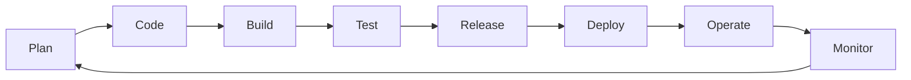

The infinite loop: feedback from Operate/Monitor flows back into Plan, making delivery continuous.

---

## 2. CI/CD (Continuous Integration / Continuous Delivery & Deployment)

- **CI**: Developers merge code frequently; every commit triggers automated build + tests. Catches integration bugs early.
- **Continuous Delivery**: Every change is automatically prepared and *ready* for production release (manual approval gate).
- **Continuous Deployment**: Every passing change goes to production automatically — no human gate.

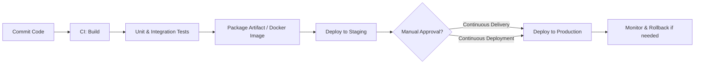

**Popular tools:** Jenkins, GitHub Actions, GitLab CI, CircleCI, Azure DevOps.

**Key idea:** Small, frequent changes are less risky than big-bang releases.

---

## 3. Version Control & Git Workflows

Git is the backbone of collaboration. Common workflows:

- **Feature Branch Workflow**: each feature on its own branch, merged via Pull Request.
- **Gitflow**: structured branches (main, develop, feature, release, hotfix) — good for versioned releases.
- **Trunk-Based Development**: everyone commits to main frequently behind feature flags — favored by high-performing teams.

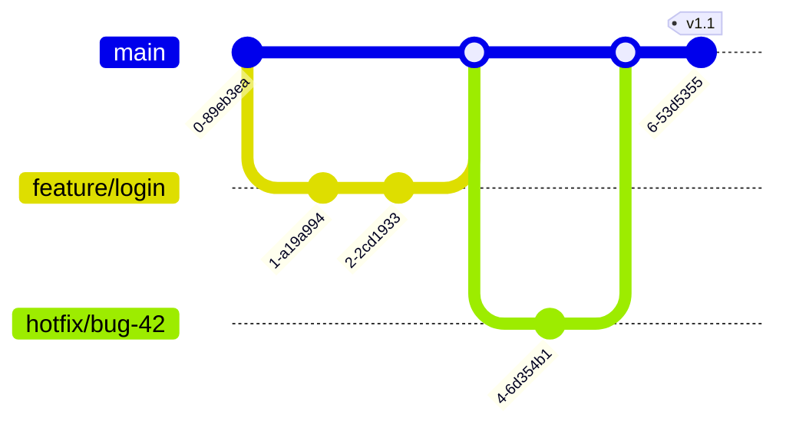

---

## 4. Containers & Docker

A container packages your app + dependencies into a single, portable, isolated unit. Unlike VMs, containers share the host OS kernel — they're lightweight and start in seconds.

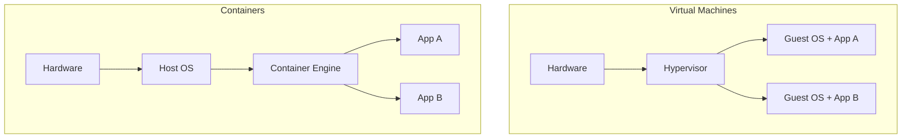

**Workflow:** `Dockerfile` → `docker build` (image) → `docker run` (container) → push to **registry** (Docker Hub, ECR).

**Key terms:** Image (blueprint), Container (running instance), Registry (image store), Layer (cached build step).

---

## 5. Kubernetes (K8s) — Container Orchestration

Kubernetes automates deploying, scaling, and healing containers across a cluster of machines.

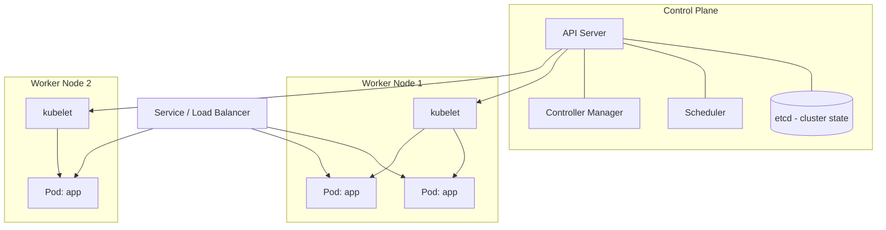

**Core objects:**
- **Pod** — smallest deployable unit (1+ containers)
- **Deployment** — manages replicas + rolling updates
- **Service** — stable network endpoint / load balancing
- **Ingress** — HTTP routing from outside
- **ConfigMap / Secret** — configuration and credentials

**Self-healing:** if a pod dies, K8s replaces it automatically to match desired state.

---

## 6. Infrastructure as Code (IaC)

Define infrastructure (servers, networks, databases) in code instead of clicking consoles. Benefits: repeatable, versioned, reviewable, disaster-recoverable.

- **Declarative** (Terraform, CloudFormation): describe *what* you want; tool figures out *how*.
- **Imperative/Config Mgmt** (Ansible, Chef): describe *steps* to configure machines.

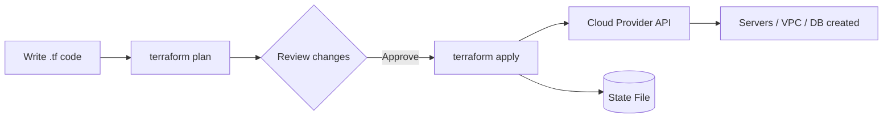

**Golden rule:** never modify infra manually ("no console cowboys") — all changes go through code + review.

---

## 7. Monitoring & Observability

**Monitoring** tells you *when* something is wrong; **observability** lets you ask *why*.

The three pillars:
- **Metrics** — numeric time series (CPU, latency, error rate) → Prometheus, Grafana
- **Logs** — event records → ELK Stack, Loki
- **Traces** — request journey across microservices → Jaeger, OpenTelemetry

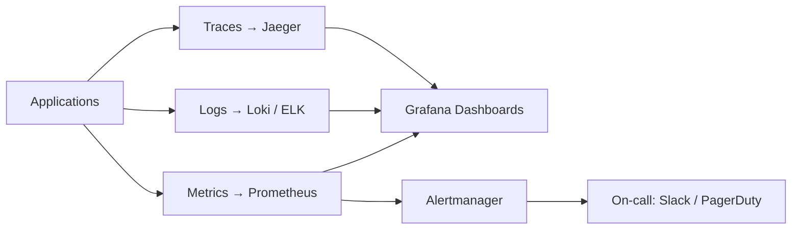

**Key SRE metrics:** SLI (what you measure), SLO (target), SLA (contract), Error Budget (allowed unreliability).

---

## 8. Deployment Strategies

How you release new versions safely:

| Strategy | How it works | Risk |
|---|---|---|
| **Rolling** | Replace instances gradually | Low downtime, slow rollback |
| **Blue-Green** | Two identical envs, switch traffic at once | Instant rollback, 2x cost |
| **Canary** | Send small % of traffic to new version, expand if healthy | Safest, more complex |
| **Feature Flags** | Code shipped dark, toggled per user | Decouples deploy from release |

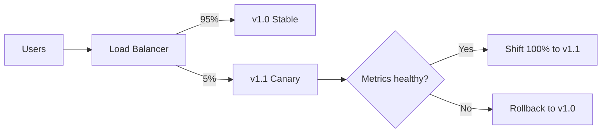

---

## 9. Microservices & API Gateway

Break a monolith into small, independently deployable services that communicate over APIs. Each service owns its data and can scale independently.

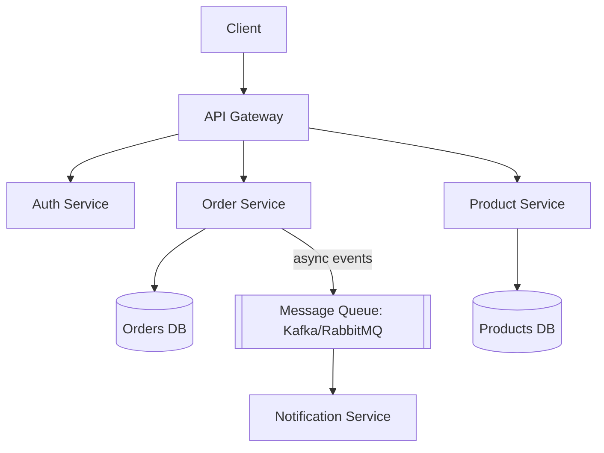

**Trade-off:** flexibility and scale vs. operational complexity (networking, distributed debugging, data consistency).

---

## 10. DevSecOps — Shift Security Left

Embed security checks throughout the pipeline instead of auditing at the end.

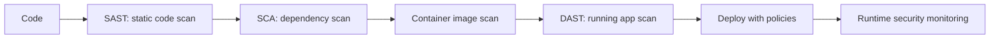

**Tools:** Snyk, Trivy, SonarQube, OWASP ZAP, Vault (secrets management).

**Rule:** never hardcode secrets — use a secrets manager and inject at runtime.

---

## 11. GitOps

Git is the single source of truth for both app *and* infrastructure. An agent in the cluster continuously syncs actual state to what's declared in Git.

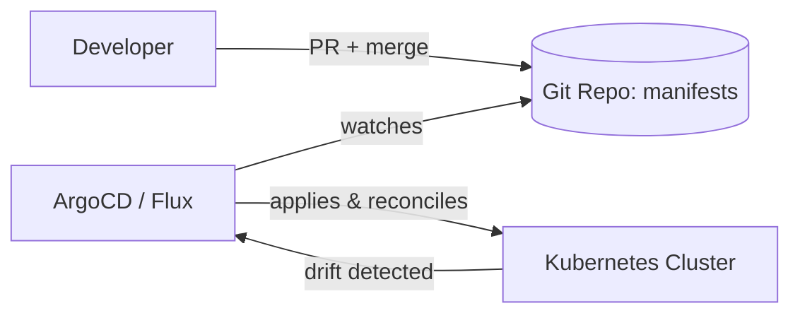

**Benefits:** auditable changes (git log), easy rollback (git revert), no manual `kubectl apply`.

---

## 12. Suggested Learning Path

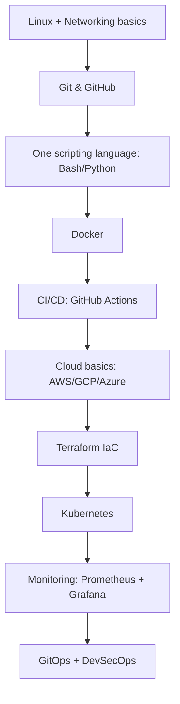

**Tip:** build one small project end-to-end (app → Dockerize → CI pipeline → deploy to K8s → monitor it). Doing beats reading.