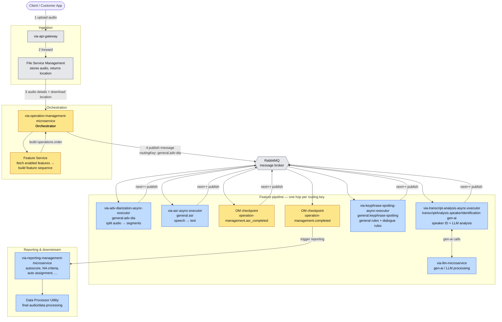
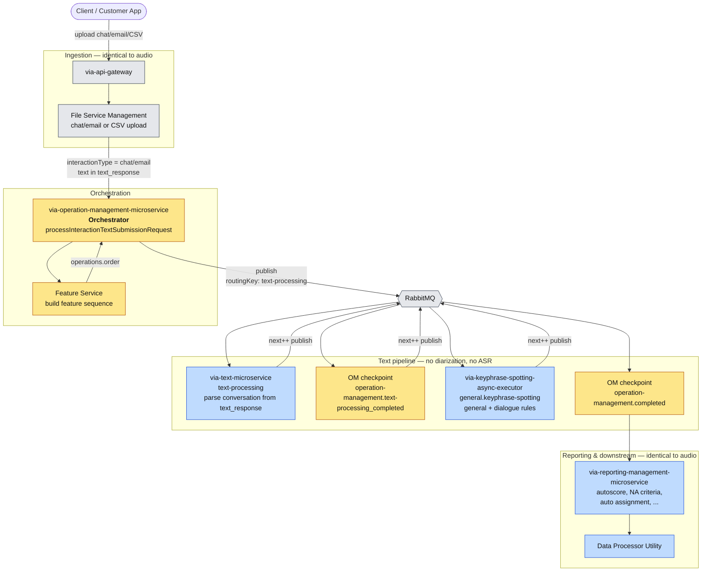
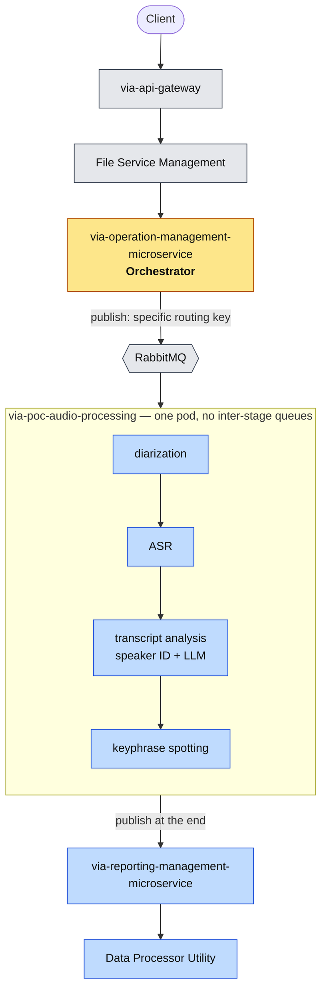

# Audio Message Flow — Onboarding Guide

> **Audience:** New engineers joining the team.
> **Goal:** Understand, end to end, what happens when a customer sends an audio file into the platform — which microservice does what, and how a single "message" travels through all of them.
>
> This document covers the **happy-path flow of one audio interaction**. Other flows (real-time, text-only, batch) are noted briefly at the end and will be documented separately.

---

## 1. The big picture (one paragraph)

A client uploads an audio file. The **API Gateway** hands it to **File Service Management**, which stores the file and tells **Operation Management** where to find it. Operation Management is the **orchestrator** — it looks up which features the customer's organization has enabled and builds an ordered **feature sequence**. It then publishes a single **message** onto a message broker (RabbitMQ). That message hops from one microservice to the next, in the order defined by the sequence: diarization → ASR (speech-to-text) → transcript analysis (speaker ID + LLM) → keyphrase spotting → reporting → data processing. Each service does its piece, writes its results, and passes the message along. When the sequence finishes, the interaction is fully processed and ready to be viewed in reports.

---

## 2. Key concepts before you read the diagram

| Term | What it means |
|------|---------------|
| **Interaction** | One audio conversation/call being processed. Identified by `interactionId`. |
| **Organization** | The customer/tenant. Identified by `organizationId` / `organizationCode`. Each org has its own set of **enabled features**. |
| **Operation Management** | The **orchestrator**. Decides *what* runs and *in what order*; owns the lifecycle of the message. |
| **Feature Service** (inside Operation Management) | Fetches the enabled features for the organization and produces the **feature sequence** (the `operations.order` array). |
| **Message** | The JSON envelope that travels through every microservice. It carries the routing plan (`operations.order` + `next`), IDs, and accumulated results. See the sample below. |
| **Routing key** | The RabbitMQ key the message is published with at each hop (e.g. `general.adv-dia`). It tells the broker which service should pick the message up next. |
| **Async executor microservice** | A worker that consumes from a queue, does one type of processing (diarization, ASR, etc.), then republishes the message for the next step. The `-async-executor-` services follow this pattern. |

---

## 3. The message envelope

Every microservice receives and forwards the **same message shape**. The orchestrator stamps the route into `operations`, and `next` is the pointer to the current step.

```json
publishAction : published message : {
  "operations": {
    "order": [
      "general.adv-dia",
      "general.asr",
      "operation-management.asr_completed",
      "transcriptAnalysis.speakerIdentification|gen-ai",
      "general.keyphrase-spotting",
      "operation-management.completed"
    ],
    "next": 0
  },
  "message": null,
  "interactionId": "a333838d-c93a-4491-b594-3ea2b5c02829",
  "organizationId": "ef5c903d-c8f5-49c3-b9f4-bcc0faa68dd2",
  "organizationCode": "bfsi_test_org",
  "interactionType": "1",
  "interactionTypeMode": null,
  "interactionName": "919729915701_2026-06-08-13-14-31.wav",
  "interactionParentDir": "/uploads/ef5c903d-.../audio/a333838d-.../",
  "batchInfo": null,
  "outputFormat": "ROMAN",
  "ruleIds": null,
  "dialogueRuleIds": null,
  "advancedRuleIds": null,
  "llmRuleIds": null,
  "reportId": "3ac5392e-6fd2-4a8f-bb86-3aa0d08894a6",
  "rta_response": { "dia_resp": null },
  "text_response": null,
  "llm_provider": null,
  "text_fileservice_info": null,
  "ad_details": null,
  "requeueTimestamp": null,
  "core_request": null,
  "core_response": null,
  "core_identifier": null,
  "response_identifier": null
}
for routingKey : general.adv-dia
```

### How routing works (the most important idea)

- `operations.order` is the **itinerary**: the ordered list of steps for *this* interaction. It is generated per-org by the Feature Service, so two organizations can have different routes.
- `operations.next` is the **cursor** — the index of the step currently being executed.
- When a service finishes, it advances `next` and publishes the message with the routing key of the next step. The broker delivers it to whichever service listens on that key.
- Steps prefixed `operation-management.*` (e.g. `asr_completed`, `completed`) are **checkpoints** that come back to the orchestrator so it can update state, persist intermediate results, or fan out to additional processing.

Decoding the sample route:

| # | Step (`order[i]`) | Routing key → handled by | What happens |
|---|-------------------|--------------------------|--------------|
| 0 | `general.adv-dia` | **via-adv-diarization-async-executor-microservice** | Splits one audio into speaker/turn **segments** (diarization). |
| 1 | `general.asr` | **via-asr-async-executor-microservice** | **Speech-to-text** on each segment → transcript. |
| 2 | `operation-management.asr_completed` | **via-operation-management-microservice** | Orchestrator checkpoint: ASR done, persist transcript, continue. |
| 3 | `transcriptAnalysis.speakerIdentification\|gen-ai` | **via-transcript-analysis-async-executor-microservice** (+ **via-llm-microservice** for the `gen-ai` part) | **Speaker identification** + **LLM-based analysis**. |
| 4 | `general.keyphrase-spotting` | **via-keyphrase-spotting-async-executor-microservice** | Applies **general rules** and **dialogue rules** to spot keyphrases. |
| 5 | `operation-management.completed` | **via-operation-management-microservice** | Final checkpoint → triggers **reporting** and downstream processing. |

> The `|` in `speakerIdentification|gen-ai` means a single step can bundle multiple sub-features handled by the same service (here: classic speaker ID **and** the gen-AI path that calls the LLM microservice).

---

## 4. End-to-end flow diagram



---

## 5. Step-by-step walkthrough

### Stage A — Ingestion
1. **Client → API Gateway:** The customer app uploads the audio file (e.g. `919729915701_2026-06-08-13-14-31.wav`) through `via-api-gateway`, the single public entry point.
2. **API Gateway → File Service Management:** The gateway forwards the upload to File Service Management, which **stores the file** (under `interactionParentDir`, e.g. `/uploads/<orgId>/audio/<interactionId>/`).
3. **File Service → Operation Management:** File Service calls Operation Management's API with the **audio details and download location**, kicking off processing.

### Stage B — Orchestration (Operation Management)
4. The **Feature Service** inside Operation Management looks up the **enabled features for the organization** and builds the **feature sequence** — the `operations.order` array.
5. Operation Management **publishes the message** to RabbitMQ with `operations.next = 0` and the routing key of the first step (`general.adv-dia`).

### Stage C — Feature pipeline (one service per hop)
6. **Diarization** (`general.adv-dia`): one audio file is split into multiple **segments** (who spoke when).
7. **ASR** (`general.asr`): each segment is converted from **speech to text**.
8. **Checkpoint** (`operation-management.asr_completed`): the message returns to the orchestrator so the transcript is persisted before analysis continues.
9. **Transcript Analysis** (`transcriptAnalysis.speakerIdentification|gen-ai`): performs **speaker identification** and **LLM-based analysis**. The gen-AI sub-feature delegates to **via-llm-microservice**.
10. **Keyphrase Spotting** (`general.keyphrase-spotting`): applies **general rules** and **dialogue rules** to detect keyphrases/intents.
11. **Checkpoint** (`operation-management.completed`): the orchestrator marks the pipeline complete and triggers downstream processing.

### Stage D — Reporting & downstream
12. **Reporting Management** (`via-reporting-management-microservice`): runs the reporting features — **autoscore, NA criteria, auto assignment**, and more.
13. **Data Processor Utility**: final audio/data processing step that finalizes the processed interaction.

---

## 6. Text interaction flow (chat / email)

Not every interaction is audio. Customers also send **chat** and **email** conversations. The big difference: **the conversation text already exists**, so there is **nothing to diarize and nothing to transcribe** — the `adv-diarization` and `asr` steps are simply **not in the sequence**. Everything else (orchestration, checkpoints, keyphrase spotting, reporting, downstream) works the same way.

### What's the same vs. what changes

| | Audio flow | Text flow (chat / email) |
|---|------------|--------------------------|
| Entry: API Gateway + File Service | ✅ same | ✅ same (client can upload a **CSV of the chat**, or push email/chat data) |
| Orchestrator builds the sequence | ✅ | ✅ |
| Diarization (`general.adv-dia`) | ✅ runs | ❌ **skipped** (no audio to split) |
| ASR (`general.asr`) | ✅ runs | ❌ **skipped** (text already available) |
| Text processing | ❌ n/a | ✅ **`text-processing`** runs instead |
| Keyphrase spotting | ✅ | ✅ same |
| OM checkpoints + reporting + data processor | ✅ | ✅ same |
| `interactionType` | `"1"` (audio) | `"3"` (chat/email); `interactionTypeMode` = `3` |

### The entry point (one endpoint, branches by type)

The audio and text paths share the **same Operation Management endpoint**:

`POST /internal/api/v2/organizations/{orgID}/interactions/{interactionID}` → [`submitInteraction(...)`](via-operation-management-microservice/src/main/java/com/mihup/via/operation/management/microservice/controller/OperationManagementController.java#L86)

File Service calls this endpoint; the controller reads `interactionType` from the `FileServiceResponse` and branches:

- `audio` → `processInteractionSubmissionRequest(...)`  *(the audio flow in §5)*
- `qms`   → `processInteractionQmsSubmissionRequest(...)`
- `chat` / `email` → [`processInteractionTextSubmissionRequest(...)`](via-operation-management-microservice/src/main/java/com/mihup/via/operation/management/microservice/service/OperationManagementService.java#L634) — annotated `@Transactional(value = "txManager")`

So for chat/email, the **API Gateway and File Service behave identically to audio**; only the Operation Management handler (and therefore the generated sequence) differs.

### The text message envelope

```json
publishAction : published message : {
  "operations": {
    "order": [
      "text-processing",
      "operation-management.text-processing_completed",
      "general.keyphrase-spotting",
      "operation-management.completed"
    ],
    "next": 0
  },
  "interactionId": "6ef3f350-10c2-4ebe-a768-f8969375695b",
  "organizationId": "9ded27a1-b00a-40c8-b88a-24d54878c12e",
  "organizationCode": "decathlon",
  "interactionType": "3",
  "interactionTypeMode": 3,
  "interactionName": null,
  "interactionParentDir": null,
  "reportId": "95ff283f-57f5-4113-a0be-4e1bae849765",
  "rta_response": null,
  "text_response": "{ \"metadata\": { \"messages\": [ {\"sender\":2, \"msg_timestamp\":\"2026-06-02 17:29:57\", \"message\":\"I want to return this item...\"}, {\"sender\":1, ...} ], \"disposition_code\":\"Return Issue\", \"agent_name\":\"...\", ... }, \"metadata_type\":\"email\", \"source\":\"decathlon\" }",
  "text_fileservice_info": { "cloudFileStore": null, "checksum": null }
}
for routingKey : text-processing
```

Key differences from the audio envelope:

- **`text_response`** is **populated** — it carries the whole conversation inline: an array of `messages` (each with `sender`, `msg_timestamp`, `message_id`, `message`) plus metadata like `disposition_code`, `agent_name`, `case_id`, `metadata_type` (`email`/`chat`) and `source`. The `sender` field distinguishes the two sides of the conversation (e.g. `1` = agent/support, `2` = customer).
- **`interactionName` / `interactionParentDir`** are `null` — there is no audio file on disk; the content lives in `text_response`.
- **`rta_response`** is `null` (real-time audio analysis doesn't apply).

### Decoding the text route

| # | Step (`order[i]`) | Routing key → handled by | What happens |
|---|-------------------|--------------------------|--------------|
| 0 | `text-processing` | **via-text-microservice** | Parses/normalizes the conversation in `text_response` (messages, senders, metadata) — the text equivalent of diarization + ASR. |
| 1 | `operation-management.text-processing_completed` | **via-operation-management-microservice** | Orchestrator checkpoint: text processed, persist, continue. *(See the `"text-processing_completed"` case in `OperationManagementService`.)* |
| 2 | `general.keyphrase-spotting` | **via-keyphrase-spotting-async-executor-microservice** | Same as audio — general + dialogue rules. |
| 3 | `operation-management.completed` | **via-operation-management-microservice** | Final checkpoint → triggers reporting + data processor. |

### Text flow diagram



> **Mental model:** audio needs *diarization + ASR* to turn sound into structured text first; chat/email arrive **as text already**, so those two stations are removed and `via-text-microservice` does the lightweight "make sense of the conversation" step instead. From keyphrase spotting onward, the two flows are the same pipeline.

---

## 7. Service ↔ responsibility map

| Service (folder) | Role in this flow |
|------------------|-------------------|
| `via-api-gateway` *(external to this repo set)* | Public entry point; receives uploads. |
| File Service Management *(external)* | Stores the audio, returns download location, notifies Operation Management. |
| `via-operation-management-microservice` | **Orchestrator** + Feature Service; builds the sequence, publishes the message, owns checkpoints. |
| `via-adv-diarization-async-executor-microservice` | Diarization — split audio into segments. |
| `via-asr-async-executor-microservice` | ASR — speech to text. |
| `via-transcript-analysis-async-executor-microservice` | Speaker identification + LLM analysis orchestration. |
| `via-llm-microservice` | LLM / gen-AI processing called by transcript analysis. |
| `via-keyphrase-spotting-async-executor-microservice` | Keyphrase spotting via general + dialogue rules. |
| `via-text-microservice` | Text processing (`text-processing`) for chat/email — parses the conversation from `text_response`. |
| `via-reporting-management-microservice` | Autoscore, NA criteria, auto assignment, and other report features. |
| Data Processor Utility *(external)* | Final data/audio processing. |
| `via-commons-framework` | Shared library — common message models, RabbitMQ plumbing, utilities used by all services. |

---

## 8. Alternative audio path — `via-poc-audio-processing` (queue-bypass / "all-in-one")

The standard audio flow in §5 hops between separate microservices through RabbitMQ. Each hop is a publish + queue-wait + consume, so when queues are busy the message **spends time waiting in the queue** between every stage. That waiting is pure overhead.

**`via-poc-audio-processing` exists to eliminate that waiting time.** The front of the flow is **unchanged**: the client still uploads through the **API Gateway → File Service → Operation Management**, and Operation Management is still the orchestrator. The only difference is the route it builds: instead of a sequence that hops through each microservice, Operation Management **publishes the message to the POC pod with a specific routing key**.

From there, the POC pod is a **single service that runs all the audio modules in-process** — diarization, ASR, transcript analysis (speaker ID + LLM), keyphrase spotting — one after another **inside itself**, with no RabbitMQ hop between them. At the **end**, it publishes the message to **Reporting Management**, and from there the **rest of the flow is exactly the same as the normal audio flow** (reporting features + data processor utility).

So it's the same work as §5, just **packed into one process to remove inter-stage queue latency** — same ingestion and orchestration at the front, only re-joining the message bus for the reporting/downstream stages at the end.

### Standard vs. all-in-one

| | Standard audio flow (§5) | `via-poc-audio-processing` |
|---|--------------------------|----------------------------|
| API Gateway → File Service → Operation Management | ✅ same | ✅ **same** |
| What Operation Management publishes | Sequence hopping through each microservice | Message to the **POC pod via a specific routing key** |
| Diarization → ASR → transcript analysis → keyphrase | Separate services, **one RabbitMQ hop between each** | All run **in-process in the POC pod, no hops** |
| Queue wait between stages | Yes (per hop) | **None** — the latency this repo removes |
| Reporting + data processor | Via Reporting Management | **Same** — message published to Reporting Management at the end |
| Net result | Same processing, lower throughput when queues back up | Same processing, lower end-to-end latency |



> **In short:** same audio pipeline as §5, collapsed into a single service to cut RabbitMQ queue-wait time, handing off to Reporting Management at the end for the identical downstream processing.

---

## 9. Quick mental model to remember

> **Operation Management writes the itinerary; RabbitMQ is the conveyor belt; each microservice is a station that does one job and pushes the package to the next station. The package (message) carries both the route and the results.**
