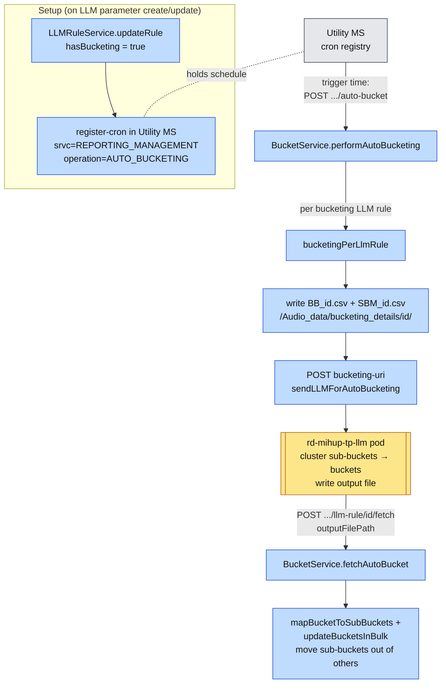

# Auto-Bucketing — Onboarding Guide

> **Audience:** New engineers joining the team.
> **Goal:** Understand what bucketing is, how a bucketing cron gets registered, how the scheduled auto-bucketing run works end to end (Reporting ↔ Utility ↔ the LLM bucketing pod), how new sub-buckets are discovered during normal processing, and how to read which interaction landed in which bucket.
>
> Prerequisite reading: [audio-message-flow.md](audio-message-flow.md) (the `gen-ai` / LLM step in transcript analysis) and [task-flow.md](task-flow.md) (reports). Bucketing builds on top of **LLM rules (a.k.a. "LLM parameters")** and the **LLM output** stored during transcript analysis.

---

## 1. What is bucketing?

An **LLM rule / LLM parameter** runs the LLM over a transcript and emits an output value (e.g. a "reason for call", a "disposition", a free-text category). Across thousands of interactions you get **many distinct raw values** — these are **sub-buckets**. **Bucketing groups those many sub-buckets into a smaller set of meaningful buckets** so a report is readable instead of having hundreds of one-off labels.

Two layers:

| Term | Meaning |
|------|---------|
| **Sub-bucket** | A raw, granular value the LLM produced for a parameter (e.g. `"unable to raise pickup request"`). Discovered automatically as interactions are processed. |
| **Bucket** | A grouping of sub-buckets (e.g. `"Pickup Issues"`). The grouping is produced by **auto-bucketing** (the LLM pod clusters sub-buckets) or edited manually. |
| **`others` / default bucket** | The holding bucket. Every newly discovered sub-bucket starts here until auto-bucketing assigns it to a real bucket. (`Constants.BUCKET_NAME_DEFAULT`.) |

Bucketing is keyed by `llmRuleId` and enabled when the rule has `hasBucketing = true` plus a `bucketingDetails` config.

---

## 2. The moving parts

| Component | Role in bucketing |
|-----------|-------------------|
| **via-reporting-management-microservice** | Owns buckets/sub-buckets, registers the cron, prepares the CSVs, calls the LLM pod, ingests the result. |
| **Utility MS** | Holds the registered cron; at trigger time it calls Reporting's `auto-bucket` endpoint. |
| **rd-mihup-tp-llm** (the "LLM bucketing pod") | Does the actual clustering: reads the CSVs, groups sub-buckets into buckets, writes an output file, and calls back. Config: `bucketing-uri` / `BUCKETING_URI` (default `…/v1/bucketing_inference`). |
| **via-transcript-analysis-async-executor-microservice** | During normal LLM processing, **discovers new sub-buckets** and parks them in the `others` bucket (`createSubBucketMappingIfAbsentV2`). |

---

## 3. Step 1 — Register the bucketing cron (from the LLM parameter)

The cron is **not** scheduled inside Reporting itself. Reporting **registers it in Utility MS**, and Utility later calls back at trigger time.

When you create/update an **LLM rule** with bucketing on, [`LLMRuleService.updateRule`](via-reporting-management-microservice/src/main/java/com/mihup/via/reporting/management/microservice/service/LLMRuleService.java#L337) detects the bucketing config and calls [`updateBucketingCronRegistryAndUpdateTriggerTime`](via-reporting-management-microservice/src/main/java/com/mihup/via/reporting/management/microservice/service/LLMRuleService.java#L516), which:

1. Builds a cron expression from the rule's configured **trigger time** (`bucketingDetails.timing` → [`generateCronExpression`](via-reporting-management-microservice/src/main/java/com/mihup/via/reporting/management/microservice/service/LLMRuleService.java#L540)).
2. **De-registers** any existing bucketing cron, then **registers** the new one in Utility MS — [`HelperService.sendUtilityToDeRegisterBucketingCron`](via-reporting-management-microservice/src/main/java/com/mihup/via/reporting/management/microservice/service/HelperService.java#L1822) → [`sendUtilityToRegisterBucketingCron`](via-reporting-management-microservice/src/main/java/com/mihup/via/reporting/management/microservice/service/HelperService.java#L1786).

Registration call:

```
POST {UTILITY_MICROSERVICE_URL}/internal/v2/cron-mgmt/register-cron
{
  "orgId":           "<organizationId>",
  "org_no":          <organization id>,
  "srvc_name":       "REPORTING_MANAGEMENT",
  "operation":       "AUTO_BUCKETING",
  "cron_expression": "<from trigger time>",
  "interaction_type": 1
}
```

(De-register uses the same shape at `…/deregister-cron`, minus `cron_expression`.)

> So Reporting "owns" the schedule conceptually, but Utility MS is the actual cron registry that fires it.

---

## 4. Step 2 — Scheduled run: Utility → Reporting → LLM pod

At the configured trigger time, **Utility MS calls Reporting's auto-bucket endpoint**:

`POST /internal/v3/bucketing/organizations/{orgId}/auto-bucket` → [`BucketingController.autoBucketTrigger`](via-reporting-management-microservice/src/main/java/com/mihup/via/reporting/management/microservice/controller/BucketingController.java#L154) → [`BucketService.performAutoBucketing`](via-reporting-management-microservice/src/main/java/com/mihup/via/reporting/management/microservice/service/BucketService.java#L510).

`performAutoBucketing` does, per org:

1. Loads all **bucketing-enabled LLM rules** (`findBucketingLLMRules`, `hasBucketing = true`).
2. For each rule whose `bucketingDetails.isAutoBucket()` is true, checks cadence: first run (no `lastRunTimestamp`) **or** enough days elapsed (`checkTimeDifference(lastRunTimestamp, intervalDays)`). If not due, it's skipped.
3. Runs [`bucketingPerLlmRule`](via-reporting-management-microservice/src/main/java/com/mihup/via/reporting/management/microservice/service/BucketService.java#L568) **asynchronously per rule** (virtual-thread pool), then stamps `lastRunTimestamp`.

`bucketingPerLlmRule` prepares the inputs and hands off to the LLM pod:

1. Loads the rule's `others`/default bucket and its current sub-bucket mappings (the raw values waiting to be grouped). If empty → nothing to do.
2. **Writes two CSVs** under `BUCKET_BASE_DIRECTORY` = `/Audio_data/bucketing_details/`:
   - **`BB_<llmRuleId>.csv`** — bucket details (`exportBucketDetailsToCsv`)
     `/Audio_data/bucketing_details/<llm_rule_id>/BB_<llm_rule_id>.csv`
   - **`SBM_<llmRuleId>.csv`** — sub-bucket mapping / granular list (`exportSubBucketMapToCsv`)
     `/Audio_data/bucketing_details/<llm_rule_id>/SBM_<llm_rule_id>.csv`
3. **Calls the LLM bucketing pod** (`rd-mihup-tp-llm`) via [`HelperService.sendLLMForAutoBucketing`](via-reporting-management-microservice/src/main/java/com/mihup/via/reporting/management/microservice/service/HelperService.java#L1856) — `POST {bucketing-uri}` (`/v1/bucketing_inference`) with:

```json
{
  "llmRuleId":            "<llm_rule_id>",
  "organizationId":       "<organizationId>",
  "bucketCount":          <bucketingDetails.maxBucketCount>,
  "bucketDetailsFilePath":"/Audio_data/bucketing_details/<id>/BB_<id>.csv",
  "granularListFilePath": "/Audio_data/bucketing_details/<id>/SBM_<id>.csv"
}
```

The pod reads the CSVs and clusters the sub-buckets into at most `bucketCount` buckets.

---

## 5. Step 3 — LLM pod finishes → notifies us to fetch

When clustering is done, **rd-mihup-tp-llm calls back** into Reporting with the path of its output file:

`POST /internal/v3/bucketing/organizations/{orgId}/llm-rule/{llmRuleId}/fetch` → [`BucketingController.fetchAutoBucket`](via-reporting-management-microservice/src/main/java/com/mihup/via/reporting/management/microservice/controller/BucketingController.java#L164) → [`BucketService.fetchAutoBucket`](via-reporting-management-microservice/src/main/java/com/mihup/via/reporting/management/microservice/service/BucketService.java#L655).

Request body (`AutoBucketingFetchReq`) carries `outputFilePath` (and `rtms`). `fetchAutoBucket`:

1. Reads the pod's output file and builds a **bucket → sub-buckets map** (`csvProcessorService.mapBucketToSubBuckets`).
2. Persists the new grouping (`helperService.updateBucketsInBulk`) — moving sub-buckets out of `others` into their assigned buckets.

After this, the parameter's sub-buckets are organised into the LLM-generated buckets.

---

## 6. End-to-end auto-bucketing diagram



---

## 7. Where sub-buckets come from (transcript analysis)

Auto-bucketing groups sub-buckets — but **the sub-buckets themselves are discovered during normal interaction processing**, not by the cron.

While transcript analysis processes the `gen-ai` step and parses each LLM rule's output ([`getLlmResponsePerRule`](via-transcript-analysis-async-executor-microservice/src/main/java/com/mihup/via/transcript/analysis/async/executor/microservice/service/AnalysisService.java#L1922)), if the rule has bucketing it calls [`createSubBucketMappingIfAbsentV2`](via-transcript-analysis-async-executor-microservice/src/main/java/com/mihup/via/transcript/analysis/async/executor/microservice/service/AnalysisService.java#L2029):

```java
// checking the sub-bucket exists, else adding it to the default bucket
if (Objects.equals(llmRule.getHasBucketing(), true)) {
    try {
        createSubBucketMappingIfAbsentV2(llmRule, ruleResp, llmSubBucketNoSet);
    } catch (Exception e) {
        log.error("createSubBucketMappingIfAbsent: Exception {}", e.getMessage(), e);
    }
}
```

`createSubBucketMappingIfAbsentV2`:
1. Reads the granular value(s) from the LLM output using `bucketingDetails.granularBucketKey` (`extractGranularKeyValues`).
2. For each distinct sub-bucket name: if a mapping already exists, reuse its `subbucketNo`; otherwise **create a new sub-bucket under the `others`/default bucket** (type `AUTOMATIC`) and add it.
3. Collects the resulting `subBucketNo`s onto the report–audio–rule mapping, so the report knows **which sub-bucket this interaction matched**.

> So the pipeline continuously feeds new raw labels into `others`; the periodic auto-bucketing run is what later promotes them into meaningful buckets. The same logic also exists in the all-in-one path ([`via-poc-audio-processing` `LLMService.createSubBucketMappingIfAbsentV2`](via-poc-audio-processing/src/main/java/com/mihup/via/poc/audio/processing/service/LLMService.java#L1145)).

---

## 8. Step 4 — Read which interaction is in which bucket

To see, for a report, which interaction fell under which bucket of an LLM parameter:

`GET /organizations/{orgId}/reports/{reportId}/bkt-interaction-details` → [`ReportingManagementController.getReportBucketingDetails`](via-reporting-management-microservice/src/main/java/com/mihup/via/reporting/management/microservice/controller/ReportingManagementController.java#L935) → `reportingManagementService.getReportInteractionBucketDetails(...)`.

Optional query params: `interactionId` (filter to one interaction), `page`, `size` (default `0` / `10`). It returns the interaction → bucket/sub-bucket breakdown for that report.

---

## 9. Quick mental model

> **Sub-buckets are the raw values; buckets are the tidy groupings.** As interactions flow through transcript analysis, every new LLM label is dropped into the `others` bucket. A cron — registered by Reporting into **Utility MS** when you save the LLM parameter — fires at the trigger time, calls Reporting's `auto-bucket`, which writes `BB_*.csv` + `SBM_*.csv` and hands them to the **rd-mihup-tp-llm** pod. The pod clusters the sub-buckets into ≤ `maxBucketCount` buckets and calls back `…/fetch`, where Reporting reads the output and moves sub-buckets out of `others` into their new buckets. Finally `…/bkt-interaction-details` tells you which interaction sits in which bucket.

### Endpoint quick-reference

| Endpoint | Direction | Purpose |
|----------|-----------|---------|
| `POST {utility}/internal/v2/cron-mgmt/register-cron` | Reporting → Utility | Register the auto-bucketing cron (on LLM param save) |
| `POST .../bucketing/organizations/{orgId}/auto-bucket` | Utility → Reporting | Trigger an auto-bucketing run |
| `POST {bucketing-uri}/v1/bucketing_inference` | Reporting → rd-mihup-tp-llm | Send CSVs, ask pod to cluster |
| `POST .../bucketing/organizations/{orgId}/llm-rule/{llmRuleId}/fetch` | rd-mihup-tp-llm → Reporting | Pod done; ingest output file |
| `GET .../organizations/{orgId}/reports/{reportId}/bkt-interaction-details` | Client → Reporting | Which interaction → which bucket |
