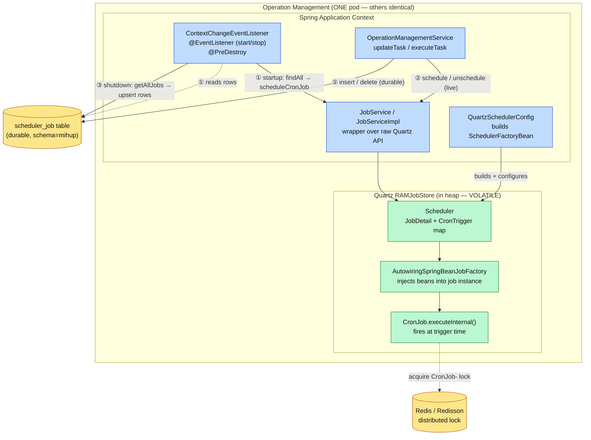
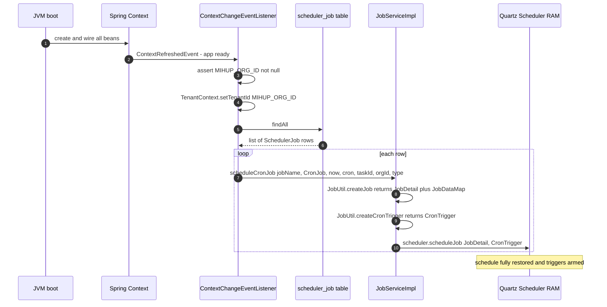
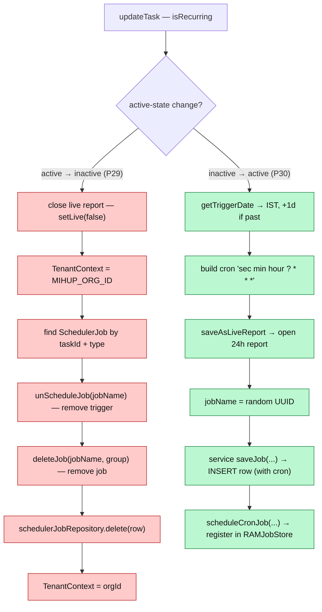
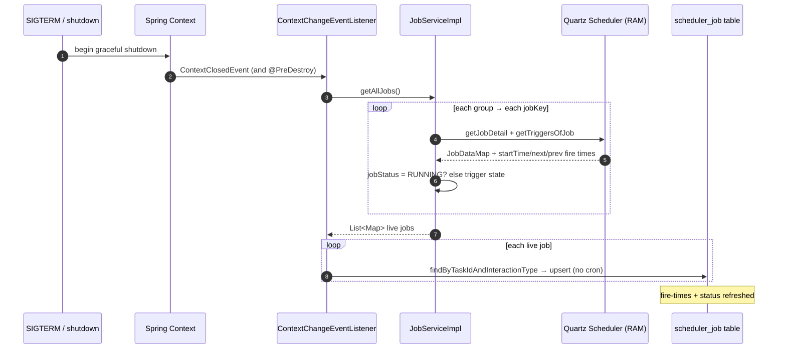
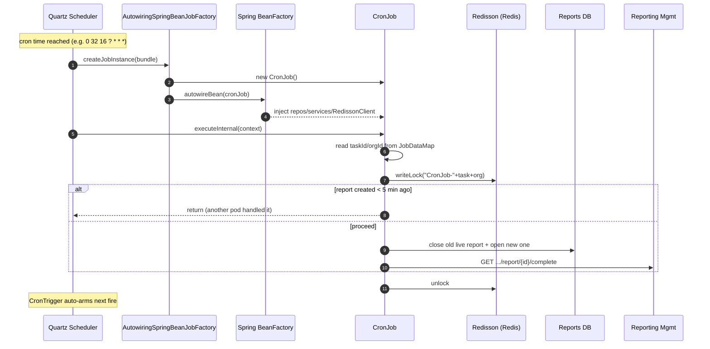
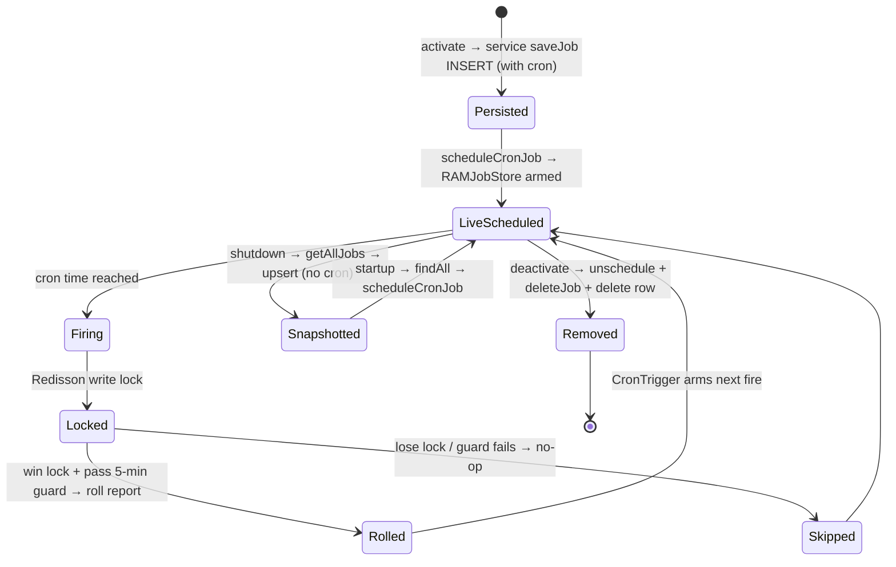

# Recurring Task Scheduling & Spring Context Sync — Deep Dive (Point-to-Point)

> **Audience:** New engineers (especially if Spring scheduling / Quartz / application-context events are new to you).
> **Goal:** Understand **exactly**, line by line, how recurring (Daily) task cron jobs live inside Operation Management: where they are stored, how they survive restarts, and how create / update / delete keeps the in-memory scheduler and the database in lock-step. This is the "event change detection" piece you asked about — we are precise about which part is a Spring *event* and which part is a direct *write-through*.
>
> Prerequisite: [task-flow.md](task-flow.md) §2 (what a Daily Task / recurring report is). This doc is the *plumbing* underneath that.
>
> **How to read this doc:** every mechanism is broken into numbered points (P1, P2, …) so you can map each sentence to a specific line of code. File/line links are clickable.

---

## 0. TL;DR in five sentences

1. Quartz is configured with **`RAMJobStore`**, so all scheduled jobs live in JVM memory and are **lost on restart**.
2. To survive restarts, a durable **`scheduler_job` DB table** keeps one row per recurring job.
3. On **startup**, a Spring `@EventListener` on `ContextRefreshedEvent` reads every DB row and re-registers it into the live scheduler.
4. On **shutdown**, a Spring `@EventListener` on `ContextClosedEvent` (plus `@PreDestroy`) snapshots the live jobs back into the DB.
5. For everyday **create/update/delete** the service does **not** touch the Spring context at all — it **dual-writes** to the DB *and* the live scheduler in the same method.

Everything below is the detailed proof of those five points.

---

## 1. The root cause: an in-memory job store

### 1.1 The configuration that decides everything

[`quartz.properties`](via-operation-management-microservice/src/main/resources/quartz.properties):

```properties
org.quartz.scheduler.instanceName=operationManagementScheduler
org.quartz.scheduler.instanceId=AUTO
org.quartz.threadPool.threadCount=10
org.quartz.jobStore.class=org.quartz.simpl.RAMJobStore     # ← THE key line
spring.quartz.job-store-type=memory                         # ← Spring agrees: in-memory
org.quartz.jobStore.misfireThreshold=60000                  # 60s misfire window
org.quartz.plugin.shutdownHook.class=org.quartz.plugins.management.ShutdownHookPlugin
org.quartz.plugin.shutdownHook.cleanShutdown=TRUE
```

Point by point:

- **P1.** `RAMJobStore` means Quartz holds every `JobDetail` and `Trigger` in a `HashMap` in heap memory. There is **no `qrtz_*` database table**. (The JDBC `JobStoreTX` lines exist but are commented out.)
- **P2.** Therefore a process restart (deploy, crash, OOM, scale event) **wipes the entire schedule**. Quartz, on its own, boots up empty.
- **P3.** `threadCount=10` → up to 10 jobs can fire concurrently inside one pod.
- **P4.** `misfireThreshold=60000` → if a trigger is more than 60 s late firing (e.g. all worker threads were busy), Quartz declares a *misfire* and applies the trigger's misfire instruction (§8.3).
- **P5.** `instanceId=AUTO` + RAMJobStore + **not clustered** → every pod runs an **independent** scheduler with its **own** copy of the jobs. This is why the job body needs a distributed lock (§9).
- **P6.** The `ShutdownHookPlugin` with `cleanShutdown=TRUE` lets Quartz drain cleanly on JVM shutdown — complementary to the Spring `@PreDestroy`/`ContextClosedEvent` save (§7).

### 1.2 The two stores you must hold in your head

| Store | Concretely | Survives restart? | It is the source of truth for… |
|-------|-----------|-------------------|-------------------------------|
| **Quartz `RAMJobStore`** | `JobDetail` + `CronTrigger` objects in heap | ❌ No | *firing* jobs at the right time |
| **`scheduler_job` table** | One JPA row per recurring job | ✅ Yes | *remembering* which jobs should exist |

The entire subsystem is a synchronizer between these two. There are **exactly three** sync moments, and **only two of them are Spring events**:

| # | Moment | Trigger | Direction | Spring event? |
|---|--------|---------|-----------|---------------|
| ① | Startup load | `ContextRefreshedEvent` / `ContextStartedEvent` | DB → RAMJobStore | ✅ yes |
| ② | Runtime CRUD | task create / activate / deactivate API | service → DB **and** RAMJobStore | ❌ no (direct dual-write) |
| ③ | Shutdown save | `ContextClosedEvent` / `ContextStoppedEvent` / `@PreDestroy` | RAMJobStore → DB | ✅ yes |

---

## 2. Component / block diagram



---

## 3. The durable record: `scheduler_job` table

Entity: [`SchedulerJob`](via-commons-framework/src/main/java/com/mihup/via/commons/framework/commons/domain/SchedulerJob.java) (lives in `via-commons-framework`, table `mihup.scheduler_job`).

| Column | Java field | Notes (point-by-point) |
|--------|-----------|------------------------|
| `job_id` | `Long id` | **P7.** PK, `IDENTITY` auto-increment. |
| `task_id` | `UUID taskId` | **P8.** `nullable=false, updatable=false, unique=true`. The business key linking the row to a Task. |
| `org_id` | `UUID orgId` | **P9.** Also `unique=true` *independently*. ⚠️ See §3.1 — this is a real constraint to understand. |
| `job_name` | `String jobName` | **P10.** The random UUID used as the Quartz **job key & trigger key**. This is the handle that ties the DB row to the in-memory job. |
| `group_name` | `String groupName` | **P11.** The Quartz **group** — set to the `orgId` at schedule time. |
| `job_status` | `String jobStatus` | **P12.** Snapshot of Quartz trigger state string (e.g. `SCHEDULED`, `PAUSED`, `RUNNING`). |
| `scheduled_time` | `Date scheduledTime` | **P13.** When it was (next) scheduled to start. |
| `last_fired_time` | `Date lastFiredTime` | **P14.** Last time the trigger fired (filled on shutdown snapshot). |
| `next_fire_time` | `Date nextFireTime` | **P15.** Next planned fire time. |
| `cron_expression` | `String cronExpression` | **P16.** `nullable=false`. The recurrence rule. **Only the runtime-create path writes this** (§6.4) — the shutdown path does not (§7.4). |
| `interaction_type` | `Short interactionType` | **P17.** AUDIO / CHAT / EMAIL / QMS code. Part of the lookup key. |

Repository — [`SchedulerJobRepository`](via-commons-framework/src/main/java/com/mihup/via/commons/framework/commons/repository/SchedulerJobRepository.java):

```java
Optional<SchedulerJob> findByTaskId(UUID taskId);
Optional<SchedulerJob> findByTaskIdAndInteractionType(UUID taskId, short interactionType);
```

- **P18.** Lookups are by `taskId` (or `taskId + interactionType`). That's how an update/delete locates the existing `jobName` to unschedule.

### 3.1 The unique-constraint subtlety (read this)

- **P19.** Both `task_id` **and** `org_id` are declared `unique = true` *separately* (not a composite unique). A separate unique on `org_id` implies **at most one `scheduler_job` row per organization**.
- **P20.** Practical effect: this table models "one recurring scheduler job per org" rather than many. If you ever need multiple recurring tasks per org, this constraint is the first thing you'd hit — worth flagging to the team. (Behaviour as written in the code today.)

---

## 4. The cast — every file in `scheduler/` and `configuration/`

| File | One-line role | Status |
|------|---------------|--------|
| [`QuartzSchedulerConfig`](via-operation-management-microservice/src/main/java/com/mihup/via/operation/management/microservice/configuration/QuartzSchedulerConfig.java) | Builds & configures the `SchedulerFactoryBean` | active |
| [`AutowiringSpringBeanJobFactory`](via-operation-management-microservice/src/main/java/com/mihup/via/operation/management/microservice/configuration/AutowiringSpringBeanJobFactory.java) | Makes Quartz job instances Spring-injectable | active |
| [`ContextChangeEventListener`](via-operation-management-microservice/src/main/java/com/mihup/via/operation/management/microservice/configuration/ContextChangeEventListener.java) | The DB↔scheduler **bridge** (load on start, save on stop) | active |
| [`PersistableCronTriggerFactoryBean`](via-operation-management-microservice/src/main/java/com/mihup/via/operation/management/microservice/configuration/PersistableCronTriggerFactoryBean.java) | Strips non-serializable `jobDetail` ref from trigger data map | active |
| [`JobService`](via-operation-management-microservice/src/main/java/com/mihup/via/operation/management/microservice/scheduler/JobService.java) | Interface for scheduler operations | active |
| [`JobServiceImpl`](via-operation-management-microservice/src/main/java/com/mihup/via/operation/management/microservice/scheduler/JobServiceImpl.java) | Implementation wrapping the raw Quartz `Scheduler` | active |
| [`JobUtil`](via-operation-management-microservice/src/main/java/com/mihup/via/operation/management/microservice/scheduler/JobUtil.java) | Static builders for `JobDetail` & `Trigger` | active |
| [`CronJob`](via-operation-management-microservice/src/main/java/com/mihup/via/operation/management/microservice/scheduler/CronJob.java) | The actual recurring work (report rollover) | active |
| [`JobsListener`](via-operation-management-microservice/src/main/java/com/mihup/via/operation/management/microservice/scheduler/JobsListener.java) | Global Quartz job listener (logging hooks) | active, log-only |
| [`TriggerListner`](via-operation-management-microservice/src/main/java/com/mihup/via/operation/management/microservice/scheduler/TriggerListner.java) | Global Quartz trigger listener (misfire hook) | active, log-only |
| [`SimpleJob`](via-operation-management-microservice/src/main/java/com/mihup/via/operation/management/microservice/scheduler/SimpleJob.java) | One-shot job class | **vestigial** — body fully commented out (§10) |

`SchedulerJob` + `SchedulerJobRepository` are in `via-commons-framework` (shared library).

---

## 5. ① Startup — load DB rows into the live scheduler

### 5.1 What `ContextRefreshedEvent` is (because this is the "event" you wanted to learn)

- **P21.** Spring's `ApplicationContext` publishes lifecycle **events**. `ContextRefreshedEvent` is fired **once the context is fully initialized** — every bean instantiated, dependency-injected, and `@PostConstruct` run. It also fires again after any programmatic `context.refresh()`.
- **P22.** `ContextStartedEvent` fires only if someone calls `context.start()` explicitly (rare; included here for safety).
- **P23.** A method annotated `@EventListener({ ContextRefreshedEvent.class, ContextStartedEvent.class })` is therefore Spring's idiomatic **"run this after the app is ready"** hook. That is the *only* "event detection" in this subsystem — it detects *the app starting*, not *a task changing*.

### 5.2 The method, point by point

[`ContextChangeEventListener.contextRefreshedEvent()`](via-operation-management-microservice/src/main/java/com/mihup/via/operation/management/microservice/configuration/ContextChangeEventListener.java#L41):

```java
@EventListener({ ContextStartedEvent.class, ContextRefreshedEvent.class })
void contextRefreshedEvent() {
    if (MIHUP_ORG_ID == null) throw new IllegalArgumentException("MIHUP_ORG_ID is null"); // P24
    TenantContext.setTenantId(MIHUP_ORG_ID);                                              // P25
    List<SchedulerJob> jobs = schedulerJobRepository.findAll();                           // P26
    if (jobs != null) {
        jobs.forEach(job ->
            jobService.scheduleCronJob(                                                   // P27
                job.getJobName(), CronJob.class, new Date(),
                job.getCronExpression(), job.getTaskId().toString(),
                job.getOrgId().toString(), job.getInteractionType()));
    }
}
```

- **P24.** Guard: `MIHUP_ORG_ID` (`@Value("${mihup-org-id}")`) must be set, else fail fast.
- **P25.** **Multi-tenancy:** the `scheduler_job` table is read under the **platform org** tenant (`MIHUP_ORG_ID`), not the per-customer org. `TenantContext` drives schema/row-level tenant resolution downstream.
- **P26.** `findAll()` returns **every** durable job across all orgs.
- **P27.** For each row, call `scheduleCronJob(...)` which rebuilds the `JobDetail` + `CronTrigger` and registers them into the (currently empty) RAMJobStore. The `new Date()` is the trigger *start time* (now); the **cron expression** governs the actual recurrence, so "now" just means "eligible to start immediately, fire on schedule."
- **P28.** After this loop, the live scheduler is a faithful reconstruction of what existed before the last shutdown. Crucially, `QuartzSchedulerConfig` set `setOverwriteExistingJobs(true)`, so even if a job name collided it's overwritten rather than throwing.

### 5.3 Startup sequence diagram



---

## 6. ② Runtime — create / activate / deactivate (the dual-write)

> **⚠️ Misconception to unlearn:** creating or deleting a recurring task does **NOT** re-fire a `ContextRefreshedEvent` and does **NOT** rebuild the Spring context. Spring contexts are not refreshed per business operation. The service performs a **direct dual-write**: it updates the DB row **and** the live scheduler in the same method. The context events (§5, §7) handle *only* startup-load and shutdown-save.

Location: `OperationManagementService.updateTask(...)`, recurring branch starting at [line 1835](via-operation-management-microservice/src/main/java/com/mihup/via/operation/management/microservice/service/OperationManagementService.java#L1835). There is a parallel create path in `executeTask` at [line 3000](via-operation-management-microservice/src/main/java/com/mihup/via/operation/management/microservice/service/OperationManagementService.java#L3000).

### 6.1 Decision: what state transition is this?

The branch keys off the recurring flag and the active-state change:

- **P29.** `isRecurring && wasActive && !nowActive` → **deactivate** (tear down).
- **P30.** `isRecurring && !wasActive && nowActive` → **activate** (build up).

### 6.2 Activate (off → on) — point by point

```java
Date triggerDate = getTriggerDate(task);                                   // P31
String cronExpression = task.getTriggerTime() != null
    ? "" + sec + " " + min + " " + hour + " ? * * *"                       // P32
    : "0 0 10 ? * * *";                                                    // P33 default 10:00
Report report = saveAsLiveReport(orgNo, task);                             // P34 open live report
...
String jobName = UUID.randomUUID().toString();                            // P35
saveJob(orgId, taskId, jobName, orgId, triggerDate, new Date(),
        triggerDate, "SCHEDULED", cronExpression, type);                  // P36 → DB write
jobService.scheduleCronJob(jobName, CronJob.class, new Date(),
        cronExpression, taskId, orgId, type);                             // P37 → live scheduler
```

- **P31. `getTriggerDate(task)`** ([line 3723](via-operation-management-microservice/src/main/java/com/mihup/via/operation/management/microservice/service/OperationManagementService.java#L3723)): takes the task's `triggerTime` (a time-of-day), pins it to **today** in **`Asia/Kolkata`**; if that instant is already in the past, **adds one day** (so it next runs tomorrow). Returns a `Date`.
- **P32. Cron build:** the expression is assembled by hand as `"<sec> <min> <hour> ? * * *"` from `triggerTime`. This is a **Quartz 7-field** expression (`sec min hour day-of-month month day-of-week year`), `?` = "no specific day-of-month". Example for 16:32:00 → `0 32 16 ? * * *`.
- **P33.** If `triggerTime` is null, default cron `0 0 10 ? * * *` = **10:00:00 every day**.
- **P34.** A new **live report** is opened (`saveAsLiveReport`) — see [task-flow.md](task-flow.md) §2; the recurring report is "live for 24h."
- **P35. `jobName`** is a fresh random `UUID` string — it becomes the Quartz job key **and** trigger key **and** the DB `job_name`.
- **P36. DB write first** via the **service-level `saveJob`** (§6.4) — this *does* persist `cronExpression`.
- **P37. Live-scheduler write second** via `scheduleCronJob` (§8). Now both stores agree.

### 6.3 Deactivate (on → off) — point by point

```java
TenantContext.setTenantId(MIHUP_ORG_ID);                                  // P38
Optional<SchedulerJob> opt = helperService.getFindByTaskIdAndInteractionType(...); // P39
if (opt.isPresent()) {
    SchedulerJob scheduleJob = opt.get();
    jobService.unScheduleJob(scheduleJob.getJobName());                   // P40 remove trigger
    jobService.deleteJob(scheduleJob.getJobName(), scheduleJob.getGroupName()); // P41 remove job
    schedulerJobRepository.delete(scheduleJob);                           // P42 remove DB row
}
TenantContext.setTenantId(orgId);                                         // P43 restore tenant
```

- **P38/P43.** Tenant is switched to `MIHUP_ORG_ID` to touch `scheduler_job`, then restored to the customer org afterward.
- **P39.** Find the durable row by `taskId + interactionType` to recover the `jobName`/`groupName`.
- **P40. `unScheduleJob(jobName)`** removes the **trigger** (`scheduler.unscheduleJob(TriggerKey)`). If the job has no other triggers and isn't durable, Quartz also drops the job.
- **P41. `deleteJob(jobName, groupName)`** explicitly deletes the **job** (and any remaining triggers) using the real `groupName` (= orgId).
- **P42.** Delete the durable row so it won't be reloaded on next startup.
- **P44.** (Side effect earlier in the branch: the current live report is closed — `report.setLive(false)` — and RAG docs cleaned if LLM was on.)

### 6.4 ⭐ Two different `saveJob` methods — do not confuse them

There are **two** `saveJob` helpers, and the difference matters:

| | **Service-level** `saveJob` ([line 2315](via-operation-management-microservice/src/main/java/com/mihup/via/operation/management/microservice/service/OperationManagementService.java#L2315)) | **Listener-level** `saveJob` ([line 83](via-operation-management-microservice/src/main/java/com/mihup/via/operation/management/microservice/configuration/ContextChangeEventListener.java#L83)) |
|---|---|---|
| Called from | runtime **activate** (P36) | **shutdown** snapshot (§7) |
| Sets `cronExpression`? | ✅ **yes** (10-arg signature includes it) | ❌ **no** (9-arg, no cron param) |
| Upsert key | `findByTaskIdAndInteractionType` | `findByTaskIdAndInteractionType` |
| Behaviour if row exists | reuse + overwrite fields | reuse + overwrite fields |

- **P45.** Because `cron_expression` is `nullable=false`, the **first** persistence of a job **must** go through the **service-level** `saveJob` (creation), which supplies the cron. The shutdown snapshot only *updates* timing/status on an **already-existing** row, so it can safely omit cron (the existing value is preserved).
- **P46.** Corollary: the **cron schedule is owned by the runtime-create path**, never by the shutdown snapshot. If a row somehow reached the listener-level `saveJob` without already existing, `cron_expression` would be null and violate the constraint — but in practice creation always inserts it first.

### 6.5 Runtime flow diagram



---

## 7. ③ Shutdown — snapshot the live scheduler back to the DB

### 7.1 Why snapshot at all?

- **P47.** While running, the **live** triggers accumulate fresh `lastFiredTime` / `nextFireTime`. The DB row from creation has stale times. To resume accurately after restart, we copy the live state back to the DB just before the JVM dies.

### 7.2 The hooks

[`ContextChangeEventListener`](via-operation-management-microservice/src/main/java/com/mihup/via/operation/management/microservice/configuration/ContextChangeEventListener.java#L107):

```java
@EventListener({ ContextClosedEvent.class, ContextStoppedEvent.class })   // P48
void contextClosedEvent() { saveSchedulerJobs(); }

@PreDestroy                                                              // P49
public void onDestroy() { saveSchedulerJobs(); }
```

- **P48.** `ContextClosedEvent` fires when the context is closing (graceful shutdown / `SIGTERM` handled by Spring). `ContextStoppedEvent` on explicit `stop()`.
- **P49.** `@PreDestroy` is a JSR-250 bean-destruction callback — a belt-and-suspenders second path to the same `saveSchedulerJobs()`.

### 7.3 `saveSchedulerJobs()` point by point

[lines 58–81](via-operation-management-microservice/src/main/java/com/mihup/via/operation/management/microservice/configuration/ContextChangeEventListener.java#L58):

```java
jobService.getAllJobs().forEach(job -> {                                 // P50
    String orgId = (String) job.get("orgId");
    String taskId = (String) job.get("taskId");
    String jobName = (String) job.get("jobName");
    String groupName = (String) job.get("groupName");
    Date scheduleTime = (Date) job.get("scheduleTime");
    Date lastFiredTime = (Date) job.get("lastFiredTime");
    Date nextFiredTime = (Date) job.get("nextFireTime");
    String jobStatus = (String) job.get("jobStatus");
    Short interactionType = (Short) job.get("interactionType");
    saveJob(orgId, taskId, jobName, groupName, scheduleTime,
            lastFiredTime, nextFiredTime, jobStatus, interactionType);   // P51 (listener-level, no cron)
});
```

- **P50. `jobService.getAllJobs()`** ([JobServiceImpl line 330](via-operation-management-microservice/src/main/java/com/mihup/via/operation/management/microservice/scheduler/JobServiceImpl.java#L330)) walks **every** group → every `JobKey`, reading back `JobDataMap` (`taskId`, `orgId`, `interactionType`) and the trigger's `startTime` / `nextFireTime` / `previousFireTime`, plus computes a `jobStatus` (`RUNNING` if currently executing else the trigger state via `getJobState`).
- **P51.** Each live job is **upserted** into `scheduler_job` via the **listener-level** `saveJob` (no cron, §6.4), keyed by `taskId + interactionType`.
- **P52.** Net result: every durable row now carries the latest `last_fired_time` / `next_fire_time` / `job_status`, ready for the next startup's `findAll()`.

### 7.4 Shutdown sequence diagram



---

## 8. Deep dive: how a job is built and fired (the Quartz internals)

### 8.1 `scheduleCronJob` — JobServiceImpl

[`JobServiceImpl.scheduleCronJob`](via-operation-management-microservice/src/main/java/com/mihup/via/operation/management/microservice/scheduler/JobServiceImpl.java#L68):

```java
String jobKey = jobName, groupKey = orgId, triggerKey = jobName;          // P53
JobDetail jobDetail = JobUtil.createJob(jobClass, false, context,
                       jobKey, groupKey, taskId, orgId, interactionType);  // P54
Trigger cronTrigger = JobUtil.createCronTrigger(triggerKey, date,
                       cronExpression, SimpleTrigger.MISFIRE_INSTRUCTION_FIRE_NOW); // P55
Date dt = schedulerFactoryBean.getScheduler().scheduleJob(jobDetail, cronTrigger); // P56
```

- **P53.** Job key = `jobName`; **group = `orgId`**; trigger key = `jobName`. (So a Quartz job is uniquely `(jobName, orgId)`.)
- **P54.** `createJob(isDurable=false, ...)` — non-durable, so the job auto-deletes once it has no triggers.
- **P55.** Cron trigger built with misfire instruction `FIRE_NOW`.
- **P56.** `scheduler.scheduleJob` inserts both into the RAMJobStore and arms the trigger.

### 8.2 `JobUtil.createJob` — stashing context into the JobDataMap

[`JobUtil.createJob`](via-operation-management-microservice/src/main/java/com/mihup/via/operation/management/microservice/scheduler/JobUtil.java#L31):

```java
JobDetailFactoryBean f = new JobDetailFactoryBean();
f.setJobClass(jobClass);                 // CronJob.class
f.setDurability(isDurable);              // false for cron jobs
f.setApplicationContext(context);        // P57 Spring-aware
f.setName(jobName); f.setGroup(jobGroup);
f.setRequestsRecovery(true);             // P58 re-run if pod died mid-execution
JobDataMap m = new JobDataMap();
m.put("taskId", taskId);                 // P59
m.put("orgId", orgId);
m.put("interactionType", interactionType);
f.setJobDataMap(m);
```

- **P57.** The factory is given the Spring `ApplicationContext` so the produced `JobDetail` cooperates with the autowiring job factory.
- **P58.** `requestsRecovery=true` → if the pod crashed *while* this job was executing, Quartz re-executes it on recovery. (Pairs with `InterruptableJob` in `CronJob`.)
- **P59.** **The only channel of data into the job** is the `JobDataMap`: `taskId`, `orgId`, `interactionType`. `CronJob.executeInternal` reads exactly these back out (§8.5).

### 8.3 `JobUtil.createCronTrigger` + `PersistableCronTriggerFactoryBean`

[`createCronTrigger`](via-operation-management-microservice/src/main/java/com/mihup/via/operation/management/microservice/scheduler/JobUtil.java#L64) uses [`PersistableCronTriggerFactoryBean`](via-operation-management-microservice/src/main/java/com/mihup/via/operation/management/microservice/configuration/PersistableCronTriggerFactoryBean.java):

- **P60.** It sets name, start time, cron expression, misfire instruction.
- **P61.** `PersistableCronTriggerFactoryBean.afterPropertiesSet()` calls super then **removes the `jobDetail` key** from the trigger's data map. Why: Spring's `CronTriggerFactoryBean` puts a live `JobDetail` *object* into the trigger data map; that object isn't a plain string and breaks property-based serialization. Removing it keeps the trigger clean. (Defensive even under RAMJobStore, and required if the JDBC store with `useProperties=true` is ever enabled.)

### 8.4 `AutowiringSpringBeanJobFactory` — why `@Autowired` works inside `CronJob`

- **P62.** Quartz instantiates job classes via reflection (`newInstance`). A raw instance has **null** `@Autowired` fields.
- **P63.** [`AutowiringSpringBeanJobFactory.createJobInstance`](via-operation-management-microservice/src/main/java/com/mihup/via/operation/management/microservice/configuration/AutowiringSpringBeanJobFactory.java#L19) overrides job creation: after Quartz builds the object, it calls `beanFactory.autowireBean(job)` so Spring injects all dependencies (repositories, services, `RedissonClient`, etc.).
- **P64.** Registered in [`QuartzSchedulerConfig.schedulerFactoryBean()`](via-operation-management-microservice/src/main/java/com/mihup/via/operation/management/microservice/configuration/QuartzSchedulerConfig.java#L35) via `factory.setJobFactory(jobFactory)`. The same config also: `setOverwriteExistingJobs(true)`, `setAutoStartup(true)`, registers `triggerListner` + `jobsListener`, and loads `quartz.properties`.

### 8.5 Fire time — `CronJob.executeInternal`

[`CronJob.executeInternal`](via-operation-management-microservice/src/main/java/com/mihup/via/operation/management/microservice/scheduler/CronJob.java#L109):

- **P65.** Reads `taskId` + `orgId` from the merged `JobDataMap`; sets `TenantContext`.
- **P66.** Acquires a **Redisson distributed read/write lock** `"CronJob-" + taskId + orgId` (write lock) — cross-pod mutual exclusion (§9).
- **P67.** Finds the current **live** report; **5-minute guard**: if it was created < 5 min ago, returns (another pod just rolled it).
- **P68.** Closes the old report (`isLive=false`, `taskEndTimestamp=now`, count interactions, snapshot), opens a fresh live report, refreshes RAG docs if Gen-AI+LLM, and notifies Reporting Management's `.../report/{reportId}/complete`.
- **P69.** It does **not** reschedule itself — the **CronTrigger** handles recurrence automatically (fires again at the next cron time). The `getTriggerDate(...)` call inside is only for a "will run at" log line.

### 8.6 Fire-time sequence diagram (with autowiring + lock)



---

## 9. Why the distributed lock is mandatory here

- **P70.** RAMJobStore is **per-JVM and not clustered**. With N replicas of Operation Management, **all N** load the same `scheduler_job` rows on startup (§5) and **all N** arm identical cron triggers.
- **P71.** At the cron instant, **all N pods fire `CronJob` simultaneously**. Without coordination they'd each roll the report → duplicates.
- **P72.** The Redisson write lock `CronJob-<taskId><orgId>` + the 5-minute freshness guard ensure **exactly one** pod performs the rollover; the rest no-op. This is the deliberate trade-off for choosing the simpler in-memory store over a clustered JDBC store. (Full report logic: [task-flow.md](task-flow.md) §2.)

---

## 10. `SimpleJob` is vestigial (don't be misled by it)

- **P73.** [`SimpleJob`](via-operation-management-microservice/src/main/java/com/mihup/via/operation/management/microservice/scheduler/SimpleJob.java) extends `QuartzJobBean` and `InterruptableJob`, but its `executeInternal` body is **entirely commented out** — it does nothing.
- **P74.** Every caller of `scheduleOneTimeJob(... SimpleJob.class ...)` across the service and `VIAOperationManagementMicroserviceApplication` is also commented out.
- **P75.** Takeaway: **recurring tasks use `CronJob` only.** `SimpleJob` is dead scaffolding from an earlier one-shot-job design; ignore it when reasoning about the live flow.

---

## 11. End-to-end "point-to-point" trace (one recurring task, full lifetime)

| Step | Actor | Action | Touches |
|------|-------|--------|---------|
| 1 | User/API | Activate recurring task | — |
| 2 | `OperationManagementService` | `getTriggerDate` → IST, +1 day if past (P31) | — |
| 3 | `OperationManagementService` | Build cron `sec min hour ? * * *` (P32) | — |
| 4 | `OperationManagementService` | `saveAsLiveReport` (open 24h report) | Reports DB |
| 5 | `OperationManagementService` | `jobName = UUID` (P35) | — |
| 6 | service `saveJob` | INSERT `scheduler_job` row **with cron** (P36/P45) | **DB** |
| 7 | `scheduleCronJob` | Build JobDetail+CronTrigger, `scheduler.scheduleJob` (P37/P56) | **RAMJobStore** |
| 8 | Quartz | At cron time, `AutowiringSpringBeanJobFactory` builds+injects `CronJob` (P62-64) | RAMJobStore |
| 9 | `CronJob` | Redisson lock + 5-min guard (P66-67) | Redis |
| 10 | `CronJob` | Roll report; notify Reporting Mgmt (P68) | Reports DB / Reporting MS |
| 11 | Quartz | CronTrigger auto-arms next day's fire (P69) | RAMJobStore |
| 12 | Pod shutdown | `ContextClosedEvent`/`@PreDestroy` → `getAllJobs` → upsert (no cron) (P48-51) | RAMJobStore → **DB** |
| 13 | Pod startup | `ContextRefreshedEvent` → `findAll` → `scheduleCronJob` per row (P21-28) | **DB → RAMJobStore** |
| 14 | User/API | Deactivate task | — |
| 15 | `OperationManagementService` | `unScheduleJob` + `deleteJob` + `repository.delete` (P40-42) | RAMJobStore + **DB** |

---

## 12. Job lifecycle (state view)



The **LiveScheduled ⇄ Snapshotted** loop across a restart is the entire reason this subsystem exists. Everything else is ordinary scheduling.

---

## 13. Gotchas & operational notes (consolidated)

- **G1. In-memory = per-pod.** No clustering → rely on the Redisson lock + 5-min guard for single-execution (P70-72).
- **G2. Hard crash skips the shutdown save.** `kill -9` bypasses `ContextClosedEvent`/`@PreDestroy`, so `next_fire_time` isn't refreshed — but the row still exists from creation, so the job is reloaded on next boot from its original cron (P47, P52).
- **G3. Tenant juggling.** `scheduler_job` is always read/written under `MIHUP_ORG_ID`; the job itself carries the real `orgId` in its JobDataMap and group (P25, P38, P59).
- **G4. Quartz 7-field cron**, not 5-field Unix (`sec min hour ? * * *`). Default `0 0 10 ? * * *` = 10:00 daily (P32-33).
- **G5. One job per org constraint.** `org_id` is uniquely constrained → effectively one recurring scheduler job per org (P19-20).
- **G6. Two `saveJob`s.** Creation writes cron (service-level); shutdown does not (listener-level). Order matters (P45-46).
- **G7. `SimpleJob` is dead code** — recurring tasks are `CronJob` only (P73-75).
- **G8. `requestsRecovery=true`** — a job interrupted by a crash is re-run on recovery (P58).

---

## 14. Quick mental model

> **Quartz forgets; the database remembers; the context listener is the bridge — and runtime edits skip the bridge entirely.** Recurring jobs live in an in-memory Quartz `RAMJobStore`, so they vanish on restart. The durable `scheduler_job` table is the backup. On **startup**, `ContextRefreshedEvent` reloads every row into the scheduler; on **shutdown**, `ContextClosedEvent`/`@PreDestroy` snapshot the live jobs back. For everyday **create/update/delete**, the service never refreshes the context — it dual-writes to the table *and* the live scheduler at once. The Spring *events* are strictly boot/teardown hooks; runtime changes are direct dual-writes; and because every pod runs its own copy of the schedule, a Redisson lock guarantees only one pod actually does the work when a job fires.
