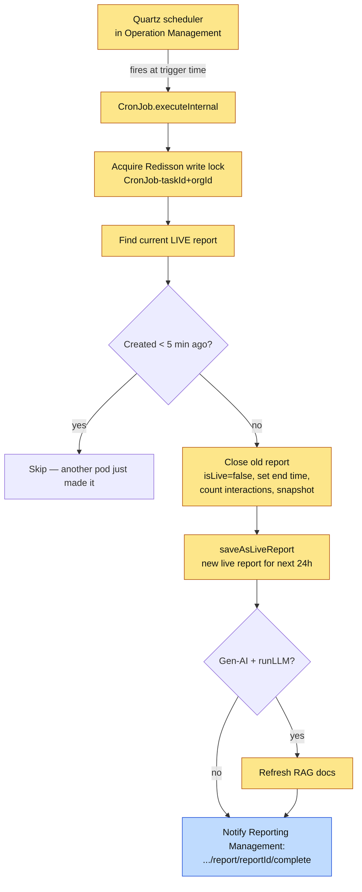
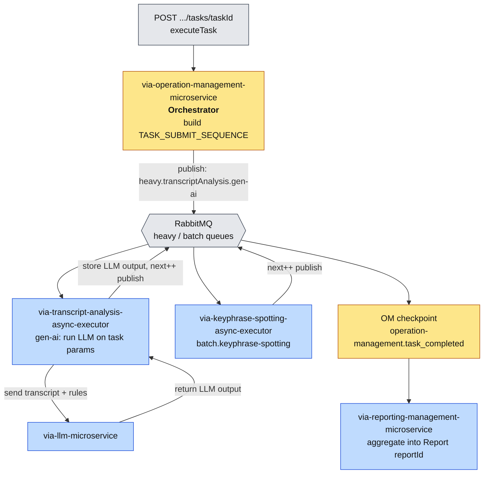

# Tasks & Reports — Onboarding Guide

> **Audience:** New engineers joining the team.
> **Goal:** Understand what a **Task** is, the two kinds of tasks, how each one runs, and how every task execution produces a **Report**.
>
> Read [audio-message-flow.md](audio-message-flow.md) first — Tasks reuse the same orchestrator (Operation Management), the same message envelope, and the same RabbitMQ pipeline concepts described there.

---

## 1. What is a Task?

A **Task** is a configured unit of analysis that runs over a set of interactions (audios / chats / emails) and produces a **Report**. Where the flows in [audio-message-flow.md](audio-message-flow.md) process **one fresh interaction as it arrives**, a Task runs analysis **across already-ingested interactions** — typically to apply rules (LLM rules, keyphrase rules) and aggregate the results into a report a QA team can act on.

> **One rule to remember:** **every Task execution produces a Report.** A Task is the *definition*; a Report is the *output of running it*.

There are **two types of Task**:

| Type | Triggered by | Cadence | Report behaviour |
|------|--------------|---------|------------------|
| **Daily Task** | A **CronJob inside Operation Management** | Automatic, recurring at a configured **trigger time** | Creates a **recurring/live report** that **stays live for 24 hours** and is **regenerated** each cycle |
| **Manual Task** | A **user API call** (`executeTask`) | On-demand, one-off | Runs the analysis pipeline over the task's interactions and produces a report |

---

## 2. Daily Task (recurring, cron-driven)

### What it is
A **Daily Task** is a recurring task whose schedule lives in **Operation Management** as a **Quartz CronJob** ([`CronJob.java`](via-operation-management-microservice/src/main/java/com/mihup/via/operation/management/microservice/scheduler/CronJob.java)). It is responsible for keeping a **live report** that represents "everything processed in the current 24-hour window." At the configured **trigger time**, the cron fires and **rolls the report over**: it closes the currently-live report and opens a fresh one for the next window.

### What the cron does on each trigger (the rollover)
Each fire of `CronJob.executeInternal(...)`:
1. Resolves the `taskId` + `orgId` from the job data and takes a **distributed write lock** (Redisson) so multiple Operation Management pods don't double-fire the same task.
2. Finds the **current live report** for the task (`isLive = true`).
3. **Closes the old report:** sets `taskEndTimestamp = now`, `isLive = false`, counts the interactions submitted in that window (`noOfAudioProcessed`), snapshots the task config, and saves it.
   - Guard: if the live report was created **less than 5 minutes ago**, it skips — this protects against another pod having *just* created the report.
4. **Opens a new live report** for the next window via `saveAsLiveReport(...)` (new `reportId`, `taskStartTimestamp = now`, `isLive = true`).
5. If the org has **Gen-AI** enabled and the task has `runLLM = true`, it refreshes the **RAG documents** for the recurring task.
6. **Notifies Reporting Management** to complete/aggregate the just-closed report:
   `GET {reporting-host}/internal/v2/reporting/organizations/{orgId}/{interactionType}/report/{reportId}/complete`

So the live report is always "open" and accumulating; the trigger is the moment it gets sealed, handed to Reporting Management, and replaced.

> **Mental model for Daily Task:** a rolling 24-hour report. The cron is a metronome — every trigger time it **cuts** the current report (finalizes + sends to reporting) and **starts a fresh one**. It works on the org's already-ingested interactions; it does not re-run ASR/diarization.



---

## 3. Manual Task (on-demand, API-driven)

### How it's triggered
A user/system triggers a manual task through Operation Management:

`POST /internal/api/v2/organizations/{orgID}/tasks/{taskId}` → [`executeTask(...)`](via-operation-management-microservice/src/main/java/com/mihup/via/operation/management/microservice/controller/OperationManagementController.java#L173)

The controller calls [`OperationManagementService.executeTask(...)`](via-operation-management-microservice/src/main/java/com/mihup/via/operation/management/microservice/service/OperationManagementService.java#L2420), which builds the task message and publishes it onto RabbitMQ — just like the audio flow, but with a **task-specific sequence**.

### The task sequence (shorter than the ingestion flow)
A task does **not** re-ingest audio. Diarization and ASR already ran when the interaction was first uploaded, so the transcript exists. The base task sequence ([`FeatureSequenceService.TASK_SUBMIT_SEQUENCE`](via-operation-management-microservice/src/main/java/com/mihup/via/operation/management/microservice/service/FeatureSequenceService.java#L40)) is just:

```
gen-ai  →  keyphrase-spotting  →  operation-management.task_completed
```

### The published message (manual task)

```json
publishAction : published message : {
  "operations": {
    "order": [
      "heavy.transcriptAnalysis.gen-ai",
      "batch.keyphrase-spotting",
      "operation-management.task_completed"
    ],
    "next": 0
  },
  "message": "Task Submitted for audioIds :fb08dbe2-d7c9-4d26-a180-32a768e4e270",
  "interactionId": "fb08dbe2-d7c9-4d26-a180-32a768e4e270",
  "organizationId": "051eb637-a87c-4e9d-9c76-ace44f2998df",
  "organizationCode": "bfsi_test_org",
  "interactionType": "AUDIO",
  "interactionTypeMode": 1,
  "interactionName": "..._recording_6a031d7f1ee9a.mp3",
  "interactionParentDir": "/uploads/051eb637-.../audio/fb08dbe2-.../",
  "outputFormat": null,
  "ruleIds": ["d79a6e5a-b40b-4b6d-a255-04d0e5ba52d4"],
  "dialogueRuleIds": [],
  "advancedRuleIds": [],
  "llmRuleIds": [],
  "reportId": "139367cf-31e2-4c47-8cbb-79ee6f53c9c0"
}
for routingKey : batch.keyphrase-spotting
```

Notice vs. the ingestion message:
- **`order`** is the short task sequence — no `adv-dia`, no `asr`. The interaction is already transcribed.
- **Routing keys carry a queue prefix** — `heavy.transcriptAnalysis.gen-ai`, `batch.keyphrase-spotting`. The prefix (`heavy` / `batch`) comes from the task's **queue identifier** and routes task work onto **dedicated queues** so a large task run doesn't compete with the live, low-latency interaction flow. (See `task.getTaskQueueIdentifier()` in [`OperationManagementService`](via-operation-management-microservice/src/main/java/com/mihup/via/operation/management/microservice/service/OperationManagementService.java#L3316): `general` → `batch.keyphrase-spotting`, otherwise `<identifier>.keyphrase-spotting`.)
- **`ruleIds`** carries the rules the task should evaluate; **`reportId`** is the report this run will populate.

### Step-by-step

1. **`gen-ai` (LLM analysis)** — handled by **via-transcript-analysis-async-executor-microservice**. The task asks for LLM output for the parameters/rules defined on it, run against the audio's transcript. The **actual LLM processing happens in transcript analysis**, which calls **via-llm-microservice**; the LLM microservice **returns the result to transcript analysis**, which **stores the LLM output**.
2. **`keyphrase-spotting`** — handled by **via-keyphrase-spotting-async-executor-microservice**, applying the task's rules.
3. **`operation-management.task_completed`** — orchestrator checkpoint: Operation Management finalizes and **Reporting Management aggregates** the results into the task's report.



---

## 4. Daily vs. Manual — side by side

| | Daily Task | Manual Task |
|---|------------|-------------|
| Trigger | Quartz **CronJob** in Operation Management, at configured trigger time | **API call** `POST .../tasks/{taskId}` (`executeTask`) |
| Cadence | Recurring | One-off, on demand |
| Report | **Live** report, valid **24h**, regenerated each cycle; cron seals the old one and opens a new one | Produces/populates the report for that run (`reportId` in the message) |
| Processing route | Rolls the report window + notifies Reporting Management to complete | Publishes `gen-ai → keyphrase-spotting → task_completed` on **heavy/batch** queues |
| Re-runs ASR/diarization? | No | No — works on already-transcribed interactions |
| Common ground | **Operation Management orchestrates; Reporting Management aggregates; every execution yields a Report** | same |

---

## 5. Where things live (code pointers)

| Concern | Location |
|---------|----------|
| Manual task API | [`OperationManagementController.executeTask`](via-operation-management-microservice/src/main/java/com/mihup/via/operation/management/microservice/controller/OperationManagementController.java#L173) |
| Manual task logic | [`OperationManagementService.executeTask`](via-operation-management-microservice/src/main/java/com/mihup/via/operation/management/microservice/service/OperationManagementService.java#L2420) |
| Task sequence definition | [`FeatureSequenceService`](via-operation-management-microservice/src/main/java/com/mihup/via/operation/management/microservice/service/FeatureSequenceService.java#L40) (`TASK_SUBMIT_SEQUENCE`) |
| Task routing-key prefix | [`OperationManagementService`](via-operation-management-microservice/src/main/java/com/mihup/via/operation/management/microservice/service/OperationManagementService.java#L3316) (`taskQueueIdentifier`) |
| Daily/recurring cron | [`CronJob.executeInternal`](via-operation-management-microservice/src/main/java/com/mihup/via/operation/management/microservice/scheduler/CronJob.java#L109) |
| Cron scheduling/registration | [`scheduler/`](via-operation-management-microservice/src/main/java/com/mihup/via/operation/management/microservice/scheduler/) (`JobService`, `JobServiceImpl`, `JobUtil`) |
| `task_completed` handling | `OperationManagementService` — `case "task_completed"` |

---

## 6. Quick mental model to remember

> **A Task is a recipe; a Report is the dish.** A **Manual Task** is cooked on demand — Operation Management publishes a short `gen-ai → keyphrase → task_completed` route onto dedicated *heavy/batch* queues, transcript analysis runs the LLM (via the LLM microservice) and keyphrase rules, then Reporting Management plates the report. A **Daily Task** is a rolling 24-hour report kept by a cron in Operation Management — every trigger time it seals the current report, sends it to Reporting Management, and starts a fresh one.
