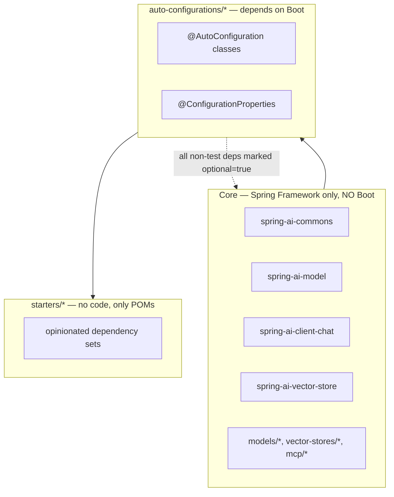

# 00 · Setup, Build, and the Rules That Shape the Code

Before the architecture, the constraints. Spring AI's design is visibly shaped by four
hard rules enforced by the build. Knowing them prevents most first-PR rejections.

---

## 1. Toolchain

| Requirement | Value | Where it is declared |
|---|---|---|
| JDK | **17.0.19-librca** (Liberica 17) | [`.sdkmanrc`](../.sdkmanrc) |
| Language level | Java 17 | `<java.version>` in [`pom.xml`](../pom.xml) |
| Build | Maven wrapper (`./mvnw`), Maven ≥ 3.9.1 enforced | [`pom.xml`](../pom.xml) |

The JDK is not interchangeable. The build passes `-XDaddTypeAnnotationsToSymbol` to
`javac` for nullability analysis, which needs a JDK carrying
[JDK-8373586](https://bugs.openjdk.org/browse/JDK-8373586). On Apple Silicon you also
need a **native arm64** JDK — Spring AI pulls in PyTorch (`models/spring-ai-transformers`),
which is CPU-architecture specific.

```bash
sdk env install    # installs the JDK pinned in .sdkmanrc
sdk env            # activates it for this shell
java -XshowSettings:properties -version 2>&1 | grep os.arch   # must match your CPU
```

## 2. The build commands you will actually use

```bash
# Full build of everything — slow, do this before opening a PR
./mvnw clean package

# Build one module and everything it needs (-am = also make dependencies)
./mvnw -am -pl spring-ai-client-chat clean test

# Apply the mandatory code format (does NOT fix import order — see below)
./mvnw process-sources

# The pre-PR command from the reference docs
./mvnw spring-javaformat:apply javadoc:javadoc -Pjavadoc

# Integration tests for one module (skipped automatically without API keys)
./mvnw -am -pl vector-stores/spring-ai-pgvector-store -Pintegration-tests verify

# One integration test, with a retry for flaky hosted services
./mvnw -am -pl vector-stores/spring-ai-pgvector-store -Pintegration-tests \
  -Dfailsafe.failIfNoSpecifiedTests=false -Dfailsafe.rerunFailingTestsCount=2 \
  -Dit.test=PgVectorStoreIT verify

# Build broken for no reason? Suspect the build cache.
./mvnw -Dmaven.build.cache.enabled=false clean package
rm -rf ~/.m2/build-cache/     # nuclear option
```

The [Maven build-cache extension](https://maven.apache.org/extensions/maven-build-cache-extension/)
is **on by default**. If a build fails inexplicably, disabling the cache is the first
diagnostic — and if that fixes it, that is a bug worth filing.

## 3. Rule one — Null safety is compiler-enforced

Spring AI 2.0 uses **JSpecify + NullAway + ErrorProne**. Read
[`design/01-null-safety.adoc`](../design/01-null-safety.adoc) in full before writing code.

The granularity is **the package**, and only production code is annotated:

```java
// src/main/java/org/springframework/ai/foo/package-info.java
@NullMarked
package org.springframework.ai.foo;

import org.jspecify.annotations.NullMarked;
```

> Java packages are **not hierarchical**. `org.springframework.ai.foo.bar` does *not*
> inherit `@NullMarked` from `org.springframework.ai.foo`. **Every new package needs its
> own `package-info.java`.** This is the single most common thing new contributors miss.

Inside a `@NullMarked` package everything is non-null by default. Annotate the
exceptions, and note it is a **type-use** annotation, so it sits next to the type:

```java
private @Nullable Foo foo;                       // correct
public MyThing(@Nullable String bar, Foo foo) { ... }
Filter.@Nullable Expression filterExpression;    // nested type — annotation goes inside
```

Annotations only inform the compiler. Consumers may still pass `null`, so assert at
boundaries — and note the two different idioms:

```java
// Constructors / methods, where the value is a parameter → IllegalArgumentException
Assert.notNull(chatModel, "chatModel cannot be null");

// Builders, where the value is accumulated state → IllegalStateException
Assert.state(this.prompt != null, "prompt cannot be null");
```

You can see both in [`ChatClientRequest`](../spring-ai-client-chat/src/main/java/org/springframework/ai/chat/client/ChatClientRequest.java):
`Assert.notNull` in the record's compact constructor, `Assert.state` in `Builder.build()`.

**LLD lesson:** nullability is part of a type's contract. Spring AI moves that contract
from Javadoc prose into the type system, where a compiler can check it. When you design
an interface, decide the nullability of every parameter and return *before* writing the
body — as a design decision, not an implementation detail.

## 4. Rule two — The core must not depend on Spring Boot

Read [`design/02-boot-modularity.adoc`](../design/02-boot-modularity.adoc).



Three rules, enforced by `maven-enforcer-plugin`'s `bannedDependencies`:

1. **Core modules must not depend on Boot.** All Spring AI functionality must work in a
   plain Spring Framework application.
2. **Auto-configuration modules mark every non-test dependency `optional=true`** —
   including `spring-boot-autoconfigure` — except dependencies on other
   auto-configuration modules. An auto-config module must have zero impact when the
   underlying library is absent from the classpath.
3. **Starters contain no code.** They exist only to pull in the auto-configuration module
   plus its real (non-optional) transitive dependencies.

If your PR adds a dependency in the wrong place, the enforcer fails the build. That is
the design being defended, not a nuisance.

**LLD lesson:** this is the Dependency Inversion Principle expressed at module
granularity. The abstraction (`ChatModel`) lives in a module that knows nothing about the
framework that wires it. Wiring is a leaf of the dependency graph, never a root.

## 5. Rule three — Formatting is mechanical, import order is not

Formatting is applied by [spring-javaformat](https://github.com/spring-io/spring-javaformat)
and enforced by CI. Run `./mvnw process-sources`. But **the plugin does not fix import
order** — you must do that yourself:

```
java.*
<blank>
javax.*
jakarta.*
<blank>
all other imports
<blank>
org.springframework.*
<blank>
static imports
```

Other non-negotiables: **tabs, not spaces**. UTF-8. LF line endings. No trailing
whitespace. Javadoc wrapped at 90 chars, code at ~120. **No wildcard imports, ever** —
not even in tests. **No static imports in production code**, with two carve-outs:
constants/enum constants, and static factory methods of third-party DSLs. In test code,
static imports are expected (`import static org.assertj.core.api.Assertions.assertThat;`).

Every source file: license header → package → imports → **exactly one top-level class**,
each section separated by exactly one blank line. New public API types and methods carry
an `@since` tag.

In `.adoc` and `.md` files: **one sentence per line.** This makes documentation diffs
reviewable.

## 6. Rule four — Commit messages have a fixed shape

```text
Add Contribution Guidelines

This commit adds CONTRIBUTING.md describing the Contribution
procedure, mentions Contribution Guidelines in the README.md and
mentions CODE_OF_CONDUCT in the README.md.

Fixes #123

Signed-off-by: Firstname Lastname <username@users.noreply.github.com>
```

- Title < 50 chars, starts with an **uppercase verb**, wraps types/filenames in backticks.
- **No** `fix:` / `feat:` / `docs:` prefixes. **No** issue or PR number in the title.
- Body wrapped at ~72 chars.
- Link issues in the body: `Fixes #123` to close, `See #123` to reference only.
- **`Signed-off-by` is mandatory** (DCO). Use `git commit -s`.

Look at the real history for calibration — `Close the resource stream in TextReader`,
`Backfill additionalProperties: false in OpenAI strict tool schemas`,
`Handle malformed pdf in PdfDocumentReader`. Short, imperative, specific.

## 7. Verify your setup

```bash
sdk env
./mvnw -am -pl spring-ai-commons clean test
```

If that passes, you have a working environment. Now go to
[01 · Architecture Overview](01-architecture-overview.md).
