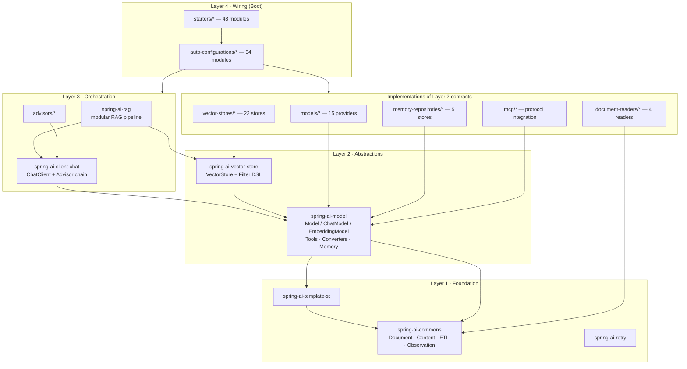
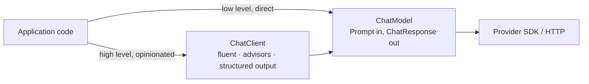
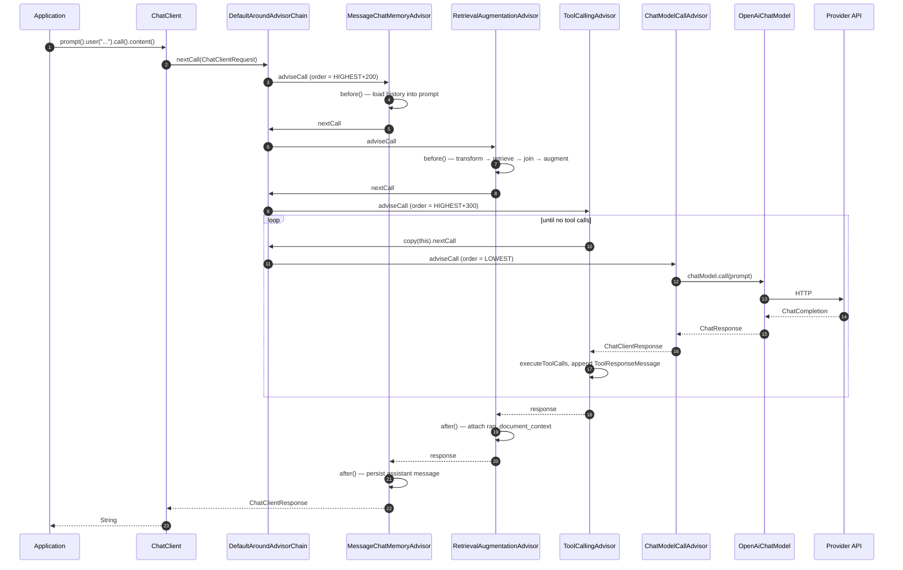

# 01 · Architecture Overview — The Module Map

168 Maven modules sound intimidating. They are not: **~10 modules contain the design,
and ~158 are implementations of interfaces those 10 define.** Learn the 10, and every
other module becomes a variation you can read in an afternoon.

---

## 1. The one diagram to memorise

Those arrows are the real Maven `<dependency>` edges — verify with
`grep -A2 "<artifactId>spring-ai-" spring-ai-model/pom.xml`.

**Read the arrows as the design.** Nothing in Layer 1 or 2 knows Layer 3 or 4 exists.
`spring-ai-model` has never heard of `ChatClient`. `spring-ai-commons` has never heard of
an LLM. The dependency graph is acyclic and strictly downward — which is why you can use
a `VectorStore` without a `ChatClient`, and a `ChatModel` without Spring Boot.

## 2. The two entry points, and why there are exactly two

Users touch Spring AI at one of two altitudes:

This mirrors Spring's own `RestClient` (high level) vs. `HttpClient` (low level) split,
and it is a deliberate LLD choice: **a convenience layer must never be the only layer.**
`ChatClient` is built *on* `ChatModel` using only public API — nothing in `ChatClient`
requires privileged access. That is the test for whether a facade is honest.

## 3. Module-by-module responsibility table

### Layer 1 — Foundation

| Module | Owns | Key types |
|---|---|---|
| `spring-ai-commons` | Data + ETL primitives, zero AI concepts | `Document`, `Content`, `Media`, `DocumentReader/Transformer/Writer`, `TextSplitter`, observation conventions |
| `spring-ai-template-st` | StringTemplate-based prompt rendering | `TemplateRenderer` implementations |
| `spring-ai-retry` | Retry policy for flaky provider APIs | retry templates & listeners |

### Layer 2 — Abstractions

| Module | Owns | Key types |
|---|---|---|
| `spring-ai-model` | The generic Model API and everything modelled on it | `Model`, `StreamingModel`, `ChatModel`, `EmbeddingModel`, `ImageModel`, `Prompt`, `ChatOptions`, `ToolCallback`, `ToolCallingManager`, `StructuredOutputConverter`, `ChatMemory` |
| `spring-ai-vector-store` | Storage-agnostic vector search + a portable filter DSL | `VectorStore`, `SearchRequest`, `Filter`, `FilterExpressionConverter`, `AbstractObservationVectorStore` |

### Layer 3 — Orchestration

| Module | Owns | Key types |
|---|---|---|
| `spring-ai-client-chat` | The fluent client and the interception chain | `ChatClient`, `Advisor`, `CallAdvisor`, `StreamAdvisor`, `DefaultAroundAdvisorChain`, `ToolCallingAdvisor` |
| `spring-ai-rag` | Composable retrieval-augmented generation | `RetrievalAugmentationAdvisor`, `QueryTransformer`, `QueryExpander`, `DocumentRetriever`, `DocumentJoiner`, `DocumentPostProcessor`, `QueryAugmenter` |
| `advisors/*` | Advisors that need heavier dependencies | tool-search advisor, vector-store advisor |

### Layer 4 — Wiring

| Module family | Count | Rule |
|---|---|---|
| `auto-configurations/*` | 54 | Boot `@AutoConfiguration`, every non-test dep `optional=true` |
| `starters/*` | 48 | POM only, no code |

### Implementations

| Family | Count | Contract they implement |
|---|---|---|
| `models/*` | 15 | `ChatModel`, `EmbeddingModel`, `ImageModel`, `AudioTranscriptionModel`, … |
| `vector-stores/*` | 22 | `AbstractObservationVectorStore` |
| `memory-repositories/*` | 5 | `ChatMemoryRepository` |
| `document-readers/*` | 4 | `DocumentReader` |
| `mcp/*` | 4 | `ToolCallback` + transports |

### Support

`spring-ai-bom` (dependency versions), `spring-ai-test` (reusable test bases —
`BaseVectorStoreTests`, `AbstractToolCallingAdvisorIT`), `spring-ai-integration-tests`,
`spring-ai-docs` (Antora reference docs), `spring-ai-spring-boot-testcontainers`,
`spring-ai-spring-boot-docker-compose`.

## 4. The call path, end to end

This is the single most useful thing to hold in your head. A `ChatClient` call with
memory, RAG, and tools:

Three things to notice, because they are the design:

1. **The chain is ordered by `Ordered`.** `Advisor extends Ordered`; lower value runs
   earlier. Memory is `HIGHEST_PRECEDENCE + 200`, tool calling is `HIGHEST_PRECEDENCE + 300`,
   and the terminal model advisor is `LOWEST_PRECEDENCE`. Ordering is *data*, not
   hardcoded sequencing.
2. **The chain terminates in an advisor, not a special case.** `ChatModelCallAdvisor`
   ([source](../spring-ai-client-chat/src/main/java/org/springframework/ai/chat/client/advisor/ChatModelCallAdvisor.java))
   is an ordinary `CallAdvisor` that simply never calls `nextCall`. No `if (last)` branch
   anywhere.
3. **The tool loop is inside an advisor**, and it re-enters the chain via
   `callAdvisorChain.copy(this).nextCall(...)`. That is why the loop can re-run everything
   *downstream* of itself on each iteration without re-running everything upstream. This
   is a Spring AI 2.0 change and chapter 05 covers why it matters.

## 5. Where the "same thing, 20 times" lives

Once you know one member of each family, you know the family. Pick the reference
implementation and read it properly:

| Family | Read this one first | Then diff against |
|---|---|---|
| Chat model | `models/spring-ai-openai/.../OpenAiChatModel.java` | `models/spring-ai-anthropic`, `models/spring-ai-ollama` |
| Vector store | `vector-stores/spring-ai-pgvector-store/.../PgVectorStore.java` | `spring-ai-redis-store`, `spring-ai-qdrant-store` |
| Memory repo | `memory-repositories/spring-ai-model-chat-memory-repository-jdbc` | the Redis and Mongo ones |
| Auto-config | `auto-configurations/models/spring-ai-autoconfigure-model-openai` | any other model auto-config |
| Document reader | `document-readers/spring-ai-markdown-document-reader` | tika, pdf, jsoup |

**Contributor tactic:** the diff between two members of a family is where bugs live. If
`PgVectorStore` handles an edge case and `RedisVectorStore` does not, that asymmetry is
often a real, fixable issue — and a very good first PR.

## 6. LLD lens

| Principle | How this architecture expresses it |
|---|---|
| **Dependency Inversion** | Providers depend on `spring-ai-model`; `spring-ai-model` depends on no provider. Boot wiring is a leaf. |
| **Stable Dependencies** | The most-depended-upon module (`spring-ai-commons`) has zero Spring AI dependencies and the least churn. Dependencies point toward stability. |
| **Common Closure** | Things that change together are packaged together — all 22 vector stores change when `VectorStore` changes, and they are one directory. |
| **Open/Closed at module scale** | Adding Cohere means adding a module. Zero edits to `spring-ai-model`. That is the acceptance test for the abstraction. |
| **Interface Segregation** | `Model` and `StreamingModel` are separate interfaces. A provider without streaming implements one. `VectorStore extends DocumentWriter, VectorStoreRetriever` — write-only consumers depend only on the writer half. |

## 7. Practice

1. **Trace an arrow you doubt.** Pick `spring-ai-rag` and prove from POMs alone why it
   cannot be used without `spring-ai-client-chat`. Then argue whether that coupling is
   correct — could `RetrievalAugmentationAdvisor` have lived in `spring-ai-model`?
2. **Find the layering violation that isn't.** `spring-ai-model` depends on
   `spring-ai-template-st`. Is that a Layer 2 → Layer 1 edge, or has a concrete templating
   choice leaked into an abstraction module? Read `PromptTemplate` and argue both sides.
3. **Design the 169th module.** Sketch the POM and package layout for a hypothetical
   `vector-stores/spring-ai-lancedb-store`. Which module does it depend on? Which does it
   *not*? Where does its auto-configuration go, and what must be `optional`?
4. **Count the seams.** List every interface in `spring-ai-model` that a third party could
   implement to extend behaviour without forking. That list is the framework's real
   extension surface.

Next: [02 · Commons and the ETL Pipeline](02-commons-and-etl.md).
