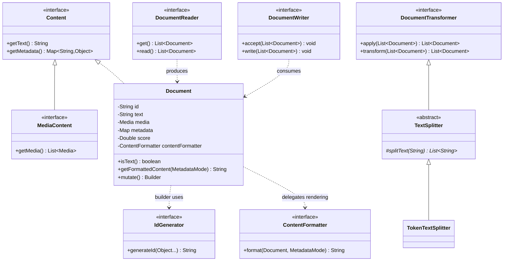
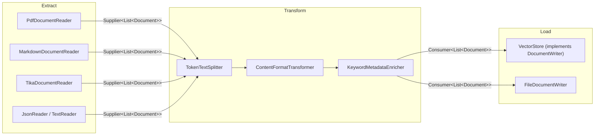
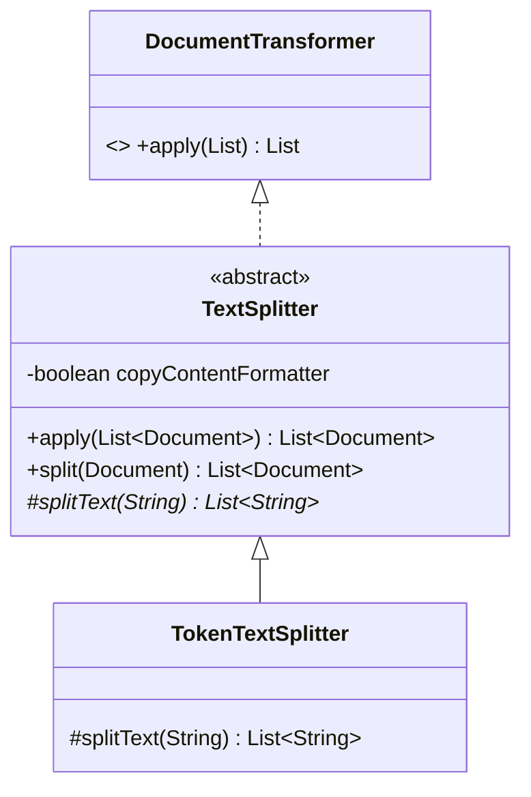

# 02 · `spring-ai-commons` — Data Primitives and the ETL Pipeline

**Module:** [`spring-ai-commons/`](../spring-ai-commons/)
**Depends on:** nothing in Spring AI. This is the root of the graph.

The striking thing about this module is what it *doesn't* contain: no LLM, no prompt, no
embedding call. It defines "a chunk of content with metadata" and "a pipeline that moves
chunks around". Everything AI-specific is built on top, elsewhere.

---

## 1. Responsibility

| Package | Owns |
|---|---|
| `content` | `Content`, `MediaContent`, `Media` — the minimal notion of "something with text and metadata" |
| `document` | `Document`, `DocumentReader/Transformer/Writer`, `ContentFormatter`, `MetadataMode`, `id/IdGenerator` |
| `transformer.splitter` | `TextSplitter`, `TokenTextSplitter` |
| `reader` | `TextReader`, `JsonReader`, `ExtractedTextFormatter` |
| `writer` | `FileDocumentWriter` |
| `tokenizer` | `TokenCountEstimator`, `JTokkitTokenCountEstimator` |
| `evaluation` | `Evaluator`, `EvaluationRequest/Response` |
| `observation` | Observation conventions and attribute name constants |
| `template` | Template rendering SPI |

## 2. The type model



## 3. The ETL pipeline — and the trick that makes it composable

The three pipeline stages are **not** bespoke interfaces. Look closely:

```java
public interface DocumentReader extends Supplier<List<Document>> {
    default List<Document> read() { return get(); }
}
public interface DocumentTransformer extends Function<List<Document>, List<Document>> {
    default List<Document> transform(List<Document> transform) { return apply(transform); }
}
public interface DocumentWriter extends Consumer<List<Document>> {
    default void write(List<Document> documents) { accept(documents); }
}
```

Each is a **named specialisation of a `java.util.function` type**, with a
domain-readable default method delegating to the functional method.



**Why this is a good design decision, stated precisely:**

### (a) Composability — chaining, with a worked example

Because `DocumentTransformer` **is a** `Function`, it inherits `andThen` and `compose`
without the framework writing a single line of chaining code.

```java
// Two transformers, written as plain lambdas.
DocumentTransformer dropShort =
        docs -> docs.stream()
                    .filter(d -> Objects.requireNonNullElse(d.getText(), "").length() >= 50)
                    .toList();   // getText() is @Nullable — see chapter 00

DocumentTransformer tagSource =
        docs -> docs.stream()
                    .map(d -> Document.builder().id(d.getId()).text(d.getText())
                                      .metadata("source", "manual-upload").build())
                    .toList();

// Chain them. `andThen` comes from java.util.function.Function — free.
List<Document> cleaned = dropShort.andThen(tagSource).apply(rawDocs);
```

Or as a full pipeline, reader → transform → transform → writer:

```java
DocumentReader   reader = new TextReader("classpath:/manual.txt");
DocumentTransformer split = TokenTextSplitter.builder().build();
VectorStore      store  = /* any VectorStore — it IS a DocumentWriter */;

store.write(split.andThen(dropShort).apply(reader.read()));
```

**One catch you must know, because the type system is subtle here.**
`andThen` is declared on `Function` and returns a `Function`, **not** a
`DocumentTransformer`:

```java
var chained = dropShort.andThen(tagSource);
// chained is Function<List<Document>, List<Document>>  — verified at runtime

DocumentTransformer bad = dropShort.andThen(tagSource);   // ❌ does NOT compile
// error: incompatible types: no instance(s) of type variable(s) V exist
//        so that Function<List<Document>,V> conforms to DocumentTransformer
```

`Function.andThen` has no idea `DocumentTransformer` exists, so it cannot return one. If
you need the chained result back **as** a `DocumentTransformer` (to pass into an API that
declares that parameter type), re-wrap it — a method reference is the tidiest way:

```java
DocumentTransformer chained = dropShort.andThen(tagSource)::apply;   // ✅ compiles
```

That works because `DocumentTransformer` has exactly one abstract method (`apply`,
inherited), so it is a functional interface and any matching lambda or method reference
can be assigned to it.

> **Honest caveat:** `grep -rn "andThen\|compose" --include="*.java" spring-ai-commons
> spring-ai-model spring-ai-rag` finds **zero** production uses. Composability here is a
> capability handed to *users*, not something the framework itself exercises. That does
> not make it worthless — it cost nothing to obtain — but "we get `andThen` for free" is a
> weaker argument than it first sounds. Weigh benefits by whether anyone actually uses them.

### (b) Lambda-friendly

```java
DocumentTransformer t =
        docs -> docs.stream()
                    .filter(d -> Objects.requireNonNullElse(d.getText(), "").length() >= 50)
                    .toList();
```

That compiles because the interface has **one** abstract method. Had the designers written
a bespoke interface with `transform(...)` *plus* any second abstract method — say
`String getName()` — it would no longer be a functional interface, and every transformer
would need a full class declaration. Notice `transform` is `default`, not abstract,
precisely to preserve this.

### (c) Named types carry domain meaning — what that actually buys you

Compare the same method signature written both ways:

```java
// Structural — using only JDK types
void ingest(Supplier<List<Document>> source,
            Function<List<Document>, List<Document>> step,
            Consumer<List<Document>> sink);

// Nominal — using the named domain types
void ingest(DocumentReader reader, DocumentTransformer transformer, DocumentWriter writer);
```

Both compile to the same thing and accept the same lambdas. The second is better for four
concrete, checkable reasons:

| Benefit | Structural version | Nominal version |
|---|---|---|
| **Discoverability** | "Find implementations of `Function`" → thousands of hits, useless | "Find implementations of `DocumentTransformer`" → `TokenTextSplitter`, `ContentFormatTransformer`, `KeywordMetadataEnricher`. The list *is* the catalogue |
| **Greppability** | `Function<List<Document>, List<Document>>` is unfindable — whitespace varies, `var` hides it, generics get inferred | `grep -rn DocumentTransformer` finds every producer and consumer |
| **A home for the contract** | Nowhere to document "must not return null", "must preserve metadata" | The interface's Javadoc is the obvious place |
| **Spring injection** | `@Autowired Function<List<Document>, List<Document>>` — fragile, and ambiguous the moment a second such bean exists | `@Autowired DocumentTransformer` — an ordinary bean type |

The one thing naming does **not** buy you is enforcement. A splitter and a metadata
enricher are both `DocumentTransformer`, so the compiler will happily let you swap them.
Naming communicates intent; it does not constrain semantics. Be precise about that
distinction when you argue for domain types in review — overselling it is how these
arguments get lost.

### (d) `VectorStore extends DocumentWriter` becomes natural

```java
public interface VectorStore extends DocumentWriter, VectorStoreRetriever {
    void add(List<Document> documents);
    default void accept(List<Document> documents) { add(documents); }   // the bridge
}
```

A vector store *is* a destination for documents, so it joins the pipeline by declaring the
interface — no adapter class, no wrapper. `store.write(docs)` and `store.add(docs)` are the
same call. Had `DocumentWriter` been a bespoke interface, this would still work; the real
win is that a `VectorStore` is *also* usable anywhere a plain `Consumer<List<Document>>` is
expected, including `list.forEach(...)`-style JDK APIs.

---

The default methods (`read`, `transform`, `write`) exist purely for call-site readability —
`reader.read()` beats `reader.get()`. One line each, and the call site stops looking like
generic plumbing.

**LLD lesson — the general rule:** when your interface's shape already exists in the JDK,
extend it rather than reinventing it, and add a domain-named default method for
readability. You get the standard type's interoperability *and* a nominal type your team,
your IDE, and your DI container can all reason about. Just be clear-eyed that combinators
inherited this way return the *supertype*, so the chained result needs re-wrapping to
travel back through your own APIs.

## 4. `Document` — the design decisions worth stealing

Read [`Document.java`](../spring-ai-commons/src/main/java/org/springframework/ai/document/Document.java).
Five things it does deliberately:

**(a) Text or media, not both.** Fields `text` and `media` are each `@Nullable`, with
`isText()` as the discriminator. This is a sum type simulated in Java 17. A more modern
approach is a sealed hierarchy — worth arguing about (exercise 2).

**(b) Identity is pluggable.** The builder takes an `IdGenerator`, defaulting to
`RandomIdGenerator`; `JdkSha256HexIdGenerator` gives content-addressed, *deterministic*
IDs. That single strategy swap is the difference between re-ingesting a document creating
duplicates and it being idempotent. Identity policy is a **Strategy**, not a hardcoded
`UUID.randomUUID()`.

**(c) Rendering is separated from data.** `Document` holds content; `ContentFormatter` +
`MetadataMode` decide how it is rendered into a prompt. Same document, different
projections for embedding vs. inference — because *how much metadata to show the model* is
a caller's decision, not a property of the data.

**(d) `score` lives on `Document`.** A retrieval concern on a general-purpose type. This
is a real, debatable tradeoff: it avoids a parallel `ScoredDocument` type and the
conversions that come with it, at the cost of a field that is meaningless outside search.
Note it and form an opinion — this exact tension appears in most retrieval systems.

**(e) `mutate()` returns a pre-populated Builder.** Copy-on-write for an immutable-ish
type. You will see the identical `mutate()` idiom on `ChatClientRequest`, `Prompt`, and
`ChatResponse` — it is a codebase-wide convention.

## 5. `TextSplitter` — textbook Template Method

```java
public abstract class TextSplitter implements DocumentTransformer {
    public List<Document> apply(List<Document> documents) { return split(documents); }
    protected abstract List<String> splitText(String text);   // the only hook
}
```

The base class owns everything invariant: iterating documents, propagating metadata to
chunks, and the `copyContentFormatter` flag. A subclass supplies **one** method —
"given a string, produce chunks" — and inherits all the document plumbing.



**The lesson is the size of the hook.** `splitText(String) -> List<String>` has no
`Document`, no metadata, no framework type in its signature. A new splitter is a pure
string function and is trivially unit-testable. When you design a Template Method, the
quality of the design is measured by **how little the hook needs to know.**

## 6. Practice

1. **Write a `DocumentTransformer` as a lambda** that drops documents under 50 characters,
   then compose it with `TokenTextSplitter` using `Function.andThen`. This proves the
   composability claim to yourself in about six lines.
2. **Argue the sum type.** Sketch `sealed interface Document permits TextDocument, MediaDocument`.
   List concretely what breaks: the builder, `getFormattedContent`, every `VectorStore`
   implementation, user code. Then decide whether the nullable-pair design was right for a
   library with backward-compatibility obligations. There is a defensible answer either way —
   the exercise is producing the list of consequences.
3. **Find the invariant.** `AbstractObservationVectorStore.validateNonTextDocuments`
   rejects non-text documents. Given `Document` supports media, what does that tell you
   about where the abstraction currently ends? Is that a bug, a TODO, or a deliberate scope
   boundary? (Check `git log` on the file.)
4. **Design a `CachingDocumentReader`.** It wraps another `DocumentReader` and caches by
   source. Which pattern is it? What is the cache key, given `DocumentReader` is a bare
   `Supplier` with no notion of a source identifier — and what does that missing key tell
   you about the limits of reusing `Supplier`?
5. **Read [`TextReader.java`](../spring-ai-commons/src/main/java/org/springframework/ai/reader/TextReader.java)
   and its git history.** Commit `91f067f` is "Close the resource stream in `TextReader`".
   That is exactly the size and shape of a good first contribution — find the class of bug,
   then look for its siblings in the other readers.

Next: [03 · The Model Abstraction](03-model-abstraction.md).
