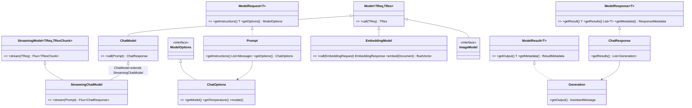
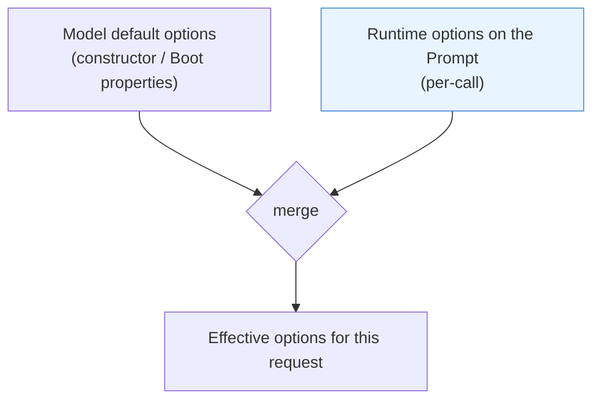
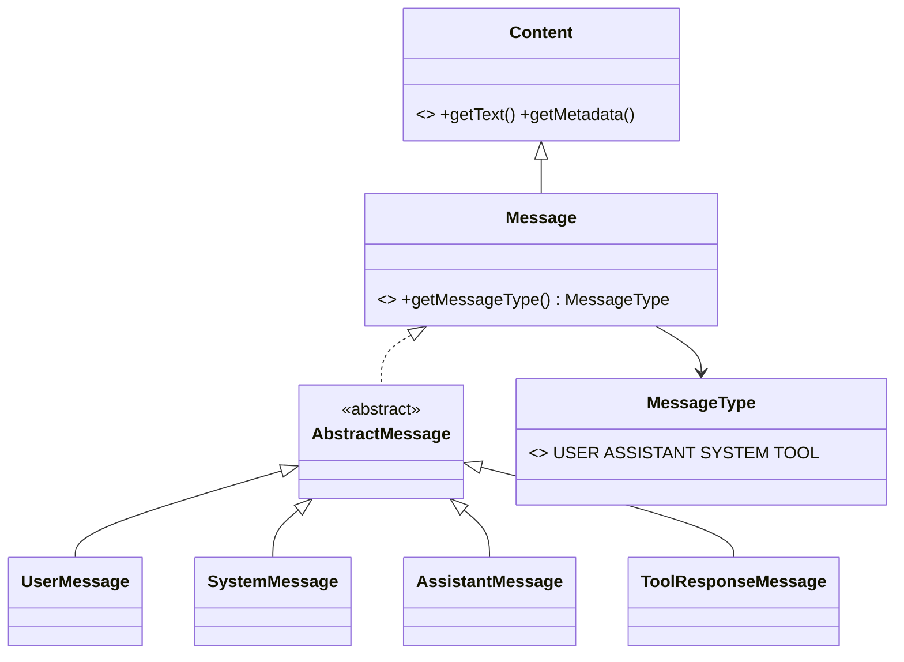
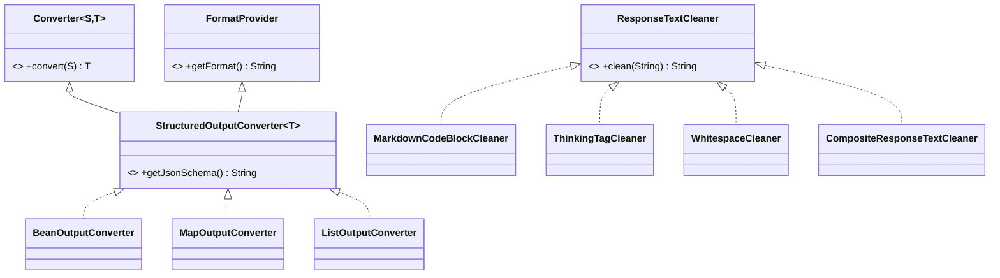
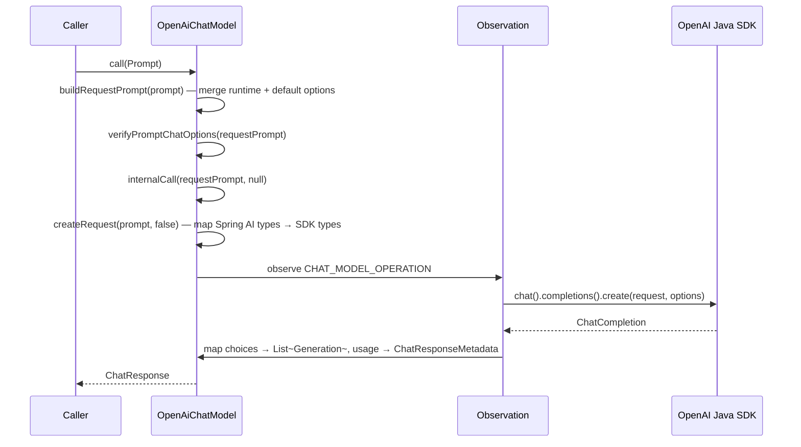

# 03 · `spring-ai-model` — The Generic Model API

**Module:** [`spring-ai-model/`](../spring-ai-model/)
**Depends on:** `spring-ai-commons`, `spring-ai-template-st`

This is the module that makes Spring AI *a framework* rather than a pile of API clients.
It answers one question: **what is the shape of "calling an AI model", independent of
which model, which modality, and which provider?**

---

## 1. The generic core — four interfaces

```java
public interface Model<TReq extends ModelRequest<?>, TRes extends ModelResponse<?>> {
    TRes call(TReq request);
}
public interface StreamingModel<TReq extends ModelRequest<?>, TResChunk extends ModelResponse<?>> {
    Flux<TResChunk> stream(TReq request);
}
public interface ModelRequest<T> {
    T getInstructions();
    @Nullable ModelOptions getOptions();
}
public interface ModelResponse<T extends ModelResult<?>> {
    @Nullable T getResult();
    List<T> getResults();
    ResponseMetadata getMetadata();
}
public interface ModelResult<T> {
    T getOutput();
    ResultMetadata getMetadata();
}
```

Five interfaces, ~15 methods, and every modality in the framework is an instantiation of
them. `ModelOptions` and `ResultMetadata` are **empty marker interfaces** — deliberately,
because their content is entirely provider-specific.



### The specialisations, in one table

| Modality | Model interface | Request | Response | Result | Options |
|---|---|---|---|---|---|
| Chat | `ChatModel` | `Prompt` | `ChatResponse` | `Generation` | `ChatOptions` |
| Embedding | `EmbeddingModel` | `EmbeddingRequest` | `EmbeddingResponse` | `Embedding` | `EmbeddingOptions` |
| Image | `ImageModel` | `ImagePrompt` | `ImageResponse` | `ImageGeneration` | `ImageOptions` |
| Transcription | `AudioTranscriptionModel` | `AudioTranscriptionPrompt` | … | … | … |
| Speech | `SpeechModel` | … | … | … | … |
| Moderation | `ModerationModel` | … | … | … | … |

Note the pattern is *identical* every time. When you contribute a new modality, the shape
is already decided for you — which is the point of a generic core.

## 2. Two design decisions worth pausing on

### (a) `ChatModel extends StreamingChatModel`

```java
public interface ChatModel extends Model<Prompt, ChatResponse>, StreamingChatModel { ... }
```

Read that again: the **blocking** interface extends the **streaming** one. Counter-intuitive,
and worth thinking about before reading on.

The reasoning: a `ChatModel` must expose `call()`; `stream()` has a sensible default
(emit one element). Making streaming the supertype means any `ChatModel` can be handed to
code that only wants `Flux<ChatResponse>`. The alternative — two sibling interfaces —
would force every consumer to accept `ChatModel & StreamingChatModel` or do
`instanceof` checks.

This is a genuine tradeoff and a good interview-grade discussion: it slightly violates ISP
(implementors carry a method some cannot do well) in exchange for a much simpler consumer
contract. Spring AI chose consumer simplicity. Whether you agree is less important than
being able to state the tradeoff crisply.

### (b) Empty marker interfaces `ModelOptions` and `ResultMetadata`

```java
public interface ModelOptions { }
public interface ResultMetadata { }
```

Zero methods. They exist purely as **type-system anchors** so that `ModelRequest.getOptions()`
has a return type more meaningful than `Object`, without the core predicting what OpenAI's
`reasoning_effort` or Anthropic's `thinking` will look like next year.

The extension ladder is then:

```
ModelOptions            (marker, in core)
  └─ ChatOptions        (the portable subset: model, temperature, topP, maxTokens, stopSequences…)
      └─ ToolCallingChatOptions   (cross-provider capability: toolCallbacks, toolContext)
          └─ OpenAiChatOptions    (provider-specific: everything else)
```

**LLD lesson:** when you cannot know the shape of an extension point, don't guess and
don't use `Object`/`Map<String,Object>`. Publish a marker, put the genuinely portable
subset in a sub-interface, and let implementations widen. Portability is *earned* by
consensus across providers, not asserted up front.

## 3. Options merging — the most-copied logic in the codebase

Every provider must resolve **three** sources of configuration:



The rule is **runtime wins over default**, expressed by the aptly small helper:

```java
// ModelOptionsUtils
public static <T> @Nullable T mergeOption(@Nullable T runtimeValue, @Nullable T defaultValue) { ... }
```

and, for collections, by explicit static methods on the options interface itself:

```java
// ToolCallingChatOptions
static @Nullable List<ToolCallback> mergeToolCallbacks(runtime, defaults) {
    // runtime REPLACES defaults entirely — not additive
}
static @Nullable Map<String, Object> mergeToolContext(runtime, defaults) {
    // maps are MERGED, runtime keys override
}
```

Notice these are **different policies for different types, made explicit**: tool callbacks
*replace*, tool context *merges*. That asymmetry is intentional (you rarely want to
accidentally inherit a default tool; you often want to inherit default context) and it is
documented in code rather than in prose.

In the provider, merging happens in one named method:

```java
// OpenAiChatModel
private Prompt buildRequestPrompt(Prompt prompt) { ... }   // called first in call() and stream()
```

**LLD lesson:** configuration precedence is a *first-class named operation*, not scattered
`x != null ? x : y` ternaries. Give it a method, a test, and a documented policy per field
type. This is one of the highest-value habits to take from this codebase.

## 4. Messages — a small closed hierarchy



Four message types, mirroring the roles every chat API agrees on. `AssistantMessage`
additionally carries `toolCalls` — the model's *request* to invoke a tool — while
`ToolResponseMessage` carries the results going back. Those two types are the entire
protocol of chapter 05.

`Prompt` wraps `List<Message>` plus `ChatOptions`, and offers surgical, copy-on-write
edits used heavily by advisors:

```java
Prompt augmentUserMessage(String newUserText);
Prompt augmentUserMessage(Function<UserMessage, UserMessage> augmenter);
Prompt augmentSystemMessage(Function<SystemMessage, SystemMessage> augmenter);
Prompt copy();
Builder mutate();
```

`RetrievalAugmentationAdvisor` calls `prompt().augmentUserMessage(augmentedQuery.text())`
— it does not rebuild the message list by hand. **Give your immutable types the specific
transformations their consumers actually need**, or every consumer will reimplement them
subtly differently.

## 5. Structured output converters



`StructuredOutputConverter<T>` extends **both** Spring's `Converter<String,T>` **and**
`FormatProvider` — because converting the response and instructing the model how to format
it are two halves of the same concern. Splitting them would let them drift out of sync,
which is precisely the bug you cannot debug.

The `ResponseTextCleaner` family is a clean **Composite**: `MarkdownCodeBlockCleaner`
strips ` ```json ` fences, `ThinkingTagCleaner` strips reasoning tags,
`CompositeResponseTextCleaner` chains them. Each cleaner is ~20 lines and independently
testable. Compare with the alternative — one `cleanResponse()` method accreting `if`
branches per provider quirk. **New provider quirk = new small class, not a new branch.**

## 6. A provider implementation, structurally

Take [`OpenAiChatModel`](../models/spring-ai-openai/src/main/java/org/springframework/ai/openai/OpenAiChatModel.java):



Every provider has the same five responsibilities:

1. **Merge options** (`buildRequestPrompt`)
2. **Validate** (`verifyPromptChatOptions`)
3. **Translate** Spring AI types ↔ provider types (`createRequest`, `buildGeneration`)
4. **Wrap in an observation**
5. **Normalise metadata** — usage, finish reason, model id

That is the **Adapter** pattern at module scale, and it is why "add a provider" is a
tractable, well-scoped contribution.

> **A 2.0 change worth knowing:** in Spring AI 1.x the *tool-calling loop* also lived
> inside each `ChatModel`. It has moved out into `ToolCallingAdvisor` (chapter 05).
> `OpenAiChatModel.internalCall` is now a single round trip. If you read a 1.x blog post
> and the code doesn't match, this is usually why.

## 7. LLD lens

| Pattern | Where | Why here |
|---|---|---|
| **Bridge** | `Model<TReq,TRes>` separates the abstraction (modality) from the implementation (provider). Both vary independently. | 6 modalities × 15 providers as ~21 classes instead of 90 |
| **Adapter** | Each `models/*` module | Isolate a third-party SDK behind a stable contract |
| **Marker interface** | `ModelOptions`, `ResultMetadata` | Type anchor for an unknowable extension point |
| **Self-referential generic builder** | `ChatOptions.Builder<B extends Builder<B>>` | Fluent builders that stay fluent across subtypes — no downcasts |
| **Composite** | `CompositeResponseTextCleaner` | Add behaviour by adding a class |
| **Copy-on-write / `mutate()`** | `Prompt`, `ChatResponse`, `ChatClientRequest` | Immutability with ergonomic edits |

## 8. Practice

1. **Design a modality from scratch.** Before reading `ImageModel`, write out the five
   types you would need for a *video generation* model against `Model<TReq,TRes>`. Then
   read `image/` and diff. Where did you over- or under-specify?
2. **Argue `ChatModel extends StreamingChatModel`.** Write the case for splitting them,
   and list every call site in `spring-ai-client-chat` that would need to change. Being
   able to *cost* a refactor is the skill.
3. **Trace one option end to end.** Follow `temperature` from
   `application.yml` → `OpenAiChatProperties` → `OpenAiChatOptions` → `buildRequestPrompt`
   → the SDK request. Count the transformation points. Then ask: what happens if a user
   sets it at runtime *and* in properties, and where exactly is that decided?
4. **Find a merge asymmetry.** Compare `mergeToolCallbacks` (replace) with
   `mergeToolContext` (merge). Now check how `stopSequences` is merged in
   `DefaultChatOptionsBuilder` / a provider's options. Is the policy consistent and
   documented? Inconsistencies here are real, reportable issues.
5. **Write the failing test first.** Pick any `ChatOptions` subtype and check that
   `mutate().build()` round-trips every field. `spring-ai-test` ships
   `AbstractChatOptionsTests` for exactly this. Missing fields in `mutate()` are a
   recurring bug class across providers — and finding one is a clean first PR.

Next: [04 · ChatClient and the Advisor Chain](04-chat-client-and-advisors.md).
