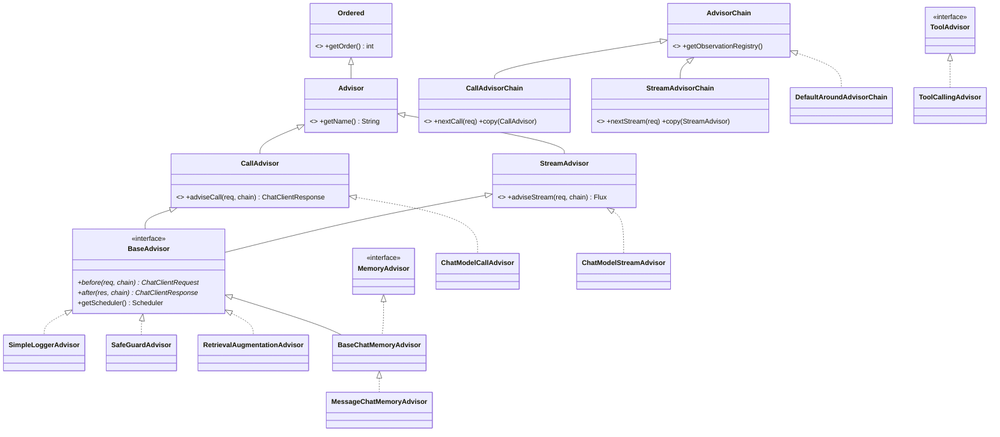
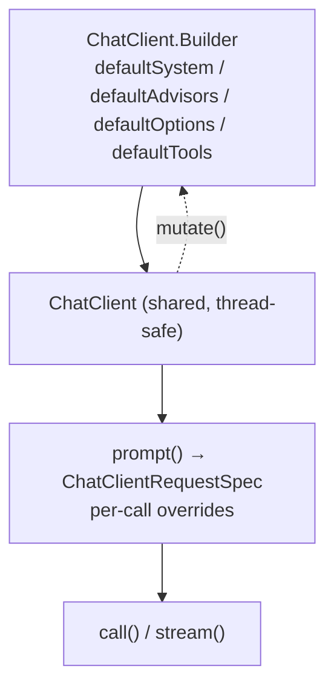

# 04 · `spring-ai-client-chat` — ChatClient and the Advisor Chain

**Module:** [`spring-ai-client-chat/`](../spring-ai-client-chat/)
**Depends on:** `spring-ai-model`

This is the most interesting module in the codebase from an LLD standpoint. It is a
**Chain of Responsibility** used as the framework's primary extension mechanism, and
almost every feature — memory, RAG, tool calling, logging, guardrails — is implemented as
a link in that chain rather than as a branch in a god-method.

---

## 1. The problem it solves

A raw `ChatModel.call(Prompt)` is one HTTP round trip. Real applications want:
conversation memory, retrieved context, tool execution loops, structured output parsing,
prompt guardrails, logging, and observability. Each of those is a cross-cutting concern
that must run **before** and/or **after** the model call, in a **specific order**, in both
blocking and streaming modes.

The naive design is a `ChatClient` class with flags and `if` branches. That class grows
without bound and every new feature edits it. Spring AI instead makes the pipeline
**data**: an ordered list of `Advisor` objects.

## 2. The type model



### Four interfaces, four jobs

| Interface | Job | When you implement it |
|---|---|---|
| `CallAdvisor` | Full control of the blocking call | You need to loop, short-circuit, or branch |
| `StreamAdvisor` | Full control of the streaming call | Same, reactively |
| `BaseAdvisor` | `before` / `after` hooks for **both** modes | Almost always — this is the one you want |
| `MemoryAdvisor` / `ToolAdvisor` | **Capability markers**, no methods | So the framework can reason about the chain (see §6) |

## 3. `BaseAdvisor` — the Template Method that eliminates duplicated reactive code

This is the highest-leverage class in the module:

```java
public interface BaseAdvisor extends CallAdvisor, StreamAdvisor {

    ChatClientRequest  before(ChatClientRequest req, AdvisorChain chain);   // you implement
    ChatClientResponse after(ChatClientResponse res, AdvisorChain chain);   // you implement

    default ChatClientResponse adviseCall(ChatClientRequest req, CallAdvisorChain chain) {
        return after(chain.nextCall(before(req, chain)), chain);
    }

    default Flux<ChatClientResponse> adviseStream(ChatClientRequest req, StreamAdvisorChain chain) {
        return Mono.just(req)
            .publishOn(getScheduler())
            .map(r -> this.before(r, chain))
            .flatMapMany(chain::nextStream)
            .map(response -> AdvisorUtils.onFinishReason().test(response) ? after(response, chain) : response)
            .onErrorResume(e -> Flux.error(new IllegalStateException("Stream processing failed", e)));
    }
}
```

Look at what a subclass is spared. Writing `adviseStream` correctly by hand means knowing:

- to hop onto a bounded-elastic scheduler so a blocking `before()` (a DB read, a vector
  search) never blocks the event loop;
- that `after()` must fire **only on the final chunk**, detected via
  `AdvisorUtils.onFinishReason()` — otherwise your post-processing runs on every token;
- to wrap errors consistently.

Every one of those is a bug an implementor would otherwise get wrong once each. Hoisting
them into a default method means they are written once and correct everywhere.

**LLD lesson — the general rule:** when a Template Method's default implementation
encodes *concurrency* or *lifecycle* correctness, its value is far greater than the lines
of code it saves. Look for the version of this in your own designs: the hook should be
where the *domain* varies, and the template should own everything where being wrong is
subtle.

## 4. The chain

[`DefaultAroundAdvisorChain`](../spring-ai-client-chat/src/main/java/org/springframework/ai/chat/client/advisor/DefaultAroundAdvisorChain.java)
holds two `Deque`s (one for call advisors, one for stream advisors) and pops as it goes:

```java
public ChatClientResponse nextCall(ChatClientRequest req) {
    if (this.callAdvisors.isEmpty()) throw new IllegalStateException("No CallAdvisors available to execute");
    var advisor = this.callAdvisors.pop();
    return AdvisorObservationDocumentation.AI_ADVISOR
        .observation(..., this.observationRegistry)
        .observe(() -> advisor.adviseCall(req, this));
}
```

Three details that matter:

**(a) Ordering is sorted, not authored.** In `Builder.build()`:

```java
OrderComparator.sort(callAdvisors);
OrderComparator.sort(streamAdvisors);
```

Advisors declare their position via `Ordered.getOrder()`; the chain sorts them. Users add
advisors in any order and get a deterministic pipeline. The published constants:

| Advisor | Order |
|---|---|
| `MessageChatMemoryAdvisor` | `Advisor.DEFAULT_CHAT_MEMORY_PRECEDENCE_ORDER` = `HIGHEST_PRECEDENCE + 200` |
| `ToolCallingAdvisor` | `DEFAULT_ORDER` = `HIGHEST_PRECEDENCE + 300` |
| `ChatModelCallAdvisor` / `ChatModelStreamAdvisor` | `LOWEST_PRECEDENCE` |

**(b) Termination is not a special case.** `ChatModelCallAdvisor` is an ordinary
`CallAdvisor` at `LOWEST_PRECEDENCE` that calls the `ChatModel` and never calls
`nextCall`. There is no `if (isLast)` anywhere in the chain. Compare with a servlet
`FilterChain`, which needs exactly this trick for the same reason.

**(c) Each hop is an observation.** Every advisor invocation is wrapped in a Micrometer
observation, so a distributed trace shows the full pipeline — with correct parent/child
nesting in the reactive path via `ObservationThreadLocalAccessor`. Observability was
designed into the chain, not bolted on.

### `copy(advisor)` — the mechanism that makes loops possible

```java
public CallAdvisorChain copy(CallAdvisor after) {   // returns a chain of everything AFTER `after`
    int idx = advisors.indexOf(after);
    return builder(...).pushAll(advisors.subList(idx + 1, advisors.size())).build();
}
```

This is what lets `ToolCallingAdvisor` re-run the *downstream* portion of the chain on
each tool iteration without re-running memory or RAG. Without it, a chain built on a
consumed `Deque` could only be traversed once.

## 5. Request and response as records

```java
public record ChatClientRequest(Prompt prompt, Map<String, @Nullable Object> context) { ... }
public record ChatClientResponse(@Nullable ChatResponse chatResponse, Map<String, @Nullable Object> context) { ... }
```

Both carry an untyped `context` map. This is the **Blackboard** pattern: advisors that do
not know about each other communicate through a shared, keyed space.
`RetrievalAugmentationAdvisor` writes `rag_document_context`; a downstream advisor can read
it.

It is a deliberate tradeoff — type safety lost, decoupling gained — and it is mitigated by
convention: keys are published constants (`RetrievalAugmentationAdvisor.DOCUMENT_CONTEXT`,
`ChatMemory.CONVERSATION_ID`, the `ChatClientAttributes` enum). **If you add a context key
in a PR, publish it as a constant.** An inline string literal will be flagged in review.

Both records offer `copy()` and `mutate()`, so advisors modify by rebuilding, never by
mutating shared state — essential when the same request may be observed concurrently in
the reactive path.

## 6. Marker interfaces that let the framework reason about the chain

`MemoryAdvisor` and `ToolAdvisor` have **no methods**. They exist so
`DefaultChatClient.buildAdvisorChain()` can inspect the chain and make decisions:

```java
private void autoRegisterToolCallingAdvisor() {
    if (autoRegisterDisabled) return;
    if (this.advisors.stream().anyMatch(a -> a instanceof ToolAdvisor)) return;   // user supplied one

    int configuredOrder = this.toolCallingAdvisorBuilder.getAdvisorOrder();
    boolean hasDownstreamMemoryAdvisor = this.advisors.stream()
        .anyMatch(a -> a instanceof MemoryAdvisor && a.getOrder() > configuredOrder);

    this.advisors.add(this.toolCallingAdvisorBuilder.copy()
        .conversationHistoryEnabled(!hasDownstreamMemoryAdvisor)   // don't double-manage history
        .build());
}

private void validateSingleToolAdvisor() {
    // more than one ToolAdvisor → IllegalStateException, with names and orders in the message
}
```

Read that carefully, because it is a genuinely sophisticated piece of design:

- A `ToolCallingAdvisor` is **always** auto-registered, so tools injected at runtime by
  another advisor still work even when the call configured none statically.
- If a `MemoryAdvisor` sits **downstream** of the tool advisor, that memory advisor will
  already replay history on every tool iteration — so the tool advisor turns its own
  history handling **off** to avoid duplicating messages.
- Two tool advisors is always a bug, so it fails fast with a message naming both.

**LLD lesson:** marker interfaces let a framework make *structural* decisions about a
user-assembled configuration. The alternative is `getClass().getName().contains("Memory")`
or a boolean flag the user must set correctly. The marker turns an implicit convention
into something the compiler and the framework can both see.

## 7. The fluent API

```java
String answer = chatClient.prompt()
    .system(s -> s.text("You are a {role}").param("role", "librarian"))
    .user("Recommend a book")
    .advisors(a -> a.param(ChatMemory.CONVERSATION_ID, "user-42"))
    .tools(new BookTools())
    .call()
    .entity(BookRecommendation.class);
```

`ChatClient` is a nest of role-specific interfaces — `ChatClientRequestSpec`,
`PromptUserSpec`, `PromptSystemSpec`, `AdvisorSpec`, `CallResponseSpec`,
`StreamResponseSpec`, `EntityParamSpec` — each exposing only what is legal at that point.
You cannot call `.entity()` before `.call()`, because `ChatClientRequestSpec` has no such
method. **The type system encodes the state machine**; illegal orderings do not compile.

The `Consumer<XxxSpec>` idiom (`.system(s -> ...)`) scopes a sub-builder without leaving
the outer chain — the same technique Spring Security's DSL uses.

Two layers of defaults:



Build once as a bean, override per call. `mutate()` on both `ChatClient` and
`ChatClientRequest` provides copy-on-write derivation.

## 8. Writing an advisor — the shape of a contribution

```java
public class PiiRedactionAdvisor implements BaseAdvisor {

    private final int order;

    @Override
    public ChatClientRequest before(ChatClientRequest req, AdvisorChain chain) {
        return req.mutate()
            .prompt(req.prompt().augmentUserMessage(Redactor::redact))
            .build();
    }

    @Override
    public ChatClientResponse after(ChatClientResponse res, AdvisorChain chain) {
        return res;
    }

    @Override public int getOrder() { return this.order; }
    // getName() defaults to getClass().getSimpleName()
}
```

That is a complete advisor working in **both** blocking and streaming modes, correctly
scheduled and observed. The framework contributed everything except the domain logic.
Study [`SafeGuardAdvisor`](../spring-ai-client-chat/src/main/java/org/springframework/ai/chat/client/advisor/SafeGuardAdvisor.java)
and [`SimpleLoggerAdvisor`](../spring-ai-client-chat/src/main/java/org/springframework/ai/chat/client/advisor/SimpleLoggerAdvisor.java)
— both are short enough to read in one sitting.

## 9. LLD lens

| Pattern | Where | Payoff |
|---|---|---|
| **Chain of Responsibility** | `AdvisorChain` + `Deque` | New features are new classes, never edits to existing ones |
| **Template Method** | `BaseAdvisor.adviseCall` / `adviseStream` | Reactive + scheduling correctness written once |
| **Decorator** | Every advisor wraps the rest of the chain | Composable, order-independent authoring |
| **Blackboard** | `context` map on request/response | Decoupled advisor-to-advisor communication |
| **Marker interface** | `MemoryAdvisor`, `ToolAdvisor` | Framework reasons about chain structure |
| **Fluent interface / step builder** | `ChatClientRequestSpec` and friends | Illegal call sequences don't compile |
| **Null Object** | `ObservationRegistry.NOOP` default | No `if (registry != null)` anywhere |
| **Strategy** | `getScheduler()` | Per-advisor control over the blocking-work boundary |

## 10. Practice

1. **Build a `TokenBudgetAdvisor`.** In `before()`, estimate prompt tokens with
   `TokenCountEstimator` and drop the oldest messages over a budget. Pick an order value
   and *justify it* relative to memory (`HIGHEST+200`) and tool calling (`HIGHEST+300`).
   Getting the ordering argument right is the actual exercise.
2. **Explain `copy(after)` from first principles.** Why can't `ToolCallingAdvisor` just
   call `chain.nextCall()` again in its loop? Trace what happens to the `Deque`. Then ask
   whether an immutable index-based chain would have been simpler.
3. **Find the streaming trap.** `BaseAdvisor.adviseStream` calls `after()` only when
   `AdvisorUtils.onFinishReason()` passes. Write an advisor whose `after()` mutates state,
   and reason about what happens with multiple `Generation`s or a stream that ends without
   a finish reason. This is a real source of bugs — check the issue tracker for it.
4. **Audit the blackboard.** `grep -rn 'context().get(' spring-ai-client-chat spring-ai-rag`
   and list every context key. Are they all published constants? Any string literal you
   find is a small, clean PR.
5. **Design the alternative.** Sketch `ChatClient` with the same feature set using
   inheritance instead of a chain (`MemoryChatClient extends ChatClient`, etc.). Enumerate
   the combinations you would need for memory × RAG × tools × logging. The combinatorial
   explosion *is* the argument for Chain of Responsibility — be able to produce that number
   on demand.

Next: [05 · Tool Calling](05-tool-calling.md).
