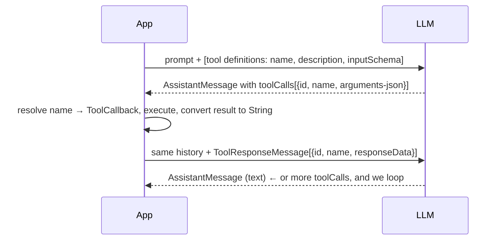
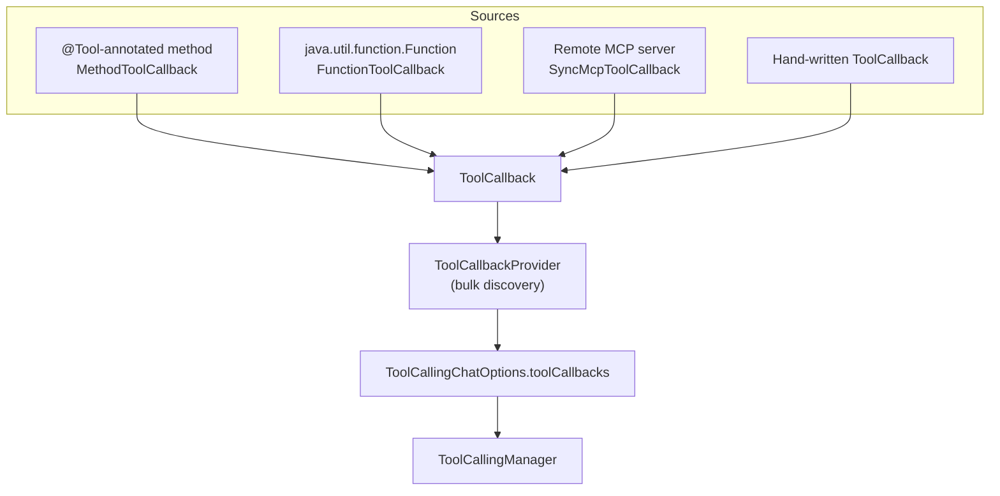
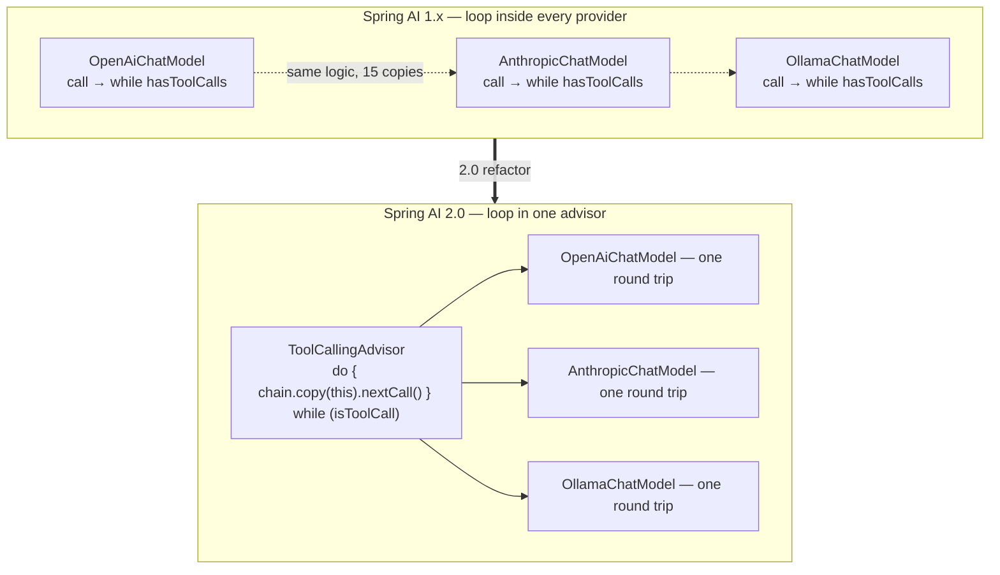

# 05 · Tool Calling — Strategy, Adapter, and an Orchestration Extraction

**Packages:** `spring-ai-model/.../tool/**`, `spring-ai-model/.../model/tool/**`,
`spring-ai-client-chat/.../advisor/ToolCallingAdvisor.java`

Tool calling is where the most subsystems meet: a Java method must become a JSON schema
the model understands, the model's request must be routed back to that method, the result
must be converted to a string, and the whole thing must loop until the model stops asking.

---

## 1. The protocol, before the code



Every design decision below follows from this loop. Note the model never executes
anything — it emits a *request*, and the application decides whether to honour it.

## 2. The type model

```mermaid
classDiagram
    class ToolCallback {
        <<interface>>
        +getToolDefinition() ToolDefinition
        +getToolMetadata() ToolMetadata
        +call(String toolInput) String
        +call(String toolInput, ToolContext ctx) String
    }
    class ToolDefinition {
        <<interface>>
        +name() String
        +description() String
        +inputSchema() String
    }
    class ToolMetadata { <<interface>> +returnDirect() boolean }
    class ToolCallbackProvider { <<interface>> +getToolCallbacks() ToolCallbacks }
    class ToolCallbackResolver { <<interface>> +resolve(String name) ToolCallback }
    class ToolCallResultConverter { <<interface>> +convert(Object, Type) String }
    class ToolExecutionExceptionProcessor { <<interface>> +process(ToolExecutionException) String }
    class ToolCallingManager {
        <<interface>>
        +resolveToolDefinitions(ToolCallingChatOptions) List~ToolDefinition~
        +executeToolCalls(Prompt, ChatResponse) ToolExecutionResult
    }
    class ToolExecutionResult {
        <<interface>>
        +conversationHistory() List~Message~
        +returnDirect() boolean
    }
    class ToolExecutionEligibilityChecker { <<interface>> +isToolCallResponse(ChatResponse) boolean }

    ToolCallback <|.. MethodToolCallback
    ToolCallback <|.. FunctionToolCallback
    ToolCallback <|.. SyncMcpToolCallback
    ToolCallback <|.. AsyncMcpToolCallback
    ToolCallbackProvider <|.. MethodToolCallbackProvider
    ToolCallbackProvider <|.. StaticToolCallbackProvider
    ToolCallbackProvider <|.. SyncMcpToolCallbackProvider
    ToolCallbackResolver <|.. DelegatingToolCallbackResolver
    ToolCallbackResolver <|.. StaticToolCallbackResolver
    ToolCallingManager <|.. DefaultToolCallingManager
    ToolCallback --> ToolDefinition
    ToolCallback --> ToolMetadata
    ToolCallback --> ToolCallResultConverter
    ToolCallingManager --> ToolCallbackResolver
    ToolCallingManager --> ToolExecutionExceptionProcessor
    ToolCallingManager --> ToolExecutionResult
```



### `ToolCallback` — the whole abstraction in four methods

```java
public interface ToolCallback {
    ToolDefinition getToolDefinition();                              // what the model is told
    default ToolMetadata getToolMetadata() { ... }                   // execution policy
    String call(String toolInput);                                   // String in, String out
    default String call(String toolInput, @Nullable ToolContext ctx) { ... }
}
```

**`String call(String)`** looks primitive. It is the correct boundary, and the reason is
worth internalising: the *wire* protocol between model and application is JSON text.
Anything richer would mean the abstraction commits to a serialisation library, and every
implementation would have to convert to and from it. By making the interface speak the
wire format, an MCP tool (already JSON over the network) and a Java method (needs
binding) implement the *same* interface with no impedance mismatch.

The two-argument `call` has a default that ignores `ToolContext` and logs a hint. That is
a **backward-compatible capability extension**: existing implementations keep compiling,
and the ones that care override. Compare with adding an abstract method — an instant
breaking change for every implementor in the ecosystem.

## 3. Four ways to be a tool



This is **Strategy** (many interchangeable tool implementations) combined with **Adapter**
(each adapts a foreign shape — reflection, lambda, network — to `ToolCallback`).

`ToolCallbackProvider` sits one level up: a source that yields *many* callbacks. That
separation matters because MCP servers and Spring bean scans discover tools in bulk and
the set can change at runtime, whereas a single `ToolCallback` is a fixed thing.

## 4. `MethodToolCallback` — reflection done carefully

```java
public String call(String toolInput, @Nullable ToolContext toolContext) {
    Assert.hasText(toolInput, "toolInput cannot be null or empty");
    this.validateToolContextSupport(toolContext);
    Map<String, Object> toolArguments = this.extractToolArguments(toolInput);   // JSON → map
    Object[] methodArguments = this.buildMethodArguments(toolArguments, toolContext);
    Object result = this.callMethod(methodArguments);
    Type returnType = this.toolMethod.getGenericReturnType();
    return this.toolCallResultConverter.convert(result, returnType);           // Object → JSON
}
```

Six named steps, each independently testable, none longer than a screen. Compare with the
same logic as one 80-line method — which is what this looks like in most codebases.

Note the invariant enforced in the constructor:

```java
Assert.isTrue(Modifier.isStatic(toolMethod.getModifiers()) || toolObject != null,
        "toolObject cannot be null for non-static methods");
```

An impossible state is rejected at construction, not at call time. **Fail at build time,
not at invoke time** — especially valuable here, where invoke time is inside an LLM loop
in production.

`getGenericReturnType()` (not `getReturnType()`) is passed to the converter so generic
information survives — `List<Book>` serialises correctly rather than as raw `List`.

The `@Tool` annotation is the declarative front door:

```java
public @interface Tool {
    String name() default "";
    String description() default "";
    boolean returnDirect() default false;
    Class<? extends ToolCallResultConverter> resultConverter() default DefaultToolCallResultConverter.class;
}
```

`resultConverter()` is a `Class<?>` because annotations can only hold constants — the
standard Java workaround for **injecting a Strategy through an annotation**. You will
meet this in Spring, JPA, and Jackson too.

## 5. `ToolCallingManager` — execution policy in one place

```java
public interface ToolCallingManager {
    List<ToolDefinition> resolveToolDefinitions(ToolCallingChatOptions chatOptions);
    ToolExecutionResult executeToolCalls(Prompt prompt, ChatResponse chatResponse);
}
```

[`DefaultToolCallingManager`](../spring-ai-model/src/main/java/org/springframework/ai/model/tool/DefaultToolCallingManager.java)
composes four collaborators, each a separate concern:

| Collaborator | Decides |
|---|---|
| `ToolCallbackResolver` | name → callback (with `DelegatingToolCallbackResolver` chaining sources) |
| `ToolExecutionExceptionProcessor` | does a tool failure throw, or become a message the model can react to? |
| `ToolCallLimits` | `DEFAULT_MAX_CALLS_PER_TOOL = 40`, `DEFAULT_MAX_TOTAL_TOOL_CALLS = 150`, per-tool overrides, `ToolCallLimitBehavior` |
| `ObservationRegistry` | per-tool-execution metrics and traces |

**`ToolCallLimits` deserves attention as a design artefact.** An LLM in a tool loop is
unbounded recursion driven by a non-deterministic process. Any production system needs a
circuit breaker. Spring AI does not bury a magic number in a `while` loop — it has a
value type with per-tool granularity, a global cap, and a *behaviour* enum
(`ToolCallLimitBehavior.THROW` vs. returning a message to the model). Exceeding it raises
`ToolCallLimitExceededException`, which can `buildGeneration()` — i.e. the limit can be
reported *to the model* as a normal turn rather than blowing up the call.

**LLD lesson:** whenever your design contains a loop whose termination depends on an
external system, the loop bound is a **domain object with a policy**, not a constant.

`ToolExecutionExceptionProcessor` is the same idea for failures. A tool that throws might
mean "abort", or might mean "tell the model the tool failed and let it recover". That is a
per-application decision, so it is a strategy interface.

## 6. The 2.0 change: the loop moved out of `ChatModel`

This is the most instructive refactor in the codebase.



`OpenAiChatModel.internalCall` is now a single request/response. The loop lives in
[`ToolCallingAdvisor.adviseCall`](../spring-ai-client-chat/src/main/java/org/springframework/ai/chat/client/advisor/ToolCallingAdvisor.java):

```java
do {
    var processed = ChatClientRequest.builder()
        .prompt(new Prompt(instructions, toolCallingChatOptions))
        .context(chatClientRequest.context()).build();
    processed = this.doBeforeCall(processed, callAdvisorChain);

    chatClientResponse = callAdvisorChain.copy(this).nextCall(processed);   // ← re-enters chain below itself
    chatClientResponse = this.doAfterCall(chatClientResponse, callAdvisorChain);

    usageAccumulator.addRoundResponse(chatClientResponse.chatResponse());
    isToolCall = this.toolExecutionEligibilityChecker.isToolCallResponse(chatClientResponse.chatResponse());

    if (isToolCall) {
        try {
            toolExecutionResult = this.toolCallingManager
                .executeToolCalls(new Prompt(fullTurnHistory, toolCallingChatOptions), chatResponse);
        } catch (ToolCallLimitExceededException ex) {
            chatClientResponse = /* surface the limit as a Generation */;  break;
        }
        fullTurnHistory = toolExecutionResult.conversationHistory();
        if (toolExecutionResult.returnDirect()) { /* skip the model, return the tool output */ break; }
        instructions = this.doGetNextInstructionsForToolCall(processed, chatClientResponse, toolExecutionResult);
    }
} while (isToolCall);
```

What that bought:

| Before | After |
|---|---|
| Loop duplicated in ~15 providers | One implementation |
| Advisors could not observe tool iterations | Every iteration flows through the chain below the advisor |
| Usage accounting per provider | `UsageAccumulator`, once |
| Loop limits per provider | `ToolCallLimits`, once |
| Provider = adapter **and** orchestrator | Provider = adapter only |

**LLD lesson — the general principle:** if the same control flow appears in every
implementation of an interface, that control flow is *not* part of the implementation's
responsibility. Hoist it into a collaborator that composes them. The signal to look for is
"I copied this loop into the new subclass."

Note also the `doBeforeCall` / `doAfterCall` / `doInitializeLoop` / `doFinalizeLoop` /
`doGetNextInstructionsForToolCall` protected hooks: `ToolCallingAdvisor` is itself a
Template Method, so a subclass can alter loop behaviour without reimplementing the loop.

And notice `conversationHistoryEnabled`, set by `DefaultChatClient.autoRegisterToolCallingAdvisor()`
(chapter 04 §6): when a downstream `MemoryAdvisor` will replay history on each iteration,
this advisor sends only the system message plus the last message instead. Two components
that must not both manage history, coordinated through a marker interface rather than
through knowledge of each other.

## 7. `returnDirect` — a small feature with a sharp edge

If `ToolMetadata.returnDirect()` is true, the tool's output is returned to the user
**without** a further model call. Useful (a tool that returns a formatted report), and
dangerous (unvalidated tool output becomes the answer). The mechanics:
`ToolExecutionResult.returnDirect()` → the advisor breaks the loop →
`ToolExecutionResult.buildGenerations()` turns each `ToolResponse` into a `Generation` with
`finishReason = "returnDirect"`. That constant is `ToolExecutionResult.FINISH_REASON`, and
downstream code keys off it — another published-constant convention.

## 8. LLD lens

| Pattern | Where |
|---|---|
| **Strategy** | `ToolCallResultConverter`, `ToolExecutionExceptionProcessor`, `ToolExecutionEligibilityChecker`, `ToolCallbackResolver` |
| **Adapter** | `MethodToolCallback` (reflection), `FunctionToolCallback` (lambda), `SyncMcpToolCallback` (network) |
| **Command** | `ToolCallback` — a named, parameterised, deferred invocation |
| **Chain of Responsibility** | `DelegatingToolCallbackResolver` over several resolvers |
| **Template Method** | `ToolCallingAdvisor`'s `doBeforeCall` / `doAfterCall` hooks |
| **Facade** | `ToolCallingManager` fronts resolver + executor + converter + limits |
| **Circuit breaker / bounded loop** | `ToolCallLimits` + `ToolCallLimitBehavior` |
| **Annotation-driven strategy injection** | `@Tool(resultConverter = ...)` |

## 9. Practice

1. **Implement `ToolCallback` directly.** Write one that returns the current time, without
   `@Tool` or `FunctionToolCallback`. Hand-write the `inputSchema` JSON. Doing this once
   makes every layer above it legible.
2. **Design an approval gate.** You want human approval before any tool whose name starts
   with `delete`. Which extension point? A decorating `ToolCallback`? A custom
   `ToolCallingManager`? A subclass of `ToolCallingAdvisor` overriding `doBeforeCall`? Argue
   for one, and name what each alternative would leak.
3. **Cost the 1.x design.** Open `git log --oneline -- spring-ai-model/src/main/java/org/springframework/ai/model/tool/`
   and find where the loop lived before. Count the providers that had to change. That
   number is the price of putting orchestration in the wrong layer.
4. **Break the limits deliberately.** Write a tool that always asks to be called again,
   run with `ToolCallLimits` at 3, and observe both `ToolCallLimitBehavior` values. Then
   ask: which behaviour would you default to in a user-facing product, and why?
5. **Compare schema generation across providers.** `spring-ai-model/.../util/json/schema/`
   builds the JSON schema. Commit `e5e277f` is "Backfill `additionalProperties: false` in
   OpenAI strict tool schemas". Read that diff — it is an excellent model for what a
   focused, well-scoped Spring AI PR looks like.

Next: [06 · Vector Store](06-vector-store.md).
