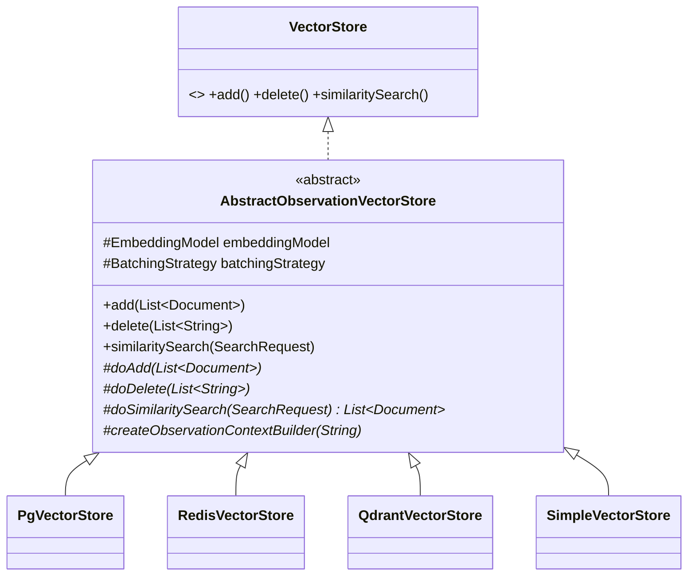
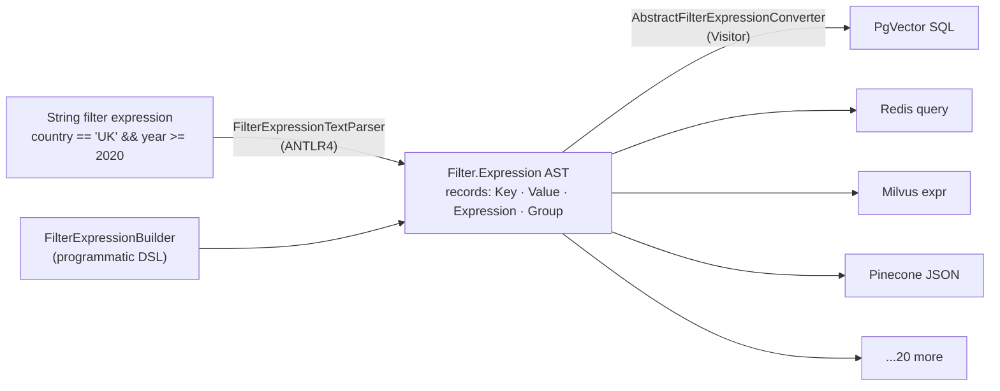
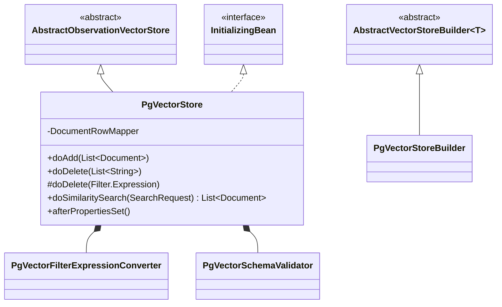

# 06 · `spring-ai-vector-store` — Portability Over 22 Databases

**Module:** [`spring-ai-vector-store/`](../spring-ai-vector-store/) plus
[`vector-stores/`](../vector-stores/) (22 implementations)
**Depends on:** `spring-ai-model` (for `EmbeddingModel`)

Two independently interesting designs live here: a **Template Method** that gives every
store observability for free, and a **portable filter DSL** compiled to 20+ different
query languages via a Visitor. The second is the best LLD study in the whole repository.

---

## 1. The contract

```java
public interface VectorStore extends DocumentWriter, VectorStoreRetriever {
    default String getName() { return this.getClass().getSimpleName(); }
    void add(List<Document> documents);
    default void accept(List<Document> documents) { add(documents); }    // DocumentWriter bridge
    void delete(List<String> idList);
    void delete(Filter.Expression filterExpression);
    default void delete(String filterExpression) { ... }                  // parses, then delegates
    default <T> Optional<T> getNativeClient() { return Optional.empty(); }
    interface Builder<T extends Builder<T>> { ... }
}
```

Three decisions in that snippet:

**(a) `extends DocumentWriter`** — a vector store *is* an ETL sink (chapter 02), so it
plugs into the pipeline with no adapter. `accept()` is the bridge to `add()`.

**(b) `extends VectorStoreRetriever`** — the read side is a separate interface. Code that
only searches can depend on the narrow one. Textbook **Interface Segregation**, and it is
what lets `spring-ai-rag` depend on retrieval without depending on ingestion.

**(c) `getNativeClient()` returning `Optional<T>`** — a deliberate, *marked* escape hatch.
Abstractions over 22 heterogeneous databases will always be a lossy compromise; pretending
otherwise pushes users to fork. Returning `Optional` makes the escape hatch honest: it is
opt-in, defaults to empty, and using it visibly costs portability.

**LLD lesson:** every portability abstraction should have an explicit escape hatch. The
choice is not "leak or don't leak" — it is "leak in a controlled, greppable way, or have
users work around you."

## 2. Template Method — observability for free



```java
// AbstractObservationVectorStore
public void add(List<Document> documents) {
    validateNonTextDocuments(documents);                       // invariant, enforced once
    var ctx = createObservationContextBuilder(Operation.ADD.value()).build();
    VectorStoreObservationDocumentation.AI_VECTOR_STORE
        .observation(customObservationConvention, DEFAULT_OBSERVATION_CONVENTION, () -> ctx, observationRegistry)
        .observe(() -> this.doAdd(documents));                 // ← the only thing a store writes
}
```

The public method owns validation + observation; `doAdd` owns storage. **22 stores get
identical, correct metrics and tracing without one of them writing observability code**,
and a bug fix in the wrapper fixes all 22 at once.

The `do*` naming convention is a Spring-wide idiom (`AbstractController.doHandle`,
`JdbcTemplate.doExecute`). When you see `doX` in Spring code, read it as "the subclass
hook of the template method `x`."

## 3. The filter DSL — portable query compilation

This is the piece worth studying hardest.

### The problem

Users write `country == 'UK' && year >= 2020`. The store must receive:

| Store | Native syntax |
|---|---|
| PgVector | `metadata::jsonb @> ...` / SQL `WHERE` |
| Redis | `@country:{UK} @year:[2020 +inf]` |
| Milvus | `metadata["country"] == "UK" && metadata["year"] >= 2020` |
| Pinecone | `{"country": {"$eq": "UK"}, "year": {"$gte": 2020}}` |
| Neo4j | Cypher |
| Elasticsearch | Query DSL JSON |

Twenty-plus target languages, one source language.

### The solution: a compiler



Front end (two of them: a text parser and a programmatic builder) → **one AST** → 20+ back
ends. This is the classic compiler architecture, and it is why adding a store costs one
converter rather than touching anything shared.

### The AST — 25 lines

```java
public class Filter {
    public enum ExpressionType { AND, OR, EQ, NE, GT, GTE, LT, LTE, IN, NIN, NOT, ISNULL, ISNOTNULL }
    public interface Operand { }
    public record Key(String key)                                          implements Operand { }
    public record Value(Object value)                                      implements Operand { }
    public record Expression(ExpressionType type, Operand left, @Nullable Operand right) implements Operand { }
    public record Group(Expression content)                                implements Operand { }
}
```

Records implementing a common `Operand` interface, with `Expression` self-referential to
give recursion. `Group` exists to preserve explicit parenthesisation from the source — the
AST is deliberately *not* fully normalised, because some back ends need the grouping to
emit correct precedence.

**LLD lesson:** when you need to express open-ended user logic portably, do not invent a
`Map<String,Object>` filter format. Define a tiny AST. It is checkable, printable
(`PrintFilterExpressionConverter` exists for exactly this), transformable, and testable
without any database.

### The back end — Template Method + Visitor

```java
public abstract class AbstractFilterExpressionConverter implements FilterExpressionConverter {
    public String convertExpression(Expression expression) { ... }
    protected void convertOperand(Operand operand, StringBuilder context) { /* dispatch on node type */ }

    protected abstract void doExpression(Filter.Expression expression, StringBuilder context);
    protected abstract void doKey(Filter.Key filterKey, StringBuilder context);
    protected abstract void doSingleValue(Object value, StringBuilder context);

    // sensible defaults a store overrides only if its syntax differs
    protected void doValue(Filter.Value filterValue, StringBuilder context) { ... }
    protected void doNot(Filter.Expression expression, StringBuilder context) { ... }
    protected void doGroup(Group group, StringBuilder context) { ... }
    protected void doStartGroup(...) / doEndGroup(...) / doStartValueRange(...) / doEndValueRange(...)
    protected static Object normalizeDateString(Object value) { ... }   // shared ISO-date handling
}
```

The base class owns **traversal**; subclasses own **emission**. A new store implements
three abstract methods and overrides a handful of `do*` defaults where its syntax differs.
Shared cross-cutting concerns — ISO date normalisation, Lucene string escaping, JSON value
emission — live in the base as `protected static` helpers, so they are written and fixed
once.

`StringBuilder context` threaded through every method is a **hand-rolled visitor
accumulator**. Slightly dated compared to returning values or using a proper visitor
interface, but it avoids allocation per node and keeps every `do*` method void and simple.
Worth having an opinion on (exercise 3).

> **Security note that is also a design note:** these converters emit query strings.
> `PgVectorFilterExpressionConverter` is directly in the path of user-controlled metadata
> filter input. Commit `0e7b5f6`, "Escape metadata values in Redis chat memory queries",
> is exactly this class of bug. When reviewing or writing a converter, ask what a value
> containing the target language's metacharacters does.

## 4. A store implementation, structurally

`PgVectorStore` is 700 lines and the shape generalises:



| Responsibility | Where |
|---|---|
| Schema creation / validation | `PgVectorSchemaValidator` + `afterPropertiesSet()` (`InitializingBean`) |
| Filter translation | `PgVectorFilterExpressionConverter` |
| Row ↔ `Document` mapping | private `DocumentRowMapper` (Spring's `RowMapper`) |
| Construction | `PgVectorStoreBuilder extends AbstractVectorStoreBuilder<PgVectorStoreBuilder>` |
| Embedding + batching | inherited `embeddingModel`, `batchingStrategy` fields |

`AbstractVectorStoreBuilder<T extends Builder<T>>` is the self-referential generic ("CRTP")
builder again — it holds the settings every store needs (`embeddingModel`,
`observationRegistry`, `batchingStrategy`) while `PgVectorStoreBuilder` adds its own and
still returns the *specific* type from inherited setters. Without the self type, every
inherited setter would return the base builder and break the fluent chain.

## 5. Batching — an abstraction over a rate limit

```java
public interface BatchingStrategy { List<List<Document>> batch(List<Document> documents); }
```

Embedding APIs cap tokens per request. `TokenCountBatchingStrategy` splits by estimated
token count. This is a small interface for a very real operational constraint — and note
it lives in `spring-ai-model` next to `EmbeddingModel`, not in the vector store module,
because the constraint belongs to the embedding provider.

**LLD lesson:** operational constraints (rate limits, payload caps, retries) deserve named
abstractions in the layer that *owns* the constraint. Inlining "split into chunks of 100"
into each store would put a provider's limit in 22 wrong places.

## 6. LLD lens

| Pattern | Where | Payoff |
|---|---|---|
| **Template Method** | `AbstractObservationVectorStore`, `AbstractFilterExpressionConverter` | Cross-cutting behaviour written once for 22 stores |
| **Visitor / Interpreter** | `Filter` AST + converters | Add a store, not a change to the DSL |
| **Interpreter front end** | `FilterExpressionTextParser` (ANTLR4) | Text and programmatic DSLs share one AST |
| **Builder (CRTP)** | `AbstractVectorStoreBuilder<T>` | Inherited fluent setters keep the subtype |
| **Strategy** | `BatchingStrategy`, `FilterExpressionConverter` | Swap policy without touching the store |
| **Interface Segregation** | `VectorStoreRetriever` split from `VectorStore` | Read-only consumers stay decoupled |
| **Controlled escape hatch** | `getNativeClient()` | Portability without forcing forks |

## 7. Practice

1. **Write a converter.** Implement `FilterExpressionConverter` targeting a language you
   know (MongoDB, JSONPath, plain SQL). Only three abstract methods are mandatory.
   Compare against `MongoDBAtlasFilterExpressionConverter` afterwards.
2. **Extend the AST.** Add a `LIKE` / `CONTAINS` `ExpressionType`. List every file that
   must change: the enum, the ANTLR grammar, the builder, and *every* converter. Now
   answer: is that cost a flaw, or the correct cost of a portable abstraction? (Consider
   what happens if you instead let each store define its own operators.)
3. **Critique the accumulator.** The converters thread a `StringBuilder` through void
   methods. Rewrite `doExpression`/`doKey` to return `String` for one converter. Compare
   readability and allocation. Which would you pick for a new codebase, and does the answer
   change when there are 22 implementations to migrate?
4. **Read `SimpleVectorStore`.** The in-memory implementation — including
   `SimpleVectorStoreFilterExpressionEvaluator`, which *evaluates* the AST rather than
   compiling it. Same AST, a fundamentally different back end. That is the payoff of
   separating syntax from semantics, demonstrated inside one module.
5. **Diff two stores for an asymmetry.** Compare how `PgVectorStore` and one other store
   handle `delete(Filter.Expression)`, or `similarityThreshold`, or null metadata values.
   Real behavioural differences between stores are among the most commonly filed Spring AI
   issues, and `spring-ai-test`'s `BaseVectorStoreTests` exists precisely to normalise them
   — check whether the store you're reading actually extends it.

Next: [07 · Modular RAG](07-rag.md).
