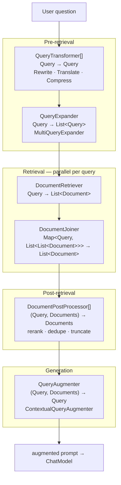

# 07 · `spring-ai-rag` — Modular RAG as Pipes and Filters

**Module:** [`spring-ai-rag/`](../spring-ai-rag/)
**Depends on:** `spring-ai-client-chat`, `spring-ai-vector-store`

The whole module is ~20 files. It is small because it made one good decision: RAG is
modelled as a **pipeline of small functional interfaces**, and the only concrete
orchestrator is a single advisor that wires them together.

The package layout is itself the documentation — it maps directly onto the
[Modular RAG](https://arxiv.org/abs/2407.21059) taxonomy:

```
rag/
├── Query.java                          the value passed between stages
├── preretrieval/query/transformation/  rewrite, translate, compress
├── preretrieval/query/expansion/       one query → many
├── retrieval/search/                   Query → Documents
├── retrieval/join/                     many result sets → one
├── postretrieval/document/             rerank, filter, compress
├── generation/augmentation/            Documents + Query → augmented Query
└── advisor/                            the orchestrator
```

---

## 1. The pipeline



## 2. Every stage is a `java.util.function` type

```java
public interface QueryTransformer      extends Function<Query, Query>                                  { Query transform(Query q); }
public interface QueryExpander         extends Function<Query, List<Query>>                            { List<Query> expand(Query q); }
public interface DocumentRetriever     extends Function<Query, List<Document>>                         { List<Document> retrieve(Query q); }
public interface DocumentJoiner        extends Function<Map<Query, List<List<Document>>>, List<Document>> { List<Document> join(Map<...> m); }
public interface DocumentPostProcessor extends BiFunction<Query, List<Document>, List<Document>>       { List<Document> process(Query q, List<Document> d); }
public interface QueryAugmenter        extends BiFunction<Query, List<Document>, Query>                 { Query augment(Query q, List<Document> d); }
```

Same idiom as the ETL pipeline in chapter 02: **extend the standard functional type, add
a domain-named method, provide a default that delegates.** Every stage is lambda-friendly,
composable via `andThen`, and mockable with a one-liner in tests.

Read the *type signatures alone* and the RAG design is fully specified. Notice how much
information is carried by the shapes:

- `QueryExpander` returns `List<Query>` — that is where fan-out happens.
- `DocumentJoiner` takes `Map<Query, List<List<Document>>>` — a triple nesting that says:
  per expanded query, per retriever, a list of documents. Fan-in must know which query
  produced what (for reciprocal-rank fusion), hence the map key.
- `DocumentPostProcessor` and `QueryAugmenter` are `BiFunction`s taking `Query` — a
  reranker needs the query, not just the documents.

**LLD lesson:** if a reviewer can reconstruct your architecture from the interface
signatures without reading a single implementation, the decomposition is right. Try this
test on your own designs.

## 3. `Query` — the pipeline's value type

```java
public record Query(String text, List<Message> history, Map<String, Object> context) {
    public Query { Assert.hasText(text, "text cannot be null or empty"); /* + null-element checks */ }
    public Query(String text) { this(text, List.of(), Map.of()); }
    public Builder mutate();
}
```

An immutable record validated in its compact constructor, carrying:

- `text` — the query itself,
- `history` — because `CompressionQueryTransformer` must resolve "what about *its* price?"
  against prior turns,
- `context` — the blackboard again, so a transformer can leave a note for a later stage.

Stages return **new** `Query` objects. With parallel retrieval across expanded queries
(see below), shared mutable state would be a data race; immutability makes the
concurrency safe by construction rather than by discipline.

## 4. The orchestrator

[`RetrievalAugmentationAdvisor`](../spring-ai-rag/src/main/java/org/springframework/ai/rag/advisor/RetrievalAugmentationAdvisor.java)
is a `BaseAdvisor` (chapter 04), so all of RAG is ~90 lines inside `before()`:

```java
public ChatClientRequest before(ChatClientRequest req, AdvisorChain chain) {
    Query originalQuery = Query.builder()
        .text(Objects.requireNonNullElse(req.prompt().getUserMessage().getText(), ""))
        .history(req.prompt().getInstructions())
        .context(context).build();

    Query transformed = originalQuery;
    for (var t : this.queryTransformers) transformed = t.apply(transformed);          // 1. transform

    List<Query> expanded = this.queryExpander != null
        ? this.queryExpander.expand(transformed) : List.of(transformed);              // 2. expand

    Map<Query, List<List<Document>>> perQuery = expanded.stream()                     // 3. retrieve (parallel)
        .map(q -> CompletableFuture.supplyAsync(() -> getDocumentsForQuery(q), this.taskExecutor))
        .toList().stream().map(CompletableFuture::join)
        .collect(Collectors.toMap(Map.Entry::getKey, e -> List.of(e.getValue())));

    List<Document> documents = this.documentJoiner.join(perQuery);                    // 4. join
    for (var pp : this.documentPostProcessors) documents = pp.process(originalQuery, documents);  // 5. post-process

    context.put(DOCUMENT_CONTEXT, documents);
    Query augmented = this.queryAugmenter.augment(originalQuery, documents);          // 6. augment

    return req.mutate()
        .prompt(req.prompt().augmentUserMessage(augmented.text()))
        .context(context).build();
}
```

Six steps, each a one-line delegation to a strategy. **There is no RAG business logic in
the orchestrator** — only sequencing and concurrency. That is what makes it possible to
build FlashRAG, self-query, HyDE, and fusion retrieval out of the same class.

Four things worth calling out:

**(a) `Objects.requireNonNullElseGet` defaults in the constructor.** Every collaborator is
optional; missing ones fall back to sane defaults (`ConcatenationDocumentJoiner`,
`ContextualQueryAugmenter`, `List.of()` for the list-valued ones). A user who supplies only
a `DocumentRetriever` gets a working RAG pipeline. **Optional dependencies with defaults
are how you make a highly configurable component approachable** — the alternative,
requiring all six, is technically purer and practically hostile.

**(b) Retrieval is parallel by default**, with an injectable `TaskExecutor` and a
`Scheduler` for the reactive path. Two expanded queries hit the store concurrently. Note
that `getScheduler()` is overridden — this is exactly the `BaseAdvisor` hook from chapter
04 doing its job, keeping blocking retrieval off the event loop.

**(c) `after()` attaches the retrieved documents** to `ChatResponse` metadata under
`DOCUMENT_CONTEXT = "rag_document_context"`. Citations and evaluation need to know what
was retrieved; a published constant makes that contract explicit.

**(d) It uses `augmentUserMessage`**, the surgical `Prompt` operation from chapter 03,
rather than rebuilding the message list.

## 5. The provided implementations

| Stage | Implementation | What it does |
|---|---|---|
| Transform | `RewriteQueryTransformer` | LLM rewrites the query for retrieval |
| Transform | `TranslationQueryTransformer` | Translates into the corpus language |
| Transform | `CompressionQueryTransformer` | Folds conversation history into a standalone query |
| Expand | `MultiQueryExpander` | LLM generates N query variants |
| Retrieve | `VectorStoreDocumentRetriever` | Similarity search with threshold, topK, filter |
| Join | `ConcatenationDocumentJoiner` | Flatten + dedupe |
| Augment | `ContextualQueryAugmenter` | Injects documents into a prompt template; handles the empty-context case |

Three of the seven are **LLM-powered** — they take a `ChatClient.Builder` and call a model
themselves. A `QueryTransformer` that internally does inference is architecturally
identical to one that does string manipulation, because the interface says nothing about
how the transformation happens. That is the payoff of a narrow contract.

`ContextualQueryAugmenter` handles the "no documents retrieved" branch explicitly — either
allowing an empty context or emitting a refusal prompt. That empty case is where naive RAG
implementations hallucinate, and it is a policy decision, so it is configurable.

## 6. Building a pipeline

```java
Advisor rag = RetrievalAugmentationAdvisor.builder()
    .queryTransformers(RewriteQueryTransformer.builder().chatClientBuilder(builder).build())
    .queryExpander(MultiQueryExpander.builder().chatClientBuilder(builder).numberOfQueries(3).build())
    .documentRetriever(VectorStoreDocumentRetriever.builder()
        .vectorStore(vectorStore).similarityThreshold(0.7).topK(5).build())
    .documentPostProcessors(myReranker)
    .build();

chatClient.prompt().advisors(rag).user(question).call().content();
```

Composition, not inheritance. There is no `AdvancedRagAdvisor extends BasicRagAdvisor`;
there is one orchestrator and a bag of strategies. Adding HyDE means writing a
`QueryTransformer` — no framework change.

## 7. LLD lens

| Pattern | Where | Payoff |
|---|---|---|
| **Pipes and Filters** | The six stage interfaces | Stages are independently testable and reorderable |
| **Strategy** | Every stage | Behaviour swapped by configuration |
| **Composition over inheritance** | One orchestrator + injected strategies | No subclass explosion for RAG variants |
| **Builder with defaults** | `RetrievalAugmentationAdvisor.Builder` | Six optional dependencies stay approachable |
| **Immutable value object** | `Query` | Parallel stages are safe by construction |
| **Blackboard** | `Query.context` + `DOCUMENT_CONTEXT` | Stage-to-stage and advisor-to-caller communication |
| **Scatter–gather** | expander → parallel retrieve → joiner | Fan-out/fan-in as explicit, named roles |

## 8. Practice

1. **Write a `DocumentPostProcessor`** that deduplicates by `Document.getId()` and keeps
   the highest `score`. Note how `Document.score` (chapter 02's debatable field) makes this
   trivial — and reconsider whether that field was the right call after all.
2. **Implement HyDE.** A `QueryTransformer` that asks the LLM to write a *hypothetical
   answer* and retrieves against that. Roughly 30 lines. Then ask what the empty-answer
   failure mode is and where you'd handle it.
3. **Design reciprocal rank fusion.** Write a `DocumentJoiner` implementing RRF. Now
   explain precisely why the interface takes `Map<Query, List<List<Document>>>` rather than
   `List<Document>` — your implementation needs both the per-query grouping *and* the
   within-list ordering. This is a case where the signature was designed around a future
   implementation.
4. **Find the concurrency contract.** The advisor uses both a `TaskExecutor` (blocking) and
   a `Scheduler` (reactive). Trace which is used in `adviseCall` vs `adviseStream`. What
   breaks if a `DocumentRetriever` blocks and `getScheduler()` returns an immediate
   scheduler?
5. **Compare with `advisors/spring-ai-vector-store-advisor`.** That module has a simpler,
   older RAG advisor. Diff the two designs and articulate what the modular version bought
   and what it cost in complexity. Both still exist — argue whether they should.

Next: [08 · Chat Memory](08-chat-memory.md).
