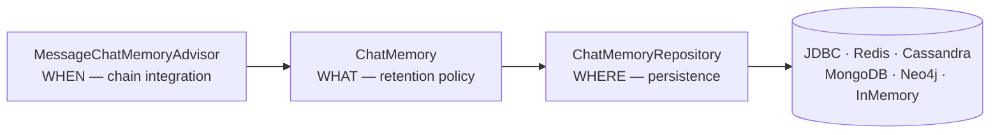
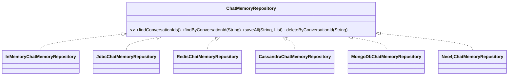

# 08 · Chat Memory — Policy Separated from Storage

**Packages:** `spring-ai-model/.../chat/memory/`,
`spring-ai-client-chat/.../advisor/MessageChatMemoryAdvisor.java`,
[`memory-repositories/`](../memory-repositories/) (5 backends)

A small subsystem with a clean three-way split that is worth copying wherever you have
"keep some state, decide how much, store it somewhere."

---

## 1. Three responsibilities, three types



| Layer | Interface | Question it answers | Varies with |
|---|---|---|---|
| Integration | `MemoryAdvisor` / `BaseChatMemoryAdvisor` | When is memory read and written? | The advisor chain |
| Policy | `ChatMemory` | How much history is kept, and which messages? | Product requirements |
| Storage | `ChatMemoryRepository` | Where do messages live? | Infrastructure |

Each axis varies for entirely different reasons and at entirely different rates. That is
the **Single Responsibility Principle** in its precise formulation — separate things that
change for different reasons, not merely things that "do different jobs."

The concrete payoff: swapping JDBC for Redis touches no policy code, and switching from a
sliding window to summarisation touches no storage code.

## 2. The interfaces

```java
public interface ChatMemory {
    String CONVERSATION_ID = "chat_memory_conversation_id";
    default void add(String conversationId, Message message) { add(conversationId, List.of(message)); }
    void add(String conversationId, List<Message> messages);
    List<Message> get(String conversationId);
    void clear(String conversationId);
}

public interface ChatMemoryRepository {
    List<String> findConversationIds();
    List<Message> findByConversationId(String conversationId);
    void saveAll(String conversationId, List<Message> messages);
    void deleteByConversationId(String conversationId);
}
```

Note they are **almost but not quite the same shape**, and the differences are the design:

- `ChatMemory.add` *appends* and applies policy. `ChatMemoryRepository.saveAll` *replaces*
  the whole conversation — a dumb, total write.
- The repository has `findConversationIds()`; `ChatMemory` does not. Enumeration is an
  administrative storage concern, not a conversational one.

Putting the total-replace semantics in the repository is what keeps backends simple:
they never implement trimming, ordering, or system-message rules. Whether that is the
right performance tradeoff for a 10,000-message conversation is a legitimate design
question (exercise 3).

Naming follows **Spring Data conventions** — `findByConversationId`, `saveAll`,
`deleteByConversationId`. A Spring developer can implement this interface without reading
its Javadoc. Borrowing an established vocabulary is free usability.

## 3. `MessageWindowChatMemory` — where the policy actually lives

The default implementation keeps the last N messages (`DEFAULT_MAX_MESSAGES = 20`). The
naive version is `subList(size - 20, size)`. Read what it actually does:

```java
private List<Message> process(List<Message> memoryMessages, List<Message> newMessages) {
    // 1. A new SystemMessage REPLACES the stored one rather than accumulating
    boolean hasNewSystemMessage = newMessages.stream()
        .filter(SystemMessage.class::isInstance)
        .anyMatch(m -> !memoryMessagesSet.contains(m));
    memoryMessages.stream()
        .filter(m -> !(hasNewSystemMessage && m instanceof SystemMessage))
        .forEach(processedMessages::add);
    processedMessages.addAll(newMessages);

    if (processedMessages.size() <= this.maxMessages) return processedMessages;

    // 2. SystemMessages are NEVER evicted — only non-system indices are candidates
    List<Integer> nonSystemIndices = /* indices of non-system messages */;

    // 3. The window must START on a USER message
    int cutIndex = processedMessages.size() - this.maxMessages;
    while (cutIndex < nonSystemIndices.size()
            && processedMessages.get(nonSystemIndices.get(cutIndex)).getMessageType() != MessageType.USER) {
        cutIndex++;
    }
    // ... remove the first cutIndex non-system messages
}
```

Three non-obvious invariants, each protecting against a real failure:

1. **System messages survive eviction.** Otherwise a long conversation silently loses its
   instructions and the assistant's behaviour drifts.
2. **A new system message replaces the old one.** Otherwise every turn with a system prompt
   accumulates duplicates.
3. **The window starts on a `USER` message.** This is the subtle one. Cutting mid-exchange
   can leave an `AssistantMessage` with `toolCalls` whose matching `ToolResponseMessage`
   was evicted — most providers reject that with a 400. The advance-to-USER loop keeps the
   history structurally valid.

**LLD lesson:** "keep the last N" sounds like a one-liner and isn't, because the items are
not independent — they have structural relationships. **Before implementing a retention
policy, enumerate the invariants that must hold over the retained set.** This method is a
compact, real example of doing that well, and each of those three rules almost certainly
started life as a bug report.

## 4. The advisor

`MessageChatMemoryAdvisor implements BaseChatMemoryAdvisor` (which extends `BaseAdvisor`
*and* the `MemoryAdvisor` marker from chapter 04):

```java
public ChatClientRequest before(ChatClientRequest req, AdvisorChain chain) {
    String conversationId = getConversationId(req.context());          // from the blackboard
    List<Message> memoryMessages = this.chatMemory.get(conversationId);
    List<Message> promptMessages = req.prompt().getInstructions();

    List<Message> processed = new ArrayList<>();
    if (!isMemoryAlreadyInPrompt(promptMessages, memoryMessages)) {    // ← idempotence guard
        processed.addAll(memoryMessages);
    }
    processed.addAll(promptMessages);

    // hoist any SystemMessage to position 0 — most providers require it first
    ...
    this.chatMemory.add(conversationId, processed.get(lastUserOrToolResponseIndex));
    return req.mutate().prompt(req.prompt().mutate().messages(processed).build()).build();
}
```

`isMemoryAlreadyInPrompt` does a sublist-prefix scan to detect history that is already
present. That guard exists because of the tool-calling loop: `ToolCallingAdvisor` re-enters
the chain on each iteration, so `before()` can run several times per user turn. Without
the check, history would be duplicated once per tool call.

This is the other half of the coordination described in chapter 04 §6 —
`autoRegisterToolCallingAdvisor()` disables the tool advisor's own history handling when a
downstream `MemoryAdvisor` exists, and `isMemoryAlreadyInPrompt` defends the same
invariant from the memory side. **Two independent guards for one invariant**, because the
components must not depend on each other's presence.

The conversation id comes from the context map via a default method on
`BaseChatMemoryAdvisor`, keyed by the published `ChatMemory.CONVERSATION_ID` constant:

```java
chatClient.prompt()
    .advisors(a -> a.param(ChatMemory.CONVERSATION_ID, "user-42"))
    .user("...").call().content();
```

## 5. The repositories



`InMemoryChatMemoryRepository` ships in `spring-ai-model` so the abstraction is usable and
testable with zero infrastructure. **Always ship an in-memory implementation of a storage
SPI** — it is the reference implementation, the test double, and the getting-started path
in one class.

The five real backends each live in their own module with their own auto-configuration and
starter, following the chapter 11 modularity rules.

Two recent commits are instructive about where bugs live in this layer:

- `0e7b5f6` — "Escape metadata values in Redis chat memory queries" (injection through a
  query language, the same hazard as chapter 06's filter converters)
- `c988e72` — "Reserve Redis chat memory timestamps atomically" (a concurrency bug in
  ordering)

Both are storage-layer bugs invisible from the policy layer — which is itself an argument
that the split is real.

## 6. LLD lens

| Pattern | Where | Payoff |
|---|---|---|
| **Repository** | `ChatMemoryRepository` | Storage swappable, policy untouched |
| **Strategy** | `ChatMemory` | Retention policy swappable, storage untouched |
| **Marker interface** | `MemoryAdvisor` | Lets the chain builder coordinate with tool calling |
| **Null Object / reference impl** | `InMemoryChatMemoryRepository` | Usable and testable with no infrastructure |
| **Convention borrowing** | Spring Data method naming | Zero-cost familiarity |
| **Idempotence guard** | `isMemoryAlreadyInPrompt` | Safe re-entry from the tool loop |

## 7. Practice

1. **Implement `SummarizingChatMemory`.** When a conversation exceeds N messages, call an
   LLM to summarise the oldest and replace them with one `SystemMessage`. Which of
   `MessageWindowChatMemory`'s three invariants must you preserve? Which becomes irrelevant?
2. **Implement `ChatMemoryRepository` over a `ConcurrentHashMap`** without looking at
   `InMemoryChatMemoryRepository`, then diff. Pay attention to defensive copying — a
   repository that hands out its internal list is a mutation bug waiting to happen.
3. **Challenge `saveAll`.** Total replacement is O(n) writes per turn. Design an
   append-only `ChatMemoryRepository` variant and list what breaks: how do you trim, how do
   you replace a system message, what does `findByConversationId` return? Then judge whether
   the simplicity of the current interface is worth its cost at realistic conversation
   lengths.
4. **Reproduce the tool-loop duplication bug.** Register `MessageChatMemoryAdvisor`, force
   a multi-iteration tool call, and stub out `isMemoryAlreadyInPrompt` to return `false`.
   Observe the duplicated history. This makes the guard's purpose concrete and unforgettable.
5. **Cross-check the backends.** Pick an edge case — empty conversation, a message with
   null text, a very long message, concurrent writes to one conversation id — and check how
   each of the five repositories behaves. Divergence here is a real, reportable issue, and
   a shared abstract test class would be a valuable contribution.

Next: [09 · MCP](09-mcp.md).
