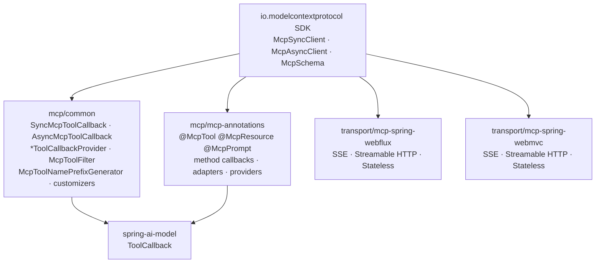
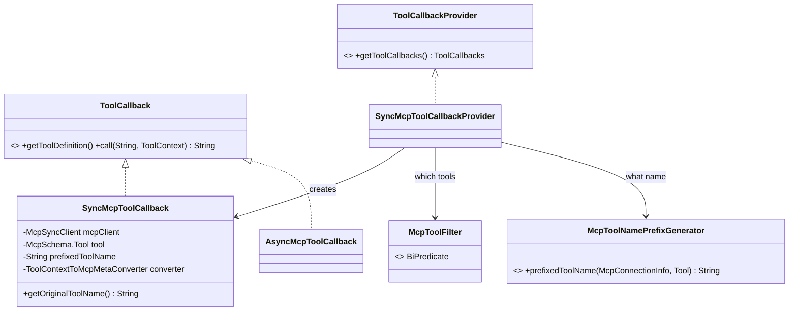
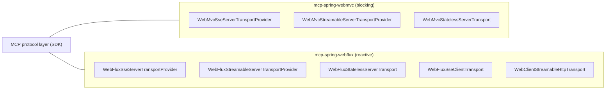

# 09 · MCP — Adapter at a Protocol Boundary

**Modules:** [`mcp/common`](../mcp/common/), [`mcp/mcp-annotations`](../mcp/mcp-annotations/),
[`mcp/transport/mcp-spring-webflux`](../mcp/transport/), `mcp/transport/mcp-spring-webmvc`,
plus `auto-configurations/mcp/*` and `starters/spring-ai-starter-mcp-*`

The [Model Context Protocol](https://modelcontextprotocol.io) lets an application consume
tools, prompts, and resources from an external server. Spring AI is both a **client**
(consume remote tools) and a **server** (expose your beans as tools).

The LLD interest here is the same lesson twice: **how to integrate a foreign protocol
without letting it into your core.**

---

## 1. Module split



Note the direction: `mcp/common` depends on `spring-ai-model`, never the reverse.
**`spring-ai-model` has no idea MCP exists.** MCP is one more `ToolCallback` source, on
exactly equal footing with `@Tool` methods and lambdas.

That is the acid test for a protocol integration: if adding it required a change to the
core abstraction, the abstraction was wrong.

## 2. Client side — MCP tools become `ToolCallback`s



```java
public class SyncMcpToolCallback implements ToolCallback {
    private final McpSyncClient mcpClient;
    private final McpSchema.Tool tool;
    private final String prefixedToolName;
    private final ToolContextToMcpMetaConverter toolContextToMcpMetaConverter;

    public ToolDefinition getToolDefinition() {
        return McpToolUtils.createToolDefinition(this.prefixedToolName, this.tool);
    }

    public String call(String toolCallInput, @Nullable ToolContext toolContext) {
        if (!StringUtils.hasText(toolCallInput)) { toolCallInput = "{}"; }   // defensive: models omit empty args
        Map<String, Object> arguments = jsonHelper.fromJsonToMap(toolCallInput);
        CallToolResult response = mcpClient.callTool(...);
        ...
    }
}
```

A **textbook Adapter**: `McpSchema.Tool` + `McpSyncClient` on one side, `ToolCallback` on
the other. Everything upstream — `ToolCallingManager`, `ToolCallingAdvisor`, `ChatClient` —
is completely unaware that this tool lives on another machine.

Because `ToolCallback.call` is `String → String` (chapter 05), the adaptation is nearly
free: MCP already speaks JSON. Had `ToolCallback` used a typed argument model, this class
would need a bidirectional mapping layer. **The primitive-looking interface pays off
exactly here** — that is the justification for the design choice, made concrete.

### Two extension points born from real-world pain

```java
public interface McpToolNamePrefixGenerator {
    String prefixedToolName(McpConnectionInfo mcpConnectionInfo, Tool tool);
    static McpToolNamePrefixGenerator noPrefix() { return (info, tool) -> tool.name(); }
}
public interface McpToolFilter extends BiPredicate<McpConnectionInfo, McpSchema.Tool> { }
```

**`McpToolNamePrefixGenerator`** solves name collision: two MCP servers may both expose
`search`. Prefixing disambiguates. But prefixes lengthen names, and providers cap tool-name
length — so `DefaultToolCallingManager` even carries a warning constant,
`POSSIBLE_LLM_TOOL_NAME_CHANGE_WARNING_START` ("LLM may have adapted the tool name…"),
pointing users at this generator. `SyncMcpToolCallback` keeps `getOriginalToolName()` so
the pre-prefix identity is never lost.

**`McpToolFilter`** solves scope: an MCP server may expose 200 tools and you want 5.
Filtering at the boundary keeps the model's tool list small — which is a cost, latency,
and accuracy concern, not just tidiness.

Both are `BiPredicate`/functional interfaces with static factory defaults — the same
"extend a JDK functional type" idiom as chapters 02 and 07.

**LLD lesson:** at any integration boundary between namespaces you do not control,
**identity mapping (naming) and scope selection (filtering) are the two extension points
you will eventually need.** Design them in from the start; retrofitting naming policy after
users depend on generated names is painful.

## 3. Server side — annotation-driven method binding

`mcp/mcp-annotations` exposes your Spring beans over MCP:

| Annotation | Exposes |
|---|---|
| `@McpTool`, `@McpToolParam`, `@McpArg` | A method as an MCP tool |
| `@McpResource` | A method as an MCP resource |
| `@McpPrompt` | A method as an MCP prompt template |
| `@McpComplete` | Argument autocompletion |
| `@McpSampling` | Server-initiated LLM calls back through the client |
| `@McpElicitation` | Requesting structured input from the user |
| `@McpProgress`, `@McpProgressToken`, `@McpLogging` | Progress and log notifications |
| `@McpToolListChanged`, `@McpResourceListChanged`, `@McpPromptListChanged` | List-change callbacks |

The package layout shows the pattern being applied uniformly:

```
annotation/
├── method/{tool,prompt,resource,complete,sampling,elicitation,logging,progress,changed/*}/
│      Sync* / Async* / Abstract* MethodCallback per feature
├── provider/{...}/       scans beans, produces specifications
├── adapter/              PromptAdapter, ResourceAdapter, CompleteAdapter
└── context/              McpSyncRequestContext, McpAsyncRequestContext, spec objects
```

Every feature follows `Abstract*MethodCallback` → `Sync*` / `Async*`. That is **Template
Method used to share reflection logic between the blocking and reactive variants** — the
argument binding, validation, and result conversion are written once in the abstract base,
and only the invocation/return-type handling differs.

This mirrors the `BaseAdvisor` sync/stream split (chapter 04) and the
`SyncMcpToolCallback`/`AsyncMcpToolCallback` pair. **When a codebase supports both blocking
and reactive, the sync/async pair with a shared abstract base is the recurring structural
answer.** Recognise it once and you can navigate all three.

## 4. Transports — the same protocol over two web stacks



Three transport styles (SSE, Streamable HTTP, Stateless) × two web stacks. Protocol logic
lives in the SDK; these modules only bridge to `WebMvc`/`WebFlux` primitives. **Separating
protocol from transport** is why adding a stack meant adding a module rather than editing
the protocol.

The `stateless` variants are recent (`bf122ac`, "Add customizers for stateless MCP
servers") — statelessness matters for serverless and horizontally-scaled deployments,
where session affinity cannot be assumed.

## 5. Customizers — the Spring extension idiom

```java
public interface McpSyncServerCustomizer { ... }
public interface McpAsyncServerCustomizer { ... }
public interface McpStatelessSyncServerCustomizer { ... }
public interface McpStatelessAsyncServerCustomizer { ... }
public interface McpClientCustomizer { ... }
```

Auto-configuration builds an object; users need to tweak it; the auto-config must not
anticipate every tweak. The Spring answer is a `*Customizer` callback bean collected and
applied before the object is finished. You will meet the identical pattern in
`RestTemplateCustomizer`, `WebClientCustomizer`, `TomcatConnectorCustomizer`, and
`ChatClientCustomizer`/`ChatClientBuilderCustomizer` in `spring-ai-client-chat`.

**LLD lesson:** when a factory produces an object whose configuration surface you cannot
fully predict, expose a customizer callback rather than growing the property namespace.
Properties handle the anticipated 90%; customizers handle the unanticipated 10% without
a framework release.

## 6. LLD lens

| Pattern | Where | Payoff |
|---|---|---|
| **Adapter** | `SyncMcpToolCallback` | Remote tools are indistinguishable from local ones upstream |
| **Provider / Abstract Factory** | `SyncMcpToolCallbackProvider` | Bulk, dynamic discovery |
| **Strategy** | `McpToolFilter`, `McpToolNamePrefixGenerator`, `ToolContextToMcpMetaConverter` | Scope and identity policy are the caller's |
| **Template Method** | `Abstract*MethodCallback` | Sync/async share all reflection logic |
| **Customizer callback** | `Mcp*Customizer` | Extensibility without property sprawl |
| **Layer separation** | protocol (SDK) vs transport (webmvc/webflux) | New web stack = new module |
| **Event notification** | `McpToolsChangedEvent` | Tool lists can change at runtime |

## 7. Practice

1. **Trace a remote call.** From `ToolCallingManager.executeToolCalls` through
   `SyncMcpToolCallback.call` to `McpSyncClient.callTool`. Mark exactly where the process
   boundary is. Then ask what `ToolCallingManager` would need to know differently if it
   *did* know the tool was remote — timeouts? retries? The answer tells you whether the
   abstraction is leaking.
2. **Write an `McpToolFilter`** that admits only tools whose description mentions
   "read-only". Then think about the trust model: the description is written by the remote
   server. What is a filter actually protecting you from, and what is it not?
3. **Explain the prefix warning.** Find `POSSIBLE_LLM_TOOL_NAME_CHANGE_WARNING_START` in
   `DefaultToolCallingManager`. Reconstruct the bug report that caused it. What would you
   change about `ToolDefinition` to make this class of problem structurally impossible?
4. **Diff sync and async.** Read `SyncMcpToolCallback` and `AsyncMcpToolCallback` side by
   side. How much is duplicated? Could a shared abstract base have eliminated it — and why
   might the authors have chosen duplication here but a shared base in
   `Abstract*MethodCallback`?
5. **Read commit `fd3fd6e`**, "Refine documentation on MCP/local tool name collision".
   Documentation PRs on genuinely subtle behaviour are valuable, welcome, and a realistic
   first contribution.

Next: [10 · Observability](10-observability.md).
