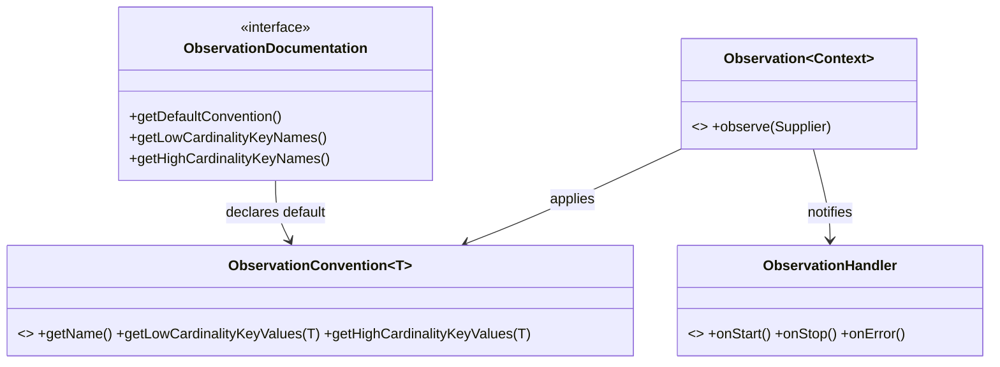
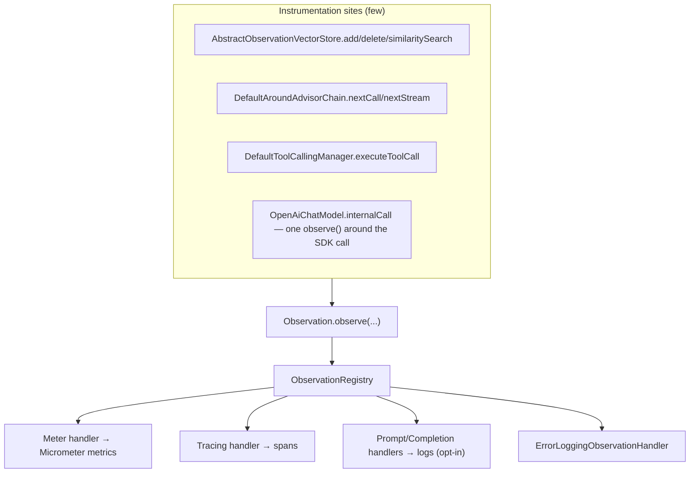

# 10 · Observability — Cross-Cutting Concerns Done Once

**Packages:** `spring-ai-commons/.../observation/`, `spring-ai-model/.../*/observation/`,
`spring-ai-vector-store/.../vectorstore/observation/`,
`spring-ai-client-chat/.../advisor/observation/`, `auto-configurations/.../observation/`

Every AI operation in Spring AI is instrumented: chat calls, embeddings, image generation,
vector-store operations, advisor hops, tool executions. Yet **no provider implementation
contains metric or trace code**. That is the design worth studying.

---

## 1. Micrometer's four-part model



| Piece | Role | Spring AI example |
|---|---|---|
| **Context** | Carries the data being observed | `ChatModelObservationContext(prompt, response, provider, streaming)` |
| **Documentation** | Declares the observation and its allowed key names | `ChatModelObservationDocumentation.CHAT_MODEL_OPERATION` |
| **Convention** | Turns a Context into name + tags | `DefaultChatModelObservationConvention` |
| **Handler** | Consumes events (metrics, traces, logs) | `ChatModelMeterObservationHandler`, `ChatModelCompletionObservationHandler` |

## 2. Where instrumentation lives — never in the provider



For chat models the `observe()` call is inside the provider, but it is a **single call
wrapping the SDK invocation** — the provider supplies a `ChatModelObservationContext` and
nothing else. It never names a metric, never chooses a tag. For vector stores, advisors
and tools, the provider does not even do that: the abstract base or the manager owns it.

**LLD lesson:** cross-cutting concerns belong at *choke points* — the few places every
call must pass through. Find the choke point (an abstract base, a chain, a manager); if
there isn't one, that absence is the design problem, not the instrumentation.

## 3. Convention over hardcoding

```java
public interface ChatModelObservationConvention extends ObservationConvention<ChatModelObservationContext> {
    @Override
    default boolean supportsContext(Observation.Context context) {
        return context instanceof ChatModelObservationContext;
    }
}
```

Every call site takes **two** conventions:

```java
ChatModelObservationDocumentation.CHAT_MODEL_OPERATION
    .observation(this.observationConvention,        // user-supplied, may be null
                 DEFAULT_OBSERVATION_CONVENTION,    // framework default
                 () -> observationContext,
                 this.observationRegistry)
    .observe(() -> { ... });
```

Custom-if-present, default-otherwise. Metric *names and tags* become a user-overridable
policy — which matters because tag cardinality drives observability cost, and no framework
can pick the right tradeoff for every deployment.

Note the default `supportsContext` implementation: a one-line `instanceof` that every
implementor would otherwise write identically (and occasionally get wrong). Same
"hoist the boilerplate into a default method" reflex as `BaseAdvisor`.

## 4. Low vs. high cardinality — a real design constraint

`ChatModelObservationDocumentation` splits key names into two enums:

```java
public enum LowCardinalityKeyNames implements KeyName { ... }    // → metric tags
public enum HighCardinalityKeyNames implements KeyName { ... }   // → trace attributes only
```

This is not bureaucracy. A metric tag creates one time series per distinct value: model
name (~50 values) is fine; a prompt string is a memory leak in your metrics backend.

**LLD lesson:** when you design a telemetry API, **make cardinality a type-level
distinction**, not a comment. If the only thing stopping a developer from tagging metrics
with a user id is documentation, it will happen. Two enums make the wrong thing awkward.

## 5. Standard attribute names — OpenTelemetry GenAI semantic conventions

```java
public enum AiObservationAttributes {
    AI_OPERATION_TYPE("gen_ai.operation.name"),
    AI_PROVIDER("gen_ai.system"),
    REQUEST_MODEL("gen_ai.request.model"),
    REQUEST_MAX_TOKENS("gen_ai.request.max_tokens"),
    REQUEST_FREQUENCY_PENALTY("gen_ai.request.frequency_penalty"),
    ...
}
```

These are **OpenTelemetry GenAI semantic convention** names, not invented ones. Alongside
them: `AiOperationType`, `AiProvider`, `AiTokenType`, `SpringAiKind`,
`VectorStoreObservationAttributes`, `VectorStoreProvider`, `VectorStoreSimilarityMetric`.

Adopting an external standard means a Grafana dashboard written for any GenAI framework
works against Spring AI. **When a standard exists for your domain's vocabulary, adopting
it is worth more than a better-designed private one** — interoperability beats elegance
for identifiers.

All of these live in `spring-ai-commons`, so every layer references the same constants.
Enum-with-`value()` rather than `static final String` gives you exhaustiveness and
discoverability.

## 6. Sensitive data is opt-in

`ChatModelPromptContentObservationHandler` and `ChatModelCompletionObservationHandler`
log prompt and completion content. They are **not registered by default** — they are
enabled by explicit properties in the observation auto-configurations. Prompts contain
user PII; completions contain model output about that PII.

Related: the reference contribution guidelines require PII logging to be marked with the
`PII_MARKER` SLF4J marker, so deployments can filter it centrally.

**LLD lesson:** any feature that increases data exposure defaults to off, and the on-switch
lives in configuration, not in code. This is a design rule, not a security afterthought —
if the safe default requires a code change, the design is wrong.

`TracingAwareLoggingObservationHandler` correlates logs with the active trace, so
opt-in content logging is still navigable.

## 7. Metrics generated

`ModelUsageMetricsGenerator` + `AiObservationMetricNames` / `AiObservationMetricAttributes`
turn token usage into counters, split by `AiTokenType` (input/output/total). Token counts
are the cost driver of an LLM application, so they are first-class telemetry rather than
something you reconstruct from logs.

## 8. Observability in the reactive path

Streaming makes this hard: an observation must span the whole `Flux`, and trace context
must propagate across scheduler hops. `DefaultAroundAdvisorChain.nextStream` shows the
full technique:

```java
return Flux.deferContextual(contextView -> {
    var advisor = this.streamAdvisors.pop();
    var observation = AI_ADVISOR.observation(...);
    Observation parentObservation = contextView.getOrDefault(ObservationThreadLocalAccessor.KEY, null);
    observation.parentObservation(parentObservation);
    try (Observation.Scope ignored = parentObservation != null ? parentObservation.openScope() : Observation.Scope.NOOP) {
        observation.start();
    }
    Flux<ChatClientResponse> response = Flux.defer(() -> advisor.adviseStream(chatClientRequest, this)
        .doOnError(observation::error)
        .doFinally(s -> observation.stop())
        .contextWrite(ctx -> ctx.put(ObservationThreadLocalAccessor.KEY, observation)));
    return CHAT_CLIENT_MESSAGE_AGGREGATOR.aggregateChatClientResponse(response, observationContext::setChatClientResponse);
});
```

Four things happen here that are easy to get wrong: reading the parent from the reactor
context, opening a scope only to `start()`, writing the new observation into the
downstream context, and stopping in `doFinally` so cancellation is handled too. Plus
`ChatClientMessageAggregator` reassembles the streamed chunks into one logical response so
the observation records a complete result rather than a fragment.

This code exists **once**. Every advisor gets correct reactive tracing without knowing any
of it — the same argument as `BaseAdvisor.adviseStream` in chapter 04.

## 9. LLD lens

| Pattern | Where | Payoff |
|---|---|---|
| **Decorator / choke point** | `AbstractObservationVectorStore`, advisor chain, `ToolCallingManager` | Instrumentation written once |
| **Strategy** | `ObservationConvention` | Naming and tagging are user policy |
| **Null Object** | `ObservationRegistry.NOOP` as default | No null checks, no cost when unused |
| **Type-level constraint** | Low vs. high cardinality enums | Makes the expensive mistake awkward |
| **Standard adoption** | OTel GenAI attribute names | Ecosystem interoperability |
| **Secure by default** | Content handlers off unless enabled | Exposure requires an explicit decision |

## 10. Practice

1. **Write a custom `ChatModelObservationConvention`** that adds a `tenant` tag from
   `ChatModelObservationContext`. Decide low or high cardinality and defend it in one
   sentence — that sentence is the whole exercise.
2. **Find the un-instrumented path.** Pick a module (say a `document-readers/*` reader) and
   check whether it has observation support. If not, is that a gap or correct scoping? An
   argued answer, filed as an issue, is a genuine contribution.
3. **Compare conventions.** Read `DefaultChatModelObservationConvention` and
   `DefaultVectorStoreObservationConvention` side by side. Are their naming schemes
   consistent? Inconsistencies in observability naming are real, small, high-value PRs.
4. **Trace a stream.** Run a streaming `ChatClient` call with a `SimpleLoggerAdvisor` and a
   tracing backend. Verify the advisor spans nest correctly under the chat-model span. Then
   remove the `contextWrite(...)` line locally and watch the nesting break — the fastest way
   to understand why that line exists.
5. **Audit the safe defaults.** Find where `ChatModelPromptContentObservationHandler` is
   conditionally registered in `auto-configurations/models/chat/observation/`. Confirm it
   defaults to off. Then check the embedding and image equivalents — are they consistent?

Next: [11 · Auto-configuration and Starters](11-autoconfig-and-starters.md).
