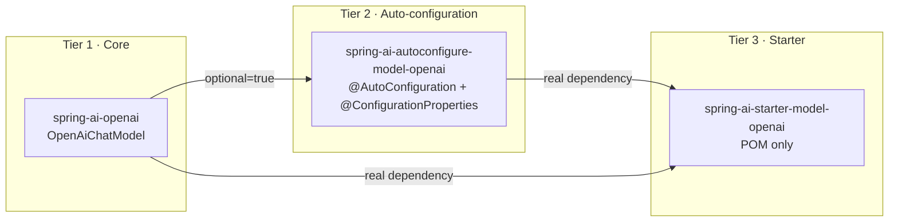
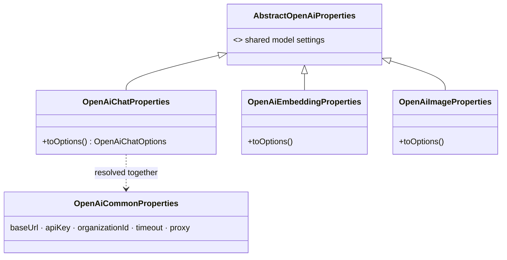
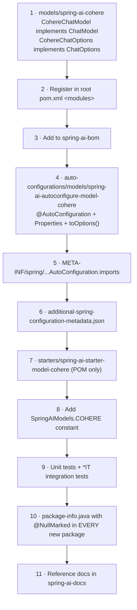

# 11 · Auto-configuration and Starters — Wiring as a Leaf

**Modules:** [`auto-configurations/`](../auto-configurations/) (54),
[`starters/`](../starters/) (48)

102 of the 168 modules are wiring. They contain almost no logic — and that is the point.
This chapter is about **module design**, which is the LLD level people practise least and
get wrong most.

Read [`design/02-boot-modularity.adoc`](../design/02-boot-modularity.adoc) alongside it.

---

## 1. The three-tier rule, enforced by the build



| Tier | May depend on Boot? | Contains code? | Dependency style |
|---|---|---|---|
| Core (`models/*`, `vector-stores/*`, …) | **No** | Yes | normal |
| Auto-config (`auto-configurations/*`) | Yes | Yes | **every non-test dep `optional=true`**, except deps on other auto-configs |
| Starter (`starters/*`) | Yes (transitively) | **No** | normal — it re-declares what the auto-config marked optional |

`maven-enforcer-plugin`'s `bannedDependencies` rule fails the build on violations. The
architecture is not a guideline here; it is a test.

**Why `optional=true` matters.** An auto-configuration module must have **zero impact when
the underlying library is absent**. Marking dependencies optional means adding
`spring-ai-autoconfigure-model-openai` to a classpath drags in nothing — the
`@ConditionalOnClass` guards then evaluate to false and the configuration silently does
not apply. The consequence users must know: **depending on an auto-config module alone
requires adding `spring-boot-autoconfigure` yourself.** Starters exist so nobody has to.

**LLD lesson:** the strongest architectural boundaries are the ones a build tool can
check. A rule in a wiki is a suggestion; a rule in `maven-enforcer-plugin` is an
invariant. When you design module boundaries, ask "what would fail if someone violated
this?" — and if the answer is "nothing until code review", automate it.

## 2. Anatomy of an auto-configuration

[`OpenAiChatAutoConfiguration`](../auto-configurations/models/spring-ai-autoconfigure-model-openai/src/main/java/org/springframework/ai/model/openai/autoconfigure/OpenAiChatAutoConfiguration.java):

```java
@AutoConfiguration
@EnableConfigurationProperties({ OpenAiCommonProperties.class, OpenAiChatProperties.class })
@ConditionalOnProperty(name = SpringAIModelProperties.CHAT_MODEL,
                       havingValue = SpringAIModels.OPENAI, matchIfMissing = true)
public class OpenAiChatAutoConfiguration {

    @Bean
    @ConditionalOnMissingBean
    public OpenAiChatModel openAiChatModel(
            OpenAiCommonProperties commonProperties,
            OpenAiChatProperties chatProperties,
            ToolCallingManager toolCallingManager,
            ObjectProvider<ObservationRegistry> observationRegistry,
            ObjectProvider<MeterRegistry> meterRegistry,
            ObjectProvider<ChatModelObservationConvention> observationConvention,
            ObjectProvider<OpenAiHttpClientBuilderCustomizer> httpClientBuilderCustomizers) {

        var resolved = OpenAiAutoConfigurationUtil.resolveCommonProperties(commonProperties, chatProperties);
        List<OpenAiHttpClientBuilderCustomizer> customizers = httpClientBuilderCustomizers.orderedStream().toList();
        ...
        var chatModel = OpenAiChatModel.builder()
            .openAiClient(openAIClient)
            .options(chatProperties.toOptions())
            .toolCallingManager(toolCallingManager)
            .observationRegistry(observationRegistry.getIfUnique(() -> ObservationRegistry.NOOP))
            .build();
        observationConvention.ifAvailable(chatModel::setObservationConvention);
        return chatModel;
    }
}
```

Six idioms to internalise, because you will write all of them in any Spring AI PR:

**(a) `@ConditionalOnMissingBean`** — user-defined beans always win. Auto-configuration is
a *default*, never an imposition. Omitting this annotation is the most common
auto-configuration bug.

**(b) `ObjectProvider<T>` for optional collaborators** — not `@Autowired(required=false)`,
not `@Nullable` parameters. `ObjectProvider` gives `getIfAvailable()`, `getIfUnique()`,
`ifAvailable(Consumer)`, and `orderedStream()`, so "zero, one, or many, possibly ordered"
is expressed precisely.

**(c) `getIfUnique(() -> ObservationRegistry.NOOP)`** — Null Object as the fallback, so no
downstream code checks for null.

**(d) `orderedStream()` for customizers** — the chapter 09 customizer pattern, with
`Ordered` respected.

**(e) `@ConditionalOnProperty(name = SpringAIModelProperties.CHAT_MODEL, havingValue = SpringAIModels.OPENAI, matchIfMissing = true)`** —
this is the **model selection mechanism**. `SpringAIModelProperties` and `SpringAIModels`
are constant holders in `spring-ai-model`:

```java
public final class SpringAIModelProperties {
    public static final String MODEL_PREFIX = "spring.ai.model";
    public static final String CHAT_MODEL = MODEL_PREFIX + ".chat";
    public static final String EMBEDDING_MODEL = MODEL_PREFIX + ".embedding";
    public static final String IMAGE_MODEL = MODEL_PREFIX + ".image";
    ...
}
```

So `spring.ai.model.chat=openai` activates exactly one chat model when several providers
are on the classpath, and `matchIfMissing = true` keeps the single-provider case
zero-config. Note the constants are shared: `SpringAIModels.OPENAI` is not the string
`"openai"` typed into 6 files. **A convention that spans modules must be a shared
constant.**

**(f) Fine-grained configuration classes.** OpenAI has *six* separate auto-configurations —
chat, embedding, image, speech, transcription, moderation — each independently
conditional. Coarse-grained configuration classes force users into all-or-nothing.

## 3. Registration and metadata

```
src/main/resources/META-INF/
├── spring/org.springframework.boot.autoconfigure.AutoConfiguration.imports
└── additional-spring-configuration-metadata.json
```

The `.imports` file lists the configuration classes (one per line — the Boot 2.7+
replacement for `spring.factories`):

```
org.springframework.ai.model.openai.autoconfigure.OpenAiChatAutoConfiguration
org.springframework.ai.model.openai.autoconfigure.OpenAiEmbeddingAutoConfiguration
org.springframework.ai.model.openai.autoconfigure.OpenAiImageAutoConfiguration
...
```

**Forgetting to add a new class here means your auto-configuration silently never runs** —
no error, no warning. It is the classic Spring AI contribution mistake, so check it before
you open the PR.

`additional-spring-configuration-metadata.json` supplies IDE autocomplete and descriptions
for properties the annotation processor cannot infer. Filling it in is user-facing polish
that reviewers notice.

## 4. Properties design



Two levels: connection settings shared across modalities (`OpenAiCommonProperties`), and
per-modality settings that can override them (`OpenAiChatProperties`).
`OpenAiAutoConfigurationUtil.resolveCommonProperties(common, chat)` performs the merge —
the **same "named precedence resolution" idea as chapter 03's options merging**, one layer
up. Precedence logic gets a named method with tests, never inline ternaries.

`toOptions()` converts properties (Boot-shaped, mutable, `@Nullable` everywhere) into
options (core-shaped, immutable). That conversion is the seam that keeps Boot types out of
the core. `design/01-null-safety.adoc` has a dedicated section on `@ConfigurationProperties`
nullability precisely because these classes are mutable JavaBeans in a `@NullMarked` world.

## 5. Starters

```xml
<!-- starters/spring-ai-starter-model-openai/pom.xml — no src/ directory at all -->
<dependencies>
  <dependency><artifactId>spring-ai-autoconfigure-model-openai</artifactId></dependency>
  <dependency><artifactId>spring-ai-openai</artifactId></dependency>
  <dependency><artifactId>spring-ai-client-chat</artifactId></dependency>
  <dependency><artifactId>spring-ai-autoconfigure-model-chat-client</artifactId></dependency>
  <dependency><artifactId>spring-ai-autoconfigure-model-chat-memory</artifactId></dependency>
  <dependency><artifactId>spring-boot-starter-restclient</artifactId></dependency>
  <dependency><artifactId>spring-boot-starter-webclient</artifactId></dependency>
</dependencies>
```

Note it pulls the *chat client* and *chat memory* auto-configurations too — the starter
encodes an **opinion** about what "I want to use OpenAI with Spring AI" means in practice.
Starters can depend on other starters when that composition makes sense.

**LLD lesson:** a starter is a **curated dependency set = an opinion, expressed as a POM.**
Separating "the capability" (core), "how to wire it" (auto-config), and "what a sensible
default setup looks like" (starter) means users choose their level of opinionation.
Frameworks that conflate the three force everyone into the same tradeoff.

## 6. Adding a provider — the full checklist



Eleven steps, and **not one of them edits an existing core class.** That is the
Open/Closed Principle validated at module scale — the acceptance test for whether an
abstraction actually works.

The reference docs
([`spring-ai-docs/.../contribution-guidelines.adoc`](../spring-ai-docs/src/main/antora/modules/ROOT/pages/contribution-guidelines.adoc))
give the official version of this list.

## 7. LLD lens

| Pattern / principle | Where |
|---|---|
| **Dependency Inversion at module scale** | Core never depends on Boot |
| **Open/Closed at module scale** | New provider = new modules, zero core edits |
| **Convention over configuration** | `matchIfMissing = true`, `@ConditionalOnMissingBean` |
| **Null Object** | `getIfUnique(() -> ObservationRegistry.NOOP)` |
| **Customizer callback** | `ObjectProvider<...Customizer>.orderedStream()` |
| **Facade / curated bundle** | Starters |
| **Executable architecture** | `maven-enforcer-plugin` `bannedDependencies` |
| **Shared constants for cross-module conventions** | `SpringAIModelProperties`, `SpringAIModels` |

## 8. Practice

1. **Read one auto-config end to end** and list every conditional annotation. For each,
   answer: what breaks for a user if it is removed? `@ConditionalOnMissingBean` has the
   most dramatic answer.
2. **Break it on purpose.** In a scratch branch, add a non-optional dependency to an
   auto-config module and run the build. Read the enforcer's failure message. Seeing the
   guard fire once makes the rule memorable.
3. **Design the module set for a new vector store.** Write out all the POMs and the
   `.imports` file for `vector-stores/spring-ai-lancedb-store` without writing any Java.
   Which dependencies are optional? What does the starter pull in?
4. **Audit `.imports` files.** Write a script that, for each auto-config module, compares
   the `@AutoConfiguration`-annotated classes against the `.imports` file entries. A
   mismatch is a silent bug — and a very clean first PR.
5. **Compare property namespaces.** Check that every model auto-config uses
   `SpringAIModelProperties` constants rather than string literals in its
   `@ConditionalOnProperty`. Any literal you find is a small, safe, welcome fix.

Next: [12 · LLD Pattern Catalog](12-lld-patterns-catalog.md).
