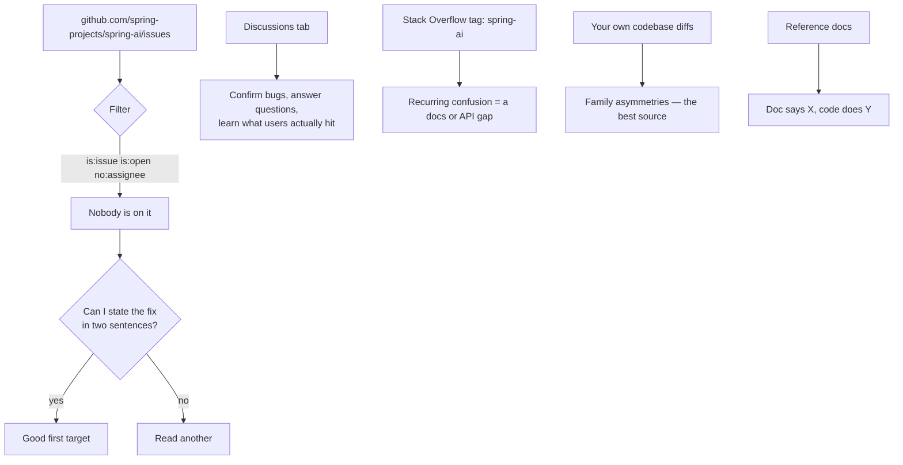
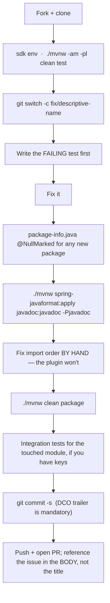

# 13 · Contribution Playbook — Where to Start and How to Ship

Everything up to here was about *understanding* the codebase. This chapter is about
getting a commit merged.

> All process rules below come from [`CONTRIBUTING.md`](../CONTRIBUTING.md) and
> [`spring-ai-docs/.../contribution-guidelines.adoc`](../spring-ai-docs/src/main/antora/modules/ROOT/pages/contribution-guidelines.adoc).
> When they and this guide disagree, they win.

---

## 1. Read the rules that will get your PR closed

Spring AI **explicitly does not accept**:

- ❌ PRs from GitHub accounts operated by autonomous AI bots — **permanent ban**.
- ❌ PRs for **already-assigned issues** (the assignee is working on it).
- ❌ PRs for **"straightforward or polish-style changes"** — typo-only fixes, cosmetic
  reformatting, unnecessary refactors.

AI-assisted contributions **are** welcome, with one condition, quoted from `CONTRIBUTING.md`:

> "We accept contributions created with the help of AI coding agents, but they must be
> carefully reviewed by a human who remains accountable for the quality of the contribution."

You are accountable for every line you submit. If you cannot explain a change in review,
do not send it.

Also: **never** report a security vulnerability through an issue or PR. Use
https://spring.io/security-policy.

**The "no polish-style changes" rule is the one that catches newcomers.** It rules out the
usual open-source starter move of fixing a typo. It means your first PR needs to be
*small but substantive* — the next section is about finding exactly that.

## 2. Where to find work



**Start here, in this order:**

**(a) Open, unassigned issues.** On the issues page, filter with
`is:issue is:open no:assignee`. Then check the labels that repository actually uses — do
not assume `good first issue` exists; read the label list on the issues page and sort by
what is genuinely small. Before starting, **search closed issues and open PRs for the same
thing** (`CONTRIBUTING.md`: "Search first"). Comment on the issue saying you are picking it
up — that prevents duplicate work and is how you avoid the assigned-issue rule.

**(b) Family asymmetries — the highest-yield source, and one this guide has prepared you
for.** Spring AI has 15 chat models, 22 vector stores, 5 memory repositories, 4 document
readers. A fix landed in one is often missing in the others. Concretely:

```bash
# Which vector stores use the shared test base, and which quietly don't?
grep -rL "BaseVectorStoreTests" --include="*IT.java" vector-stores/*/src/test

# Which chat options classes have a mutate() round-trip test?
grep -rl "AbstractChatOptionsTests" --include="*.java" models/*/src/test

# Which auto-config classes are missing from their .imports file?
for d in auto-configurations/*/*; do
  grep -rl "@AutoConfiguration" "$d/src/main/java" 2>/dev/null
done
```

Then read the recent history for the *shape* of accepted fixes:

```bash
git log --oneline -40
git show 91f067f   # Close the resource stream in TextReader
git show 0e7b5f6   # Escape metadata values in Redis chat memory queries
git show e5e277f   # Backfill additionalProperties: false in OpenAI strict tool schemas
git show 8a1fd8e   # Handle malformed pdf in PdfDocumentReader
```

Every one of those is: **one real defect, one module, one focused commit, with a test.**
That is the target.

**(c) Recurring confusion in Discussions or on Stack Overflow.** If three people hit the
same wall, that is either a documentation gap or an API design gap. Both are contributions;
the documentation one is far easier to land. Note `fd3fd6e`, "Refine documentation on
MCP/local tool name collision" — a docs PR about genuinely subtle behaviour, which is *not*
a "polish-style change."

**(d) Integration test hardening.** Commits like `ddafe86` ("Harden Bedrock ITs") and
`192de91` ("Harden Ollama integration tests against flakiness") show flaky ITs are a real,
welcomed workstream — and they require no API keys to reason about.

## 3. Matching work to what you have just learned

| If you read… | You are ready to… |
|---|---|
| Ch. 02 — Commons/ETL | Fix a `document-readers/*` edge case (malformed input, resource leaks, encoding) |
| Ch. 03 — Model abstraction | Add a missing field to a provider's `ChatOptions` / fix a `mutate()` round-trip |
| Ch. 04 — Advisors | Contribute a new advisor, or fix streaming `after()` behaviour |
| Ch. 05 — Tool calling | Fix JSON-schema generation, tool name handling, or `returnDirect` semantics |
| Ch. 06 — Vector stores | Port a fix across stores; fix a `FilterExpressionConverter` escaping bug |
| Ch. 07 — RAG | Add a `QueryTransformer` / `DocumentPostProcessor` / `DocumentJoiner` |
| Ch. 08 — Chat memory | Fix a repository backend inconsistency |
| Ch. 09 — MCP | Fix tool-name prefixing or filtering behaviour |
| Ch. 10 — Observability | Add missing instrumentation or align a convention |
| Ch. 11 — Auto-config | Fix a missing `@ConditionalOnMissingBean`, `.imports` entry, or metadata JSON |

**The single best first PR pattern:** find a bug fixed in provider/store A, verify it exists
in B, fix B, add a test. You have a proven fix, a proven test shape, and an obvious
justification for the reviewer.

## 4. The workflow



```bash
git switch -c fix/redis-memory-metadata-escaping

# ... change code + tests ...

./mvnw -am -pl memory-repositories/spring-ai-model-chat-memory-repository-redis clean test
./mvnw spring-javaformat:apply javadoc:javadoc -Pjavadoc
./mvnw clean package                      # full build before you open the PR

git commit -s        # -s adds the required Signed-off-by trailer
```

If the full build fails for no visible reason, suspect the build cache before you suspect
your change:

```bash
./mvnw -Dmaven.build.cache.enabled=false clean package
```

## 5. The commit and PR

Commit message (`CONTRIBUTING.md` §Commit message):

```text
Escape metadata values in Redis chat memory queries

Metadata values were interpolated into Redis search queries without
escaping, so a value containing query syntax characters produced a
malformed query. Escape values before interpolation and add a test
covering special characters.

Fixes #1234

Signed-off-by: Your Name <you@users.noreply.github.com>
```

Rules, restated because each one gets PRs bounced:

- Title < 50 chars, **uppercase verb** first, backticks around type/file names.
- **No** `fix:` / `feat:` / `docs:` prefix. **No** `GH-123`. **No** `(#123)`.
- Body wrapped at ~72 chars. `Fixes #123` to close, `See #123` to reference.
- **`Signed-off-by` on every commit** — use `git commit -s`.

The PR:

- **Title is used verbatim in the changelog.** Same rules as the commit title.
- **Reference the issue in the description, not the title** — `Fixes #123`.
- Describe context and motivation as you would in an issue; you do **not** need to open an
  issue first unless you want a design discussion.
- One logical change per PR. Unrelated formatting churn gets it sent back.

## 6. Pre-submit checklist

Copy this into your PR description and tick it honestly.

```
[ ] Searched existing issues AND open PRs for duplicates
[ ] Issue is unassigned; I commented that I'm taking it
[ ] Not a "straightforward or polish-style" change
[ ] New/changed behaviour is covered by a test that FAILS without my fix
[ ] Every NEW package has package-info.java with @NullMarked
[ ] @Nullable is on the type use (private @Nullable Foo foo)
[ ] Assert.notNull in constructors / Assert.state in builders
[ ] New public API has @since
[ ] Javadoc wrapped at 90 chars; .adoc and .md are ONE SENTENCE PER LINE
[ ] Import order: java / javax+jakarta / other / org.springframework / static
[ ] No wildcard imports; no static imports in production code
[ ] Tabs, LF, UTF-8, no trailing whitespace
[ ] If I added an @AutoConfiguration class: it is in the .imports file
[ ] If I added properties: additional-spring-configuration-metadata.json updated
[ ] If I changed a core module: no Spring Boot dependency was introduced
[ ] If I changed an auto-config module: new deps are optional=true
[ ] ./mvnw spring-javaformat:apply javadoc:javadoc -Pjavadoc
[ ] ./mvnw clean package passes
[ ] Integration tests run for the touched module (or noted why not)
[ ] Every commit has Signed-off-by (git commit -s)
[ ] PR title follows changelog rules; issue referenced in the body
[ ] I can explain every line in review
```

## 7. A worked first contribution

A realistic, end-to-end example of the family-asymmetry play:

1. **Find it.** `git show 0e7b5f6` — metadata values were interpolated into Redis queries
   unescaped.
2. **Generalise it.** Chapter 06 taught you that 20+ `FilterExpressionConverter`s emit
   query strings from user-supplied metadata. Ask: which of them escape values, and which
   don't?
   ```bash
   find vector-stores -name "*FilterExpressionConverter.java" -path "*/main/*" \
     | xargs grep -L "escape\|emitLuceneString\|emitJsonValue"
   ```
3. **Verify.** Pick one candidate. Read its `doSingleValue` / `doValue`. Write a test with a
   value containing that query language's metacharacters. Confirm it produces a malformed
   or injectable query.
4. **Search.** Check issues and PRs — has someone reported it? If yes and it's assigned,
   pick another. If reported and unassigned, comment that you're taking it.
5. **Fix.** Reuse the base class helper (`emitLuceneString`, `emitJsonValue`) if one fits,
   rather than hand-rolling escaping. Chapter 06 told you those exist.
6. **Test.** Keep the failing test; it is the PR's justification.
7. **Ship.** Follow §4–§6.

That PR is small, substantive, tested, motivated by a precedent commit, and explainable in
review. It is exactly the shape maintainers merge.

## 8. After the PR

- Expect review comments. Spring maintainers are exacting about style and scope — that is
  not a judgement of you.
- Push follow-up commits; do not force-push over review history unless asked.
- If asked to squash or rebase, keep the `Signed-off-by` trailers.
- If a maintainer merges it, note that the committer may rewrite the commit message to
  reference both the issue and the PR (`Fixes #123` / `Closes #456`) — that is normal.

## 9. Staying current

```bash
git fetch upstream && git log --oneline upstream/main -20
```

Watch `design/` — new design documents are added there (`01-null-safety.adoc`,
`02-boot-modularity.adoc` today) and they are the clearest statement of where the
architecture is going. Reading a new one the day it lands is the cheapest way to stay
aligned with the maintainers' thinking.

---

**You now have:** the module map, the type models, the runtime flows, the pattern catalog,
the build rules, and the contribution process. The remaining step is not more reading — it
is opening one file, finding one real defect, and writing one failing test.

Back to the [index](README.md).
