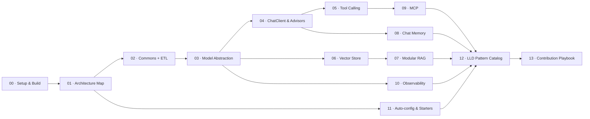

# Spring AI — Contributor Onboarding & LLD Study Guide

A module-by-module walkthrough of the Spring AI codebase (`2.0.2-SNAPSHOT`, 168 Maven
modules), written so that reading it doubles as **Low Level Design practice**.

Every chapter follows the same shape:

1. **What the module is responsible for** — the functional boundary.
2. **The type model** — the interfaces and records that define it, with a Mermaid class diagram.
3. **The runtime flow** — what actually happens on a call, with a Mermaid sequence diagram.
4. **LLD lens** — which design principles / patterns are at work, *and why the alternative was rejected*.
5. **Practice** — design exercises against the real code, plus "read these files next".

## Reading order

| # | Chapter | Why it matters for LLD |
|---|---------|------------------------|
| [00](00-setup-and-build.md) | Setup, build, code style, null-safety | Constraints that shape every design decision here |
| [01](01-architecture-overview.md) | Architecture map & module graph | Layering, dependency direction, acyclic module design |
| [02](02-commons-and-etl.md) | `spring-ai-commons` — Document, Content, ETL | Interface segregation, `Supplier`/`Function`/`Consumer` as SPI |
| [03](03-model-abstraction.md) | `spring-ai-model` — the generic Model API | Generic type hierarchies, Bridge, options merging |
| [04](04-chat-client-and-advisors.md) | `spring-ai-client-chat` — ChatClient + Advisors | Chain of Responsibility, Fluent Builder, Template Method |
| [05](05-tool-calling.md) | Tool calling subsystem | Strategy, Adapter, Command, orchestration extraction |
| [06](06-vector-store.md) | `spring-ai-vector-store` + 22 stores | Template Method, Visitor over an AST, Portability layer |
| [07](07-rag.md) | `spring-ai-rag` — modular RAG | Pipes & Filters, Composition over inheritance |
| [08](08-chat-memory.md) | Chat memory + repositories | Repository pattern, policy/storage separation |
| [09](09-mcp.md) | Model Context Protocol integration | Adapter, Annotation-driven method binding |
| [10](10-observability.md) | Micrometer observability | Cross-cutting concerns, Convention over hardcoding |
| [11](11-autoconfig-and-starters.md) | Auto-configuration & starters | Modularity enforcement, conditional wiring |
| [12](12-lld-patterns-catalog.md) | Consolidated pattern catalog | One-page revision sheet, mapped to real files |
| [13](13-contribution-playbook.md) | Where to pick work & how to ship it | The actual contribution workflow |

## How to use this as LLD practice

Do **not** read it front to back like a novel. For each chapter:

1. Read section 1 (responsibility) and section 2 (type model).
2. **Close the guide.** On paper, sketch the interfaces you would design for that
   responsibility, before looking at what Spring AI did.
3. Read section 3 and 4, and diff your design against theirs.
4. Do the exercises in section 5 against the real source tree.

The gap between your sketch and the real design is the lesson. That gap is
consistently the most valuable part of this exercise — the framework authors were
solving for 20+ providers, streaming and non-streaming, Boot and non-Boot, and those
constraints are what force the design.

> Every file path in this guide is a real path in this repository at the commit you
> are on. If a path 404s, the code moved — `git log --follow` it; that history is
> itself a design lesson.
