# Spring Boot Startup Time — Monitoring, Analysis & Optimization (Gold-Mine Reference)

> Branch: `fix/startupTimeOptimise`
>
> This is a two-in-one document:
>
> 1. **What we actually did** in *this* microservice (VIA Reporting Management) to
>    monitor, analyse and reduce boot time, and
> 2. A **comprehensive, industry-standard catalogue** of every practical technique
>    to optimize Spring Boot / JVM startup — from `@Lazy` beans, to parallel bean
>    initialization on separate threads, to CDS/AOT/GraalVM/CRaC — with mermaid
>    diagrams for the startup flow and for each optimization.
>
> Use the table of contents to jump around. Sections tagged **[applied here]** are
> changes that live in this repository; the rest are reference techniques you can
> reach for next.

---

## Table of Contents

1. [How Spring Boot starts up (the flow)](#1-how-spring-boot-starts-up-the-flow)
2. [Monitoring & measuring startup](#2-monitoring--measuring-startup)
   - 2.1 [`BufferingApplicationStartup` + `/actuator/startup`](#21-bufferingapplicationstartup--actuatorstartup-applied-here)
   - 2.2 [The spring-boot-startup-analyzer tool](#22-the-spring-boot-startup-analyzer-tool-applied-here)
   - 2.3 [Startup diagnostic logging](#23-startup-diagnostic-logging-applied-here)
   - 2.4 [Other profilers & tooling](#24-other-profilers--tooling)
3. [What the analysis revealed in this repo](#3-what-the-analysis-revealed-in-this-repo)
4. [Optimization techniques (catalogue)](#4-optimization-techniques-catalogue)
   - 4.1 [Lazy bean initialization](#41-lazy-bean-initialization-applied-here)
   - 4.2 [Parallel / concurrent bean initialization on separate threads](#42-parallel--concurrent-bean-initialization-on-separate-threads)
   - 4.3 [Background-bootstrap the JPA EntityManagerFactory](#43-background-bootstrap-the-jpa-entitymanagerfactory)
   - 4.4 [Trim the component scan](#44-trim-the-component-scan)
   - 4.5 [Exclude unused auto-configuration](#45-exclude-unused-auto-configuration-applied-here)
   - 4.6 [Global lazy initialization](#46-global-lazy-initialization)
   - 4.7 [Connection pool & datasource](#47-connection-pool--datasource)
   - 4.8 [Hibernate / JPA tuning](#48-hibernate--jpa-tuning)
   - 4.9 [Disable JMX, trim logging, defer migrations](#49-disable-jmx-trim-logging-defer-migrations-partly-applied-here)
   - 4.10 [JVM-level: CDS / AppCDS](#410-jvm-level-cds--appcds)
   - 4.11 [Spring AOT & GraalVM native image](#411-spring-aot--graalvm-native-image)
   - 4.12 [CRaC — Coordinated Restore at Checkpoint](#412-crac--coordinated-restore-at-checkpoint)
   - 4.13 [JVM flags & quick wins](#413-jvm-flags--quick-wins)
5. [What we tried and reverted](#5-what-we-tried-and-reverted)
6. [Decision guide / checklist](#6-decision-guide--checklist)
7. [Files touched in this repo](#7-files-touched-in-this-repo)
8. [References](#8-references)

---

## 1. How Spring Boot starts up (the flow)

You cannot optimize what you do not understand. Almost every technique below
targets one specific phase of `SpringApplication.run()`. Here is the lifecycle:

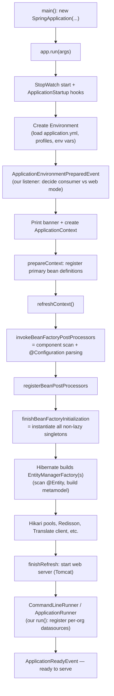

**The expensive phases (where time goes), in order of usual cost:**

| Phase | Why it is slow | Techniques that attack it |
|---|---|---|
| `H1` component scan + `@Configuration` parsing | Walks large package trees, reads class metadata. | [4.4](#44-trim-the-component-scan) context-indexer, narrower scan; [4.11](#411-spring-aot--graalvm-native-image) AOT |
| `H3` instantiate non-lazy singletons | Every eager `@Bean`/`@Component` is built **single-threaded**, in dependency order. | [4.1](#41-lazy-bean-initialization-applied-here) `@Lazy`, [4.2](#42-parallel--concurrent-bean-initialization-on-separate-threads) parallel init, [4.6](#46-global-lazy-initialization) global lazy |
| `H4` Hibernate EMF build | Scans entities, builds the metamodel — **once per persistence unit**. | [4.3](#43-background-bootstrap-the-jpa-entitymanagerfactory) background bootstrap, [4.8](#48-hibernate--jpa-tuning) |
| `H5` external clients | Network handshakes (Redis, GCP, DB) on the critical path. | [4.1](#41-lazy-bean-initialization-applied-here) lazy clients |
| `D`/`H1` class loading + verification | JVM loads & verifies thousands of classes cold. | [4.10](#410-jvm-level-cds--appcds) CDS, [4.13](#413-jvm-flags--quick-wins) flags |

> **Key mental model:** Spring instantiates singleton beans on **one thread**, in
> topological dependency order. So the single biggest levers are (a) *don't build
> a bean at all at boot* (`@Lazy`), (b) *build fewer beans* (trim scan / exclude
> auto-config), and (c) *move the unavoidable heavy builds off the critical thread*
> (background bootstrap / parallel warming). Everything in Section 4 is a variation
> on one of those three ideas.

---

## 2. Monitoring & measuring startup

> **Rule #1 of performance work: measure first, change second, re-measure.**
> Every change below was (or should be) validated against real numbers, not a hunch.

### 2.1 `BufferingApplicationStartup` + `/actuator/startup` **[applied here]**

Spring Boot has a first-class startup-tracing API: `ApplicationStartup`. By
default it is a no-op. We replaced it with a **buffering** implementation so that
the duration of every startup step (each bean instantiation, each post-processor,
the context refresh, etc.) is recorded and then exposed at the actuator endpoint
`GET /actuator/startup`.

This is wired in the application's `main()` method
(`VIAReportingManagementMicroserviceApplication.java`):

```java
public static void main(String[] args) {
    SpringApplication app = new SpringApplication(VIAReportingManagementMicroserviceApplication.class);

    // Startup diagnostics: records duration of every bean/phase so they
    // surface at GET /actuator/startup. Remove once tuning is complete.
    app.setApplicationStartup(new BufferingApplicationStartup(4096));

    // ... environment listener (consumer vs web mode) ...
    app.run(args);
}
```

- `BufferingApplicationStartup(4096)` keeps the **4096** most-significant startup
  steps in an in-memory ring buffer.
- Each step has a name (e.g. `spring.beans.instantiate`), tags (the bean name),
  and a start/end timestamp → a precise duration.
- After boot, the data is drained **once** by reading `GET /actuator/startup`
  (it is a draining read — call it once and save the JSON).

How the pieces connect:

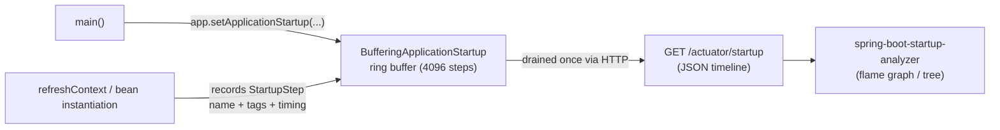

To expose the endpoint, `startup` must be in the actuator exposure list. This
repo already exposes everything:

```yaml
management:
  endpoints:
    web:
      exposure:
        include: ["*"]   # includes 'startup'
```

> **Cost & hygiene:** `BufferingApplicationStartup` adds tiny per-step overhead and
> holds the buffer in memory. It is a **diagnostic**, not a permanent production
> feature. The comment in `main()` says it plainly: *"Remove once tuning is
> complete."* When you ship, either remove the line or guard it behind a profile
> so production boots without the buffer.

### 2.2 The spring-boot-startup-analyzer tool **[applied here]**

We analysed the `/actuator/startup` output using:

**<https://alexey-lapin.github.io/spring-boot-startup-analyzer/#/>**

It is a free, browser-based, **client-side** viewer (your data never leaves the
browser) that turns the raw JSON timeline into a **sortable tree / flame-graph**
so you can instantly see which beans and phases dominated boot.

Workflow we used:

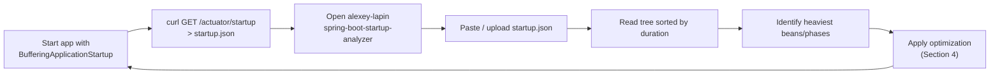

Concrete steps:

1. Boot the service (locally or a test pod) with the buffering startup enabled (already wired — see 2.1).
2. Capture the timeline once:
   ```bash
   curl -s http://localhost:8099/actuator/startup -X POST > startup.json
   # (the endpoint is a draining read; POST or GET depending on Boot version — save the output)
   ```
3. Open the analyzer URL, load `startup.json`.
4. Sort by **self time / total time**. Look for:
   - `spring.beans.instantiate` steps with large durations → candidate `@Lazy` beans.
   - Hibernate `EntityManagerFactory` build steps → candidate for background bootstrap / fewer PUs.
   - Repeated/duplicated work (e.g. metamodel built twice for two persistence units).
5. Apply a fix from Section 4, restart, re-capture, compare. Keep the before/after JSONs.

> **Why this beats reading logs:** the analyzer gives you *cumulative vs self
> time* per bean and a visual flame graph, so you spot the one bean that owns 40%
> of boot instead of scrolling thousands of log lines.

### 2.3 Startup diagnostic logging **[applied here]**

Complementary to the actuator data, we keep a focused block of DEBUG/TRACE
loggers in `src/main/resources/application.yml` (kept **commented out** so prod
boots quietly — uncomment to investigate):

```yaml
logging:
  level:
    # STARTUP DIAGNOSTICS — temporary. Remove once root cause is confirmed.
    org.hibernate.boot: DEBUG
    org.hibernate.jpa.boot: DEBUG
    org.hibernate.boot.internal: DEBUG
    org.hibernate.cfg: DEBUG
    org.hibernate.boot.MetadataSources: TRACE          # every @Entity added to a PU
    org.springframework.orm.jpa: DEBUG                 # which bean drives which EMF
    org.springframework.beans.factory.support: DEBUG   # bean creation order
    org.springframework.context.support: DEBUG
    org.springframework.boot.autoconfigure: DEBUG      # what was/wasn't excluded
    org.springframework.context.annotation.ClassPathScanningCandidateComponentProvider: TRACE  # scan "vacuum cleaner"
```

| Logger | What it reveals |
|---|---|
| `org.hibernate.boot*` | How many persistence units, in what order, with per-PU timing. |
| `org.hibernate.boot.MetadataSources` (TRACE) | Every entity added per PU — confirmed metadata work happening twice (primary + replica). |
| `org.springframework.orm.jpa` | Which Spring bean drives which `EntityManagerFactory`. |
| `org.springframework.beans.factory.support` | Bean creation order — pair "Creating bean X" with the heavy log right after it. |
| `org.springframework.boot.autoconfigure` | Active vs excluded auto-configurations (the auto-config report). |
| `ClassPathScanningCandidateComponentProvider` (TRACE) | The component-scan "vacuum cleaner" effect. |

The console pattern prints millisecond timestamps
(`%d{yyyy-MMM-dd HH:mm:ss.SSS}`), so subtracting two log lines gives the cost of a
phase. **Re-comment before merging** — DEBUG/TRACE is noisy and slows boot itself.

> Spring Boot also prints a built-in **auto-configuration report** when you add
> `--debug` (or `debug: true`). It lists every auto-config and *why* it matched or
> didn't — invaluable for deciding what to exclude (4.5).

### 2.4 Other profilers & tooling

Reach for these when actuator + analyzer aren't enough:

- **`spring-context-indexer`** — generates `META-INF/spring.components` at compile
  time so Spring skips classpath scanning (see 4.4). Also a *measurement* in the
  sense that it tells you scan cost was significant if removing it helps.
- **Java Flight Recorder (JFR)** — `-XX:StartFlightRecording=duration=60s,filename=startup.jfr`.
  Open in JDK Mission Control to see class loading, JIT compilation, allocation,
  and lock contention during boot. Best for JVM-level (not Spring-bean-level) cost.
- **`async-profiler`** — `-agentpath:.../libasyncProfiler.so=start,event=cpu,file=startup.html`
  produces a CPU flame graph of the whole JVM during startup; catches native /
  class-loading / regex / reflection hot spots Spring tracing can't see.
- **Micrometer `@Timed` / custom `ApplicationListener<ApplicationReadyEvent>`** —
  record total time-to-ready and ship it as a metric so you can **trend boot time
  across deploys** and alert on regressions.
- **`-verbose:class`** — counts classes loaded; a quick proxy for "are we loading
  too much?" and a baseline for CDS gains (4.10).
- **`-Xlog:class+load:file=...`** — the input you feed to AppCDS to build the
  archive (4.10).

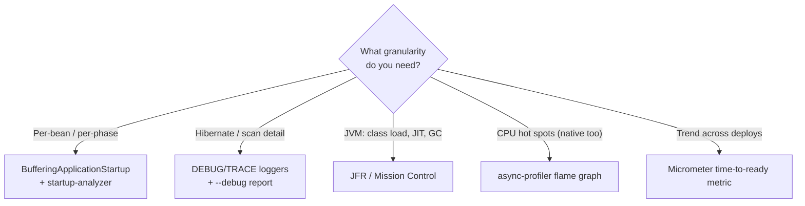

---

## 3. What the analysis revealed in this repo

Combining the actuator timeline, the analyzer flame graph, and the diagnostic
logs, the expensive boot-time work was:

1. **Two persistence units built eagerly.** A primary `EntityManagerFactory` *and*
   a `replica` EMF (`persistenceUnitName = "replica"`). Hibernate scanned entities
   and built the metamodel **twice**, but most request paths only need the replica
   lazily.
2. **Heavy external clients created on the critical path.** Redisson (Redis) and
   the Google Cloud `TranslationServiceClient` (plus `GoogleCredentials` parsing)
   were built during context refresh — adding network/IO before first request.
3. **Per-org datasource registration in the `CommandLineRunner`.** `run()` iterates
   every organization and registers a Hikari datasource bean dynamically — work
   that happens after refresh but before "ready".
4. **Broad component scan** across two base packages, and **diagnostic logging**
   noise that itself slowed boot.

---

## 4. Optimization techniques (catalogue)

For each technique: the idea, when to use it, the trade-off, and a diagram where
it clarifies the mechanism. Sections marked **[applied here]** are live in this repo.

### 4.1 Lazy bean initialization **[applied here]**

**Idea:** don't build a bean at boot; build it on first use. Annotate the bean
(and, crucially, its *injection points*) with `@Lazy`. Spring injects a **proxy**
that materializes the real bean only when a method is first called.

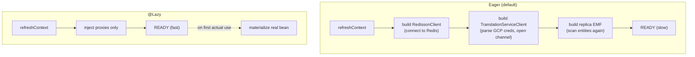

**What we made lazy:**

| File | Beans / fields made `@Lazy` |
|---|---|
| `MultiTenantJpaConfiguration.java` | Replica chain: `multiTenantConnectionProviderReplica()`, `replicaEntityManagerFactoryBean(...)`, `replicaEntityManagerFactory(...)`, `txManagerReplica(...)` — bean **and** injected args. Primary EMF stays eager (hot path). |
| `GcpTranslateConfig.java` | `getGoogleCredentials()`, `translationServiceClient(@Lazy GoogleCredentials)`. |
| `RedissionConfig.java` | `redissionClient()` (kept `@Primary`, singleton). |
| `TranslationService.java` | Class `@Lazy` + `@Autowired @Lazy TranslationServiceClient`. |
| `TextSearchService.java` | `@Autowired @Lazy RedissonClient`. |

> **The critical subtlety:** marking only the *bean* `@Lazy` is not enough. If an
> **eager** bean injects a lazy bean directly, Spring must instantiate the lazy
> bean to satisfy the dependency — laziness defeated. You must also mark the
> **injection point** `@Lazy` so Spring injects a proxy. That is why you see
> `@Lazy` on both the `@Bean` method *and* its parameters/fields above.

**Trade-off:** the first request that touches a lazy bean pays the construction
cost (a latency spike), and configuration errors that would normally fail at boot
now fail at first use. Keep core request-path beans eager.

### 4.2 Parallel / concurrent bean initialization on separate threads

This is the most-requested and most-misunderstood technique, so it gets the
deepest treatment.

**The hard truth:** Spring's `DefaultListableBeanFactory` instantiates singleton
beans **on a single thread**, in dependency order. There is **no public
"parallelize all bean creation" switch** in stock Spring, because bean creation
touches a lot of shared, not-fully-thread-safe state and ordering matters. So
"parallel bean init" in practice means one of the patterns below.

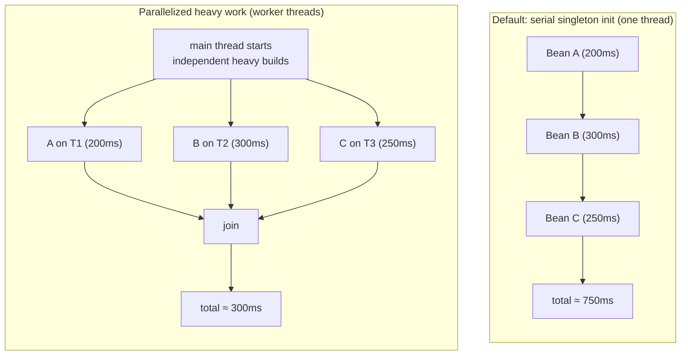

**Pattern A — Background-bootstrap the EntityManagerFactory (most impactful, Spring-native).**
Spring lets the JPA EMF build *itself* on a background thread while the rest of
the context continues. See [4.3](#43-background-bootstrap-the-jpa-entitymanagerfactory)
— this is the one genuinely supported "bean builds on another thread" mechanism
and it directly fits this repo's two-EMF problem.

**Pattern B — `@Lazy` + asynchronous warm-up.** Make heavy beans `@Lazy` (so boot
is fast), then warm the ones you *know* you'll need on background threads right
after `ApplicationReadyEvent`, so the first real request doesn't pay the cost:

```java
@Component
@RequiredArgsConstructor
public class StartupWarmUp {
    private final ObjectProvider<RedissonClient> redisson;        // lazy beans
    private final ObjectProvider<TranslationServiceClient> translate;

    @EventListener(ApplicationReadyEvent.class)
    public void warm() {
        // ready event already fired → these run in parallel, off the boot path
        CompletableFuture.runAsync(() -> redisson.getIfAvailable());   // forces construction
        CompletableFuture.runAsync(() -> translate.getIfAvailable());
    }
}
```

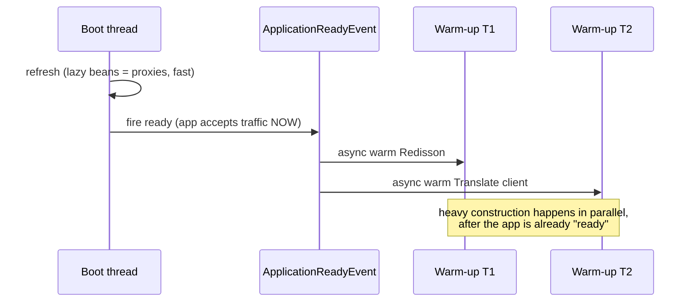

> This is usually the best real-world win: time-to-ready drops, and the heavy
> clients are warmed concurrently in the background so users rarely hit a cold proxy.

**Pattern C — Parallelize your own `CommandLineRunner` / `ApplicationRunner` work.**
This repo's `run()` registers a Hikari datasource **per organization** in a serial
`forEach`. Each `buildDataSource()` opens a JDBC connection (`SELECT 1` test) — so
N orgs = N sequential network round-trips. Parallelize them:

```java
@Override
public void run(String... args) {
    List<Organization> orgs = organizationService.findAll();
    orgs.parallelStream().forEach(org -> {                 // or a bounded ExecutorService
        String datastoreId = org.getDatastore().getDatastoreId().toString();
        if (datastoreId != null && !context.containsBean(datastoreId)) {
            registerBeansDynamicallyService.registerBean(datastoreId, buildDataSource(org));
        }
    });
}
```

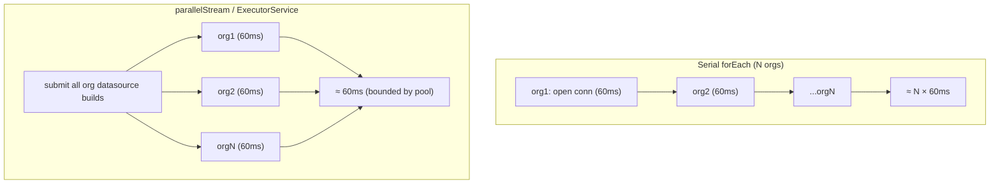

> ⚠️ **Thread-safety caveats for Pattern C:** (1) `GenericApplicationContext`
> bean registration is generally safe but `context.containsBean` + register is a
> check-then-act race under parallelism — guard with `computeIfAbsent`-style
> locking or a `ConcurrentHashMap` of in-flight ids. (2) Anything relying on
> `TenantContext` (a `ThreadLocal`) will **not** propagate to worker threads
> automatically — set/clear it inside each task (this codebase already wraps its
> executors to propagate tenant id; reuse that pattern). (3) Bound the parallelism
> (don't unleash `parallelStream` on 500 orgs against one DB).

**Pattern D — `@Async` `@PostConstruct`-style initialization with a bootstrap executor.**
For independent self-initializing components, kick their heavy `init()` onto an
executor and `join()` before the dependent phase. Keep it to genuinely
independent work; ordering bugs here are painful.

**Pattern E — Virtual threads (Java 21+) for I/O-bound warm-up.** This service
already defines a `virtualThreadPoolTaskExecutor`. Virtual threads make
**I/O-bound** parallel warm-up (opening many DB/Redis/HTTP connections) cheap —
thousands of blocked carriers cost almost nothing. Use them for Pattern B/C
fan-out of connection-opening work. (Virtual threads do **not** speed up
CPU-bound metamodel building.)

**What does NOT exist:** a flag like `spring.main.parallel-bean-init=true`.
Frameworks have experimented (and Spring AOT/native sidesteps the problem
differently), but in stock Spring the supported levers are A–E above — push heavy,
*independent* work onto threads either via the EMF background bootstrap or via
async warm-up after readiness.

### 4.3 Background-bootstrap the JPA EntityManagerFactory

The single Spring-native way to build a bean on another thread. `LocalContainerEntityManagerFactoryBean`
accepts a **bootstrap executor**; given one, Hibernate's expensive metamodel build
runs on that executor while context refresh continues. The EMF is returned as a
proxy that blocks only if something touches it before the background build finishes.

```java
@Bean
public ThreadPoolTaskExecutor emfBootstrapExecutor() {
    ThreadPoolTaskExecutor ex = new ThreadPoolTaskExecutor();
    ex.setCorePoolSize(2);                 // primary + replica in parallel
    ex.setThreadNamePrefix("emf-bootstrap-");
    ex.initialize();
    return ex;
}

@Bean(name = "replicaEntityManagerFactoryBean")
public LocalContainerEntityManagerFactoryBean replicaEntityManagerFactoryBean(...) {
    LocalContainerEntityManagerFactoryBean emf = new LocalContainerEntityManagerFactoryBean();
    // ... existing config ...
    emf.setBootstrapExecutor(emfBootstrapExecutor());   // <-- build on background thread
    return emf;
}
```

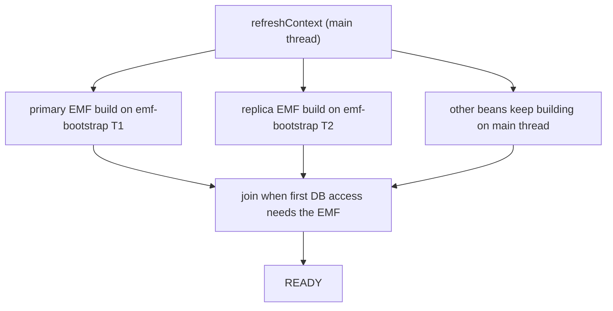

> **Why it fits this repo:** we have *two* persistence units whose metamodel builds
> are independent. A 2-thread bootstrap executor lets primary and replica build
> **concurrently** instead of one-after-another. Combine with [4.1](#41-lazy-bean-initialization-applied-here)
> (replica already `@Lazy`) for the best result. Note: do not also `getObject()`
> the EMF synchronously right after creating it, or you re-serialize the build.

### 4.4 Trim the component scan

The scan (`H1`) reads metadata for every class under your `scanBasePackages`. Two levers:

1. **Narrow the scan.** Point `@ComponentScan` / `scanBasePackages` at the
   tightest package set. This repo scans two roots
   (`...microservice` and `...commons.framework.commons`) — keep them as tight as possible.
2. **Use the Spring Context Indexer.** Add the dependency; at *compile time* it
   generates `META-INF/spring.components`, and Spring reads that index instead of
   scanning the classpath at runtime.

```xml
<dependency>
  <groupId>org.springframework</groupId>
  <artifactId>spring-context-indexer</artifactId>
  <optional>true</optional>
</dependency>
```

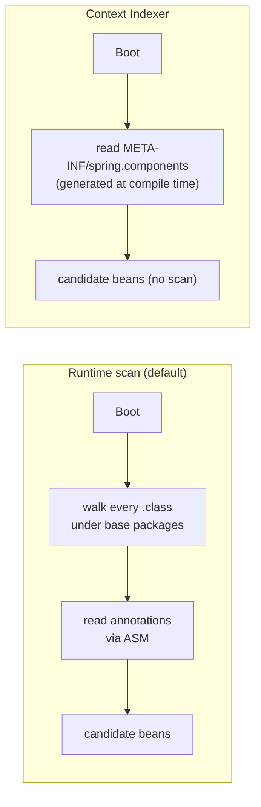

> Biggest payoff on large codebases and on native/AOT. On a few hundred classes the
> win is modest but free. **Caveat:** the indexer only covers your own annotated
> components, and every module must be indexed for it to fully replace scanning.

### 4.5 Exclude unused auto-configuration **[applied here]**

Every active auto-config evaluates conditions and may create beans. Exclude what
you don't use. This repo already excludes the default DataSource/JPA auto-configs
because it wires JPA manually for multi-tenancy:

```java
@SpringBootApplication(exclude = {
    DataSourceAutoConfiguration.class,
    HibernateJpaAutoConfiguration.class,
    DataSourceTransactionManagerAutoConfiguration.class
}, scanBasePackages = { ... })
```

Find more candidates with the `--debug` auto-config report (2.3): look for
auto-configs that "matched" but you don't need (e.g. unused messaging, mail,
metrics exporters) and add them to `exclude` or set their `spring.*.enabled=false`.

### 4.6 Global lazy initialization

A blanket switch that makes **all** beans lazy unless overridden:

```yaml
spring:
  main:
    lazy-initialization: true
```

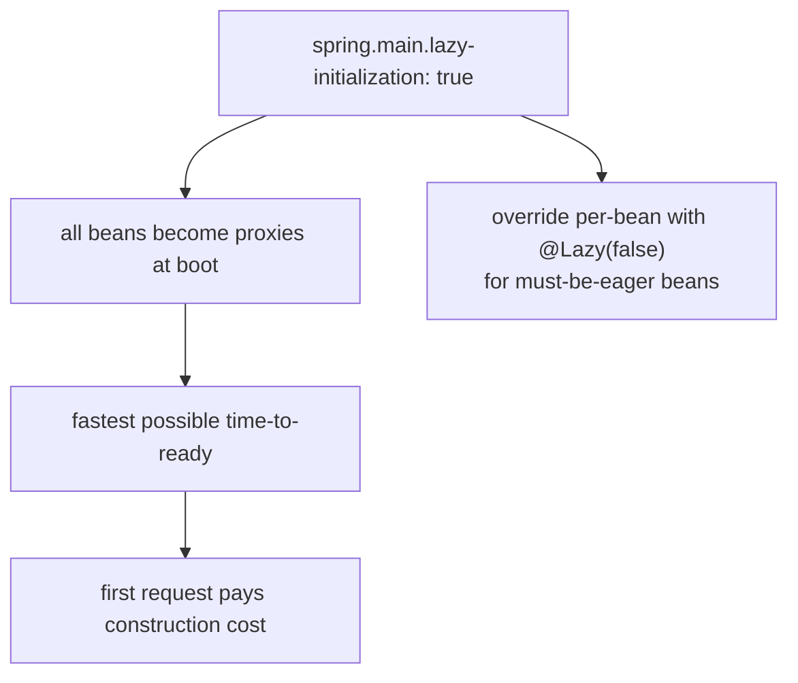

> **Trade-off:** great for fast local dev restarts; risky in prod because
> first-request latency spikes and boot-time failures move to runtime. If you use
> it in prod, pair with Pattern B warm-up (4.2) and mark critical infra
> `@Lazy(false)`. This repo deliberately uses **targeted** `@Lazy` (4.1) rather
> than the global flag, to keep the primary datasource and request-path beans eager.

### 4.7 Connection pool & datasource

- **Don't open the whole pool at boot.** Set Hikari `minimum-idle` low (even `1`,
  as this repo does in `buildDataSource`) so boot opens one connection, not the
  full `maximum-pool-size`. Connections grow on demand.
- **`initialization-fail-timeout`** — a positive value makes Hikari open and
  validate a connection at boot (fails fast but adds a round-trip); `-1` defers
  validation entirely. Pick per environment.
- **Defer `data.sql`/schema init** — `spring.jpa.defer-datasource-initialization`
  and `spring.sql.init.mode` so script execution doesn't block the critical path.
- **Cache prepared statements** (this repo sets `cachePrepStmts`, `prepStmtCacheSize`,
  etc.) — helps runtime more than boot, but keeps the first queries fast.

### 4.8 Hibernate / JPA tuning

- **`ddl-auto: validate`** (this repo) or **`none`** in prod — never `update`/`create`
  at boot; schema validation/generation is slow and dangerous.
- **`hibernate.boot.allow_jdbc_metadata_access: false`** (Hibernate 6.2+) — skips a
  DB metadata round-trip at boot if you specify the dialect explicitly.
- **Fewer persistence units / fewer entities per PU.** Each PU rebuilds the
  metamodel. This repo's two-PU setup is exactly why [4.3](#43-background-bootstrap-the-jpa-entitymanagerfactory)
  background bootstrap pays off.
- **`hibernate.temp.use_jdbc_metadata_defaults: false`** and setting the dialect
  explicitly avoids a metadata probe.
- **Disable `open-in-view`** (`spring.jpa.open-in-view: false`) — runtime hygiene, not boot, but recommended.

### 4.9 Disable JMX, trim logging, defer migrations **[partly applied here]**

- **JMX off** (`spring.jmx.enabled: false`) — this repo already does it. JMX
  registration of every endpoint/bean adds boot overhead and is rarely used.
- **Trim logging** — DEBUG/TRACE during boot is expensive (string formatting,
  appender I/O). This repo keeps boot loggers at `INFO`/`ERROR` and the diagnostic
  block commented out (2.3).
- **Async/deferred DB migrations** — Liquibase/Flyway run synchronously at boot by
  default. For large changelogs, run them as a separate init job/step so the app
  doesn't block on migration during a rollout.
- **Disable Open-API/Swagger generation in prod** if not needed (`springdoc`
  scanning controllers adds boot cost).

### 4.10 JVM-level: CDS / AppCDS

**Class Data Sharing** memory-maps a pre-parsed archive of class metadata so the
JVM skips parsing/verifying thousands of classes cold. **AppCDS** extends this to
*your application's* classes. Spring Boot 6 / Boot 3.3+ supports **training-run
CDS** that captures the classes Spring touches during startup.

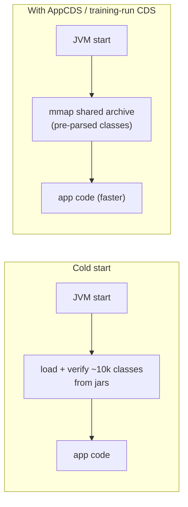

Modern Boot flow (Boot 3.3+):

```bash
# 1. training run — records the classes used during startup
java -Dspring.context.exit=onRefresh -XX:ArchiveClassesAtExit=app.jsa -jar app.jar
# 2. real run — use the archive
java -XX:SharedArchiveFile=app.jsa -jar app.jar
```

> Typical win: **10–30%** off startup with near-zero code change. No behavioural
> difference at runtime. Excellent for containerized services that restart often.
> The archive must be rebuilt when the classpath changes.

### 4.11 Spring AOT & GraalVM native image

**Spring AOT** (`process-aot`) moves bean-definition processing, condition
evaluation, and proxy generation to **build time**, emitting plain Java code. On
the JVM this trims the reflection/scanning phases; it is also the prerequisite for
native images.

**GraalVM native image** compiles ahead-of-time to a standalone binary. Startup
goes from **seconds to milliseconds** (10–50ms is common) and memory drops sharply.

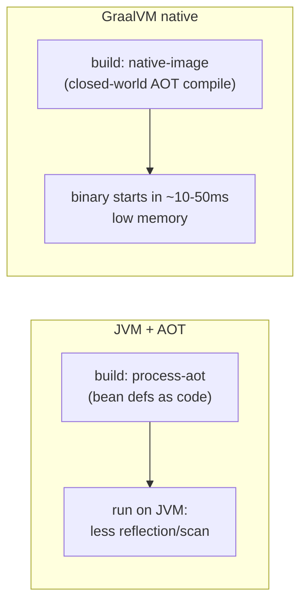

```bash
mvn -Pnative native:compile     # produces a native binary
```

> **Trade-offs:** longer, heavier builds; the closed-world model means reflection /
> dynamic proxies / resources must be registered (hints) — libraries that aren't
> native-ready break. Best for serverless / scale-to-zero / FaaS where cold start
> dominates. Big lift for a large multi-tenant app like this one; evaluate per service.

### 4.12 CRaC — Coordinated Restore at Checkpoint

**Coordinated Restore at Checkpoint** snapshots a *fully warmed-up, running* JVM
(heap, JIT state, open—then-closed resources) to disk, then **restores** from the
snapshot in tens of milliseconds. Spring Boot 3.2+ integrates with CRaC.

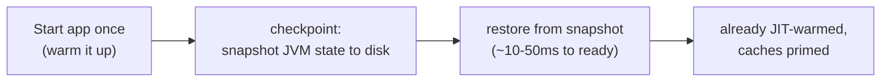

> Restores a *warm* process (JIT already optimized) — unlike native, which starts
> cold-but-fast. Requirements: a CRaC-enabled JDK, and beans must release/re-acquire
> resources around checkpoint (`org.crac.Resource`) — open connections can't be
> snapshotted. Powerful for fast, warm scale-out.

### 4.13 JVM flags & quick wins

For short-lived / fast-restart processes (containers, CI), these shave startup at
the cost of peak throughput — fine when the process restarts often:

| Flag | Effect | Caveat |
|---|---|---|
| `-XX:TieredStopAtLevel=1` | Stop JIT at C1 — faster warm-up, less aggressive optimization. | Lower peak throughput; good for short-lived procs. |
| `-Xss512k` | Smaller thread stacks → less memory churn at boot. | Too small risks `StackOverflowError`. |
| `-XX:+UseSerialGC` (small heaps) | Cheaper GC init for small containers. | Bad for large, throughput-heavy heaps. |
| `-Xms == -Xmx` | Pre-size heap, avoid resize pauses during boot. | Reserve the memory up front. |
| `-XX:+UseAppCDS` / `-XX:SharedArchiveFile` | See 4.10. | Rebuild archive on classpath change. |
| `-Dspring.config.location=...` | Skip searching many config locations. | Be explicit about where config lives. |
| `-Djava.security.egd=file:/dev/urandom` | Avoid blocking on entropy for secure-random init. | Mostly historical; still helps in containers. |

> ⚠️ Do **not** use `-noverify` / `-Xverify:none` — deprecated, unsafe, and removed
> in modern JDKs. Use CDS (4.10) instead to cut verification cost.

---

## 5. What we tried and reverted

Not every lazy change is a win. An earlier attempt (commit `dd750c0f`,
"lazy on organization service") made the **multi-tenant connection providers**
themselves lazy (`MultitenantConnectionProviderImpl` / `...Replica`). This was
**reverted** in commit `d34cb3df` ("revert the lazy initialization") because the
connection providers are part of the **primary tenant-resolution path** — making
them lazy broke/destabilized tenant resolution rather than helping.

> **Lesson:** only defer beans that are genuinely *off* the first-request critical
> path. Deferring core infrastructure (tenant connection providers, primary EMF)
> trades a small boot win for correctness risk. Measure, and keep the hot path eager.

---

## 6. Decision guide / checklist

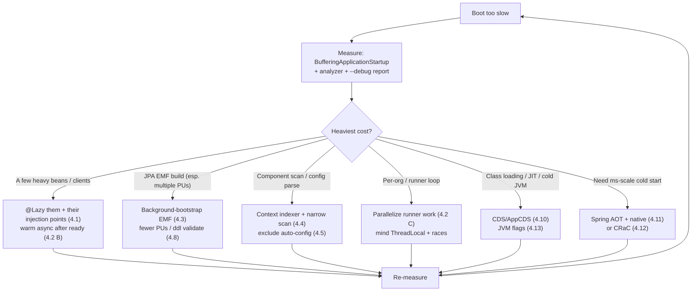

**Quick checklist (cheapest → heaviest):**

- [ ] Measure with `BufferingApplicationStartup` + analyzer (2.1, 2.2) — **always first**.
- [ ] `@Lazy` heavy/optional beans **and their injection points** (4.1). ✅ done here
- [ ] Disable JMX, trim boot logging (4.9). ✅ done here
- [ ] Exclude unused auto-config (4.5). ✅ done here
- [ ] `ddl-auto: validate`/`none`, low Hikari `minimum-idle` (4.7, 4.8). ✅ done here
- [ ] Warm lazy beans async after `ApplicationReadyEvent` (4.2 B).
- [ ] Parallelize the per-org datasource runner loop (4.2 C).
- [ ] Background-bootstrap the two EMFs (4.3).
- [ ] Context indexer + narrow scan (4.4).
- [ ] Consider global `spring.main.lazy-initialization` for dev (4.6).
- [ ] AppCDS / training-run CDS for container restarts (4.10).
- [ ] Spring AOT, then native or CRaC if cold start must be ms-scale (4.11, 4.12).
- [ ] Remove `BufferingApplicationStartup` + diagnostic loggers before shipping prod.

---

## 7. Files touched in this repo

| File | Change |
|---|---|
| `VIAReportingManagementMicroserviceApplication.java` | `app.setApplicationStartup(new BufferingApplicationStartup(4096))` in `main()` → exposes the startup timeline at `/actuator/startup` for the analyzer. (Diagnostic — remove after tuning.) |
| `MultiTenantJpaConfiguration.java` | Replica EMF chain (connection provider, EMF bean, EMF, replica tx manager) made `@Lazy`, bean + injected args. Primary EMF stays eager. |
| `configuration/GcpTranslateConfig.java` | `GoogleCredentials` + `TranslationServiceClient` beans made `@Lazy`. |
| `configuration/RedissionConfig.java` | `RedissonClient` bean made `@Lazy` (kept `@Primary`, singleton). |
| `service/TranslationService.java` | Class + injected translate client made `@Lazy`. |
| `service/TextSearchService.java` | Injected `RedissonClient` made `@Lazy`. |
| `service/ReportingManagementService.java` | `@Lazy` import / lazy injection wiring. |
| `resources/application.yml` | Startup diagnostic loggers added then commented out for prod; JMX disabled; `ddl-auto: validate`. |

---

## 8. References

- **Startup analyzer we used:** <https://alexey-lapin.github.io/spring-boot-startup-analyzer/#/> (client-side viewer for `/actuator/startup` JSON).
- Spring Boot docs — *Application Startup tracking* (`ApplicationStartup`, `BufferingApplicationStartup`, the `startup` actuator endpoint).
- Spring Framework docs — `LocalContainerEntityManagerFactoryBean#setBootstrapExecutor` (background JPA bootstrap).
- Spring Framework docs — `@Lazy`, `spring.main.lazy-initialization`.
- Spring `spring-context-indexer` (compile-time component index).
- Spring Boot — *Class Data Sharing (CDS)* and training-run support; GraalVM native image & Spring AOT.
- OpenJDK **CRaC** (Coordinated Restore at Checkpoint) + Spring Boot CRaC integration.
- HikariCP — pool sizing & `initializationFailTimeout`.